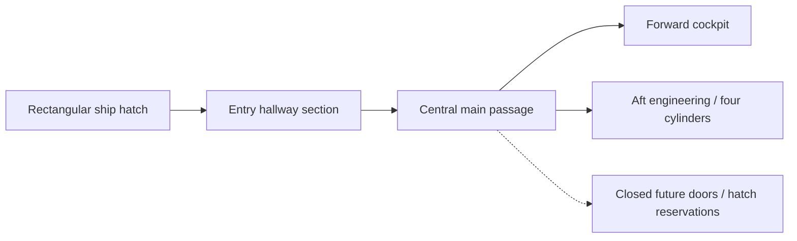
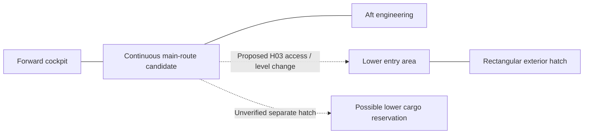

# Phase 1.2 — Spatial And Motion Decision Packet

Status: discussion in progress, 2026-10-07. The user authorized Phase 1.2; no later subphase,
modeling, Unreal initialization or gameplay implementation is authorized. No decisions in this
packet are accepted solely by being written here.

Authority: [Baseline v1](../reconstruction/baseline-v1/spatial-constraint-map.md), its motion/slice
contracts and [implementation Phase 1.2](vertical-slice-1-implementation-plan.md#phase-12-spatial-and-motion-decision-packet).
Phase 1.1 is complete. Phase 1.2 remains open; VS-D01–03 are not resolved.

## First Discussion — Arrival And Melfina's Case

The user wants to discuss opening feel and additional episode references before choosing geometry.
They proposed using Melfina's locked transport case and resuscitation sequence from Episodes 1/2,
with changed location/preceding events. [Focused source review](../../reference/indexes/episode-01-02-melfina-case-review.md)
records supported visuals, track-qualified English statements and limits.

The opening direction below extends the accepted slice, whose current occupant is a placeholder/script.
User agreements and preferences are recorded here; promoting the resulting bounded additions into
the baseline scope is part of reconciling the completed packet, rather than silently changing it now.
Full character art, crew AI, general inventory and dialogue production do not follow automatically.

## Discussion Direction And Current Status

| Item | User direction / proposal | Status and limit |
| --- | --- | --- |
| Case placement | Designated visually indicated floor position near the navigation apparatus; open/revive there to limit occupant travel | User-proposed direction; exact placement and open/exit clearance unselected |
| Resuscitation | Preserve 600-second default; a second interaction skips the remainder to completion/activation | User agreed the clearly labeled demo shortcut; F, not a canon fast-resuscitation feature |
| Occupant transfer | Minimal scripted movement/text to get into apparatus; presentation format later | Direction for discussion; no full crew AI or finished character/dialogue production |
| Preparation overlap | Start useful cockpit/Gilliam and local engineering preparation during the timer | User agreed direction; detailed dependencies later in 1.3, final readiness still requires completed navigation setup |
| Facility arrival | Start inside proposed asteroid entry airlock with both doors closed; open inner door, operate nearby hangar-light control | User-proposed opening; entire airlock geometry/pressure procedure not established by current evidence |
| Hangar reveal | Near-forward-underbody composition; overhead lamps reveal the ship from near to far, then surrounding lights together | User agreed composition/direction; E/F staging based on the lit anime enclosure; dimensions/timing pending |
| Boarding / visibility | Reach ship hatch by jump, operate access panel; minimal guide lighting toward cockpit before bootstrap | User proposal; jump/gravity, held load and route dimensions unresolved |
| Held tool / boot | Carry the closed portable computer in one hand; use it at a cockpit station to activate Gilliam, followed by registration/status interaction | User agreed carrying direction; EP-04 device appearance/use supported; exact plug/port and demo interaction granularity unresolved |
| Trunk transport | Melfina's trunk secured on the player's back while the computer is carried in hand | User agreed transport direction; E/F mounting/load/collision choices remain unselected; low-gravity premise not a measured value |
| Computer connection region | Under the seated pilot's right-hand captain-chair/control panel, near the ignition-key region | EP-04 04:59–05:00 directly confirms reaching below/beside the panel; precise right-side/key-area placement remains the user's lead/provisional E choice, with connector and electrical relationship unverified |
| Interior route | Rectangular ship entry leads into hallway space; central passage connects forward cockpit and aft engineering, with closed future branches | User selected demo topology; entry corridor context A, local settei directions B candidate; exact hull coordinates/connections E and unresolved |

[Episode 4 opening/bootstrap review](../../reference/indexes/episode-04-opening-bootstrap-review.md)
connects reveal/boarding/computer operation to Gilliam's introduction and registration, then links the
existing apparatus/engineering/key-start evidence. The computer proposal supersedes the generic
switches-to-wake-Gilliam suggestion in this discussion; precise action prerequisites remain unselected.

An EP-01/02 revival aboard the ship changes EP-04's chronology, where Melfina is already awake.
The case, carried computer and ship navigation apparatus retain distinct identities. Agreed discussion
directions are not a completed spatial proposal or a silent amendment to the approved slice contract.

## Consolidated Opening Flow — Working Experience Direction

This summarizes the discussion, not a canonical chronology or final state machine. Exact input,
dependency, interruption and result rules belong to Phase 1.3. No fitted layout is implied.

1. Start as the same physical player inside the proposed facility entry airlock, both doors closed,
   Melfina's trunk secured on the back and the closed portable computer carried in one hand.
2. Open the inner facility door into a dark hangar. A nearby locally readable control allows the
   player to activate hangar lighting; no handheld flashlight has been selected.
3. Overhead lights reveal the ship sequentially; surrounding lights then come on together to establish
   the hangar ambiance. Preserve grey commissioning appearance and the sense of the ship's scale.
4. Reach the ship's exterior hatch by the proposed jump/boarding approach and operate its access
   panel. Minimal emergency/guide lighting makes the inside route and essential destinations readable.
5. Enter hallway space and follow the proposed central passage toward the forward cockpit; boarding
   does not directly enter the cockpit. Remove the trunk from the back and place it at the designated/highlighted floor
   location near the navigation apparatus. Enter `VSDO2C`, open the case and initiate the reference-inspired
   resuscitation sequence. Code delivery and whether opening itself starts the process are unresolved.
6. Set up the portable computer at the captain's station, access the proposed connection region under
   the pilot-right panel, and perform the boot interaction that brings Gilliam online. This supersedes
   the earlier suggestion that generic highlighted cockpit switches alone wake him.
7. Gilliam provides basic deterministic registration/status and startup guidance. Available cockpit
   and local engineering preparation can occupy the resuscitation period, including unsealing all
   four cylinders. These tasks remain physical; guidance does not silently complete them.
8. Resuscitation completes normally or through the agreed demo shortcut. Melfina activates, receives
   a short text/scripted transition and moves the minimum distance needed to enter her apparatus.
9. Complete navigation, engineering, seating and ignition requirements, returning to the bridge as
   needed. Finish at SHIP READY while supported in the hangar, with no departure.

The player remains free to perform available preparation during the timer; no ten-minute list of
extra chores is introduced. Steps 7/8 overlap rather than requiring one fixed sequential completion.
The physical reveal remains the user's design target; camera control, transitions and precise timing
are not selected merely by this outline.

## Agreed Minimal Interior Topology

The user explicitly ruled out direct cockpit boarding and selected these demo spaces:

- Rectangular boarding hatch and its entry hallway/approach section.
- Main passage running centrally through the ship.
- Cockpit at the forward end and engineering/service room toward the aft end.
- Closed doors/hatches indicating/reserving future branches, with placement informed by references.

The entry section might be part of the main passage or connect through a short branch; distinct
room count, junction shape, side, level and distance remain unselected. This is a topology, not a
final straight corridor extending the full 72 m or a fitted deck plan. The user has not selected a
second working pressure lock immediately inside the ship hatch.

Arrows represent the user-selected E working route, not confirmed source adjacencies. Source-supported
constraints remain authoritative: S01 bridge/passage, S02/S03 dining directions, S04 ladder access,
S10 rail relationship, S12 necessary traversal and S13 incomplete boarding correspondence.
[Entry/corridor reconciliation](../../reference/indexes/episode-04-entry-hall-review.md) records
the Gene/Gilliam corridor scene and the relevant settei comparison.

Preserve recognizable passage features and the round floor access hatch H03 separately from the
rectangular entry records H04/H05. No dining or lounge interior is currently required by this demo
direction; respect their named source directions through the chosen route/reservation proposal.
If reconciling that route requires a room segment or other expansion, surface it rather than adding it
silently. Cabins/cargo/utility remain unresolved: a closed door is not evidence of a specific room.

The user's [floor-hatch storage recollection](../reconstruction/open-questions.md#passage-floor-hatch--storage-recollection--pending-2026-10-07)
is an active reference lead. Do not finalize H03's unseen destination or use its below-floor volume
for unrelated machinery until correspondence is checked. EP-09 translated cargo-hold dialogue is a
search lead, not a fitted storage-room claim. The demo can retain a closed hatch/reservation while
this research continues; no storage interaction or extra playable room is selected.

Reserve future branch volume before choosing door locations; keep those doors closed for the slice.
Do not place arbitrary doorways where the apparatus cavity, grappler roots, Shooter, robot rail or
all-four cylinder sweeps need space. Full-ship room layout, branch interiors and extra deck count
stay deferred. The exact hatch position/inside junction is the next reconstruction comparison.

### Hatch Location And Possible Level Transition — Pending Evidence Reconciliation

The user asked to locate the hatch before choosing the trip length, recalling an aft/lower-hull
position and identifying the rectangular outline in EP-04's underside shot. They proposed that the
entry may lie below the central passage because the cockpit is on the dorsal nose.
[Exterior comparison](../../reference/indexes/episode-04-hatch-location-review.md) supports lower-hull
placement and the settei's hatch-between-grapplers constraint, but does not confirm an aft/near-engineering
location, exact coordinates or central-passage floor elevation.

Keep both a lower entry with a local rise to the main passage and a lower passage rising toward
the cockpit as E candidates. No full second deck, stairs/ramp/ladder, transfer height or short cockpit
walk is selected. The forward/mid-body grappler region is the first landmark-based candidate to test;
the user's aft alternative remains a reference question. Post-boarding trip length will follow placement,
rather than placing the hatch to satisfy the earlier assistant preference for a short walk.

Any candidate must leave room for grappler roots, case-carrying movement, H03 floor access and the
apparatus cavity below the cockpit. Preserve the agreed near-forward hangar reveal separately from
boarding destination: the facility entry need not face or sit immediately beneath the ship's boarding hatch.

### Working Level Hypothesis — Central Route And Lower Entry

The user proposes a continuous cockpit-to-engineering main route, with bulkheads where needed;
a lower boarding area reached from the main passage's round exterior-access hatch H03; and a
potential separate lower cargo space accessed through another hatch. This is a coherent candidate
to reconcile, not three newly verified source connections.
[Passage/entry-level review](../../reference/indexes/passage-entry-level-reconciliation.md) distinguishes:

- Supported local passage-to-cockpit connection and rail-bearing route context toward engineering.
- The user's continuous main-route direction; exact length, bends, floor transitions and engineering
  junction remain E choices. SET-045 and SET-046 still name dining along the route relationships.
- Proposed H03 connection down to rectangular boarding/airlock records H04–H06, compatible with
  its exterior-access label but not yet traced in episode or full-ship section evidence.
- Possible distinct lower cargo volume/second floor hatch; unverified user recollection, no assigned
  canonical identity or selected position. Reserve provisionally without adding a playable cargo room.

This diagram represents an E hypothesis; even solid lines are proposed reconstruction connections,
not a canon status legend. Cargo/entry adjacency, pressure boundaries, main-deck height and a full
second deck remain unknown. The proposed lower route must avoid the navigation cavity, preserve
floor access and accommodate the trunk/computer; choosing a ladder because a round hatch exists
does not establish that the carried load fits. Resolve level/route fit before choosing the cockpit walk.

### First Underfloor Separation Proposal — E, Fit Pending

The user's expectation that the ventral boarding area can be farther aft than the dorsal cockpit is
consistent with the current exterior landmark interpretation; its actual separation is unmeasured.
The local passage floor hatch H03 is different: SET-044 depicts it near the cockpit doorway, while
the apparatus occupies the rear of the cockpit in SET-022/028. The underfloor entry route must therefore
be reconciled at its forward end, even if the exterior hatch is farther aft.

Propose keeping the apparatus cavity beneath the cockpit, the H03 ascent on the passage side of
the cockpit boundary, and the lower access route beneath the passage rather than passing beneath
the apparatus. [Evidence and first fit concept](../../reference/indexes/passage-entry-level-reconciliation.md#apparatus-versus-lower-access--first-fit-concept)
record this distinction. No measured dimensions, connector choice or clearance pass is claimed.

This gives the next dimensional proposal three separate volumes to test: apparatus storage/descent,
H03 ascent/landing with carried trunk, and lower entry/access with grappler-root clearance. Their margins
and hull fit must be explicit before selecting a ladder/ramp/steps or final deck arrangement.

## Agreed Hangar Composition And Reveal Direction

The user wants a composition broadly informed by Episode 4, with creative staging that makes the
ship's scale and unexpectedly distant extent apparent relative to the player. They agreed the following
proposal; this is E/F experience direction, not source-measured hangar geometry:

- Position the facility entry near the forward underside, with only nearby hull initially distinguishable.
- Activate overhead lights from near to far, exposing successive lengths of hull and surrounding
  structure until its distant extent becomes apparent.
- Bring surrounding lights on together after the overhead sequence to complete the hangar ambiance.
- Use human-scale doorway/control/structural references to make size legible rather than changing
  the accepted 72 m overall ship length for dramatic effect.
- Compose the view so the reveal can be appreciated from the airlock threshold with player camera
  control retained; walking during the sequence remains possible in the proposed experience.
- Make the boarding hatch/approach readable by completion, returning attention to the next action.

Exact doorway position, viewing distance, hull/support alignment, lamp spacing and reveal timing remain
provisional. Later graybox validation must check doorway occlusion, receding-hull visibility, both camera
perspectives and the boarding approach with carried equipment. No visual fit has been demonstrated.

## Visibility And Power Boundaries To Preserve

| Stage | Visibility intent | Unresolved power/geometry contract |
| --- | --- | --- |
| Facility entry | Enough local visibility to orient and identify the inner-door control | Airlock dimensions, local supply and any interlock; a second door does not approve pressure simulation |
| Dark hangar | Nearby lighting control can be located before the reveal | Exact switch placement/cue; independent facility lighting supply is a proposal, not canon |
| Hangar revealed | Near-to-far overhead lights, then surrounding lights; boarding route becomes readable | Sequence direction agreed; lamp layout/timing, shadow/brightness and supports remain unselected |
| Dormant ship entered | Minimal path/emergency light supports travel, case placement and computer setup | Hatch-triggered lighting and available initial ship services are F proposals; underlying source unknown |
| Computer/Gilliam boot | Cockpit lights/displays become more available and Gilliam can guide | Boot prerequisites and service domains later in 1.3; boot is distinct from main ignition |
| Final ignition | Completed startup produces operating-state feedback | Existing readiness contract applies; no numerical reactor/power model added |

The facility entry airlock and ship exterior hatch are different locations. Keep their controls,
light stages and evidence identities separate. The computer is not assumed to provide ship power
merely because it is connected, and the case's energy source has not been established.

## Resuscitation And Demo Shortcut — Agreed Direction

- Keep the reference's 600-second default, with progress/status available while the player prepares
  the ship. The anime's edited screen time is not proof of a continuous real-time duration.
- Once in progress, provide a second local case interaction clearly labeled as a demo shortcut to skip
  remaining time. This is F; it does not establish a canonical medical/operational acceleration function.
- Skipping advances to completion/activation with a brief readable transition; exact animation duration
  is unselected. It does not complete cockpit controls, engine preparation, navigation deployment or ignition.
- Final readiness still requires the completed navigation apparatus and all other existing conditions.
- The English track's restriction on moving Melfina during resuscitation supports choosing a stationary
  case staging area; exact carry/placement restrictions and interruption rules remain for 1.3.
- Use minimal occupant movement and text for this demo. Speech bubble versus popup/display text,
  dialogue wording, input acknowledgement and any optional voice production are undecided.
- Disconnecting/stowing the computer before seating/lift was an assistant recommendation, not yet a
  user decision. Regardless of that choice, the computer/cable must have a reviewed safe placement.

## Bounded Scope Changes And Later Contract Work

| Change from Baseline v1 | Direction to capture | Still needed before implementation |
| --- | --- | --- |
| Opening facility access | Proposed two-door entry airlock and nearby hangar-light interaction | VS-D01 spatial connection and explicit bounded scope amendment; no exterior exploration/pressure simulation assumed |
| Carried equipment | One specific back-mounted trunk and one handled portable computer | Carry/stow/reach envelopes; minimal equipment state later; full inventory UI/storage system remains unselected |
| Melfina introduction | Case placement, lock, revival, timer shortcut and short transfer | Case envelope, code delivery, dependency/interaction rules and baseline acceptance update |
| Gilliam bootstrap | Computer operation, basic registration/status and existing deterministic guidance | Connection/access geometry now; crew/player identity and action/result rules later in 1.3 |
| Preparation ordering | Allow useful engineering/cockpit work while revival is underway | Explicit F dependency reconciliation; retain all-four preparation and navigation-ready requirements |

Final art, full character/crew simulation, LLM dialogue, flight, combat, repairs and general-purpose
inventory mechanics remain outside the agreed opening work. Canonical-looking props do not make
the new combined chronology or interaction rules canon. Review the baseline scope/sequence amendment
alongside the packet; map accepted actions to later implementation/validation owners without starting
those phases. No added opening feature is considered delivered by this documentation.

Remaining opening decisions, to address incrementally:

- Back-mounted trunk dimensions/attachment and computer stowage needed for boarding and controls.
- Exact facility doorway/control position, rectangular ship hatch correspondence, jump/landing and entry-hall/main-passage junction; direct cockpit entry is ruled out.
- Case/code presentation, control access and safe occupant emergence into the apparatus approach.
- Computer placement/connection access and cable/storage clearance as the seating lifts; use the seated pilot's right side as the proposed orientation, not camera-right.
- Scope of registration and bootstrap interaction, text/guidance presentation and timing in Phase 1.3.

Priority for the next spatial discussion: select the facility-to-ship approach and ship entrance, then
locate the case staging area and computer work area against the apparatus/seat sweeps. That makes
the opening intent concrete before choosing numerical dimensions or detailed input behavior.

Case dimensions/carry envelope and open/activation clearances will be proposed after this intent
is clear, then tested against H entry identities, S connections and M/MC reservations. Keep the
case and ship navigation cylinder separate; no docking connection is established by the evidence.

## Remaining Packet Work — Not Yet Proposed

- Finalized exterior-entry identity/coordinates and entry-hall junction proposal (VS-D01), retaining H04/H05 uncertainty; hallway entry is the agreed direction.
- Hull-relative bridge/passage/engineering placement and supported named directions (VS-D02).
- Player/occupant scale, apparatus cavity, seat lift and all-four cylinder sweeps (VS-D03).
- Operator paths, provisional E dimensions/margins and M01–M09 fit proposal.
- Affected M10–M13 reservations and targeted source checks that could invalidate the proposal.
- MC-01–MC-08 demonstration plan, distinguishing actual slice fit from future reservation-only checks.

No spatial checkbox or fit test is complete. Opening discussion may inform later Phase 1.3 actions,
but does not start that subphase or select implementation details prematurely.
