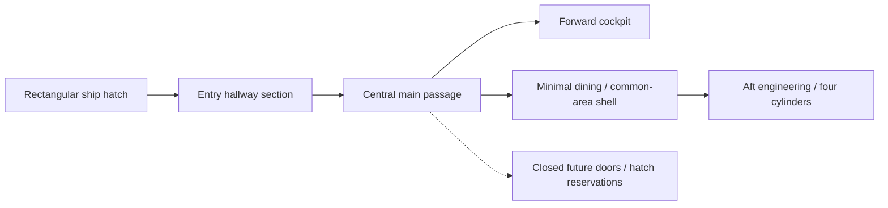
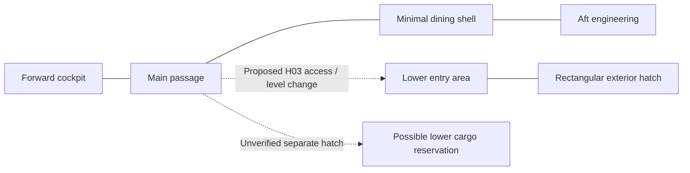

# Phase 1.2 — Spatial And Motion Decision Packet

Current behavior companion: [accepted Phase 1.3 closeout](phase-1-3-closeout-audit.md).
The discussion below is historical where it leaves behavior for Phase 1.3: those decisions are
now selected, while metric layout, source correspondence and actual fit remain pending.

Status: Phase 1.2 planning accepted and complete, 2026-10-07. No later subphase,
modeling, Unreal initialization or gameplay implementation is authorized. No decisions in this
packet are accepted solely by being written here.

Authority: [Baseline v1](../reconstruction/baseline-v1/spatial-constraint-map.md), its motion/slice
contracts and [implementation Phase 1.2](vertical-slice-1-implementation-plan.md#phase-12-spatial-and-motion-decision-packet).
Phases 1.1 and 1.2 planning are complete. VS-D01–03 have accepted provisional E choices;
source correspondence and actual fit remain unresolved where recorded.

The [closeout proposal](phase-1-2-closeout-proposal.md) supplies the remaining local canopy,
engineering platform and worn-computer storage proposals, a concrete route consolidation,
MC-01–MC-08 demonstration plan and accepted bounded opening contract supplement. The user
accepted this package on 2026-10-07; dimensions remain trial inputs and no fit is proven.

The discussion sections below preserve the sequence of prior proposals and their then-open
questions. Where they describe scope reconciliation or local profiles/storage as unfinished,
the accepted closeout supplies the current planning decision. Source uncertainties and fit
limitations remain in force; later action/input questions stay with Phase 1.3.

## First Discussion — Arrival And Melfina's Case

The user wants to discuss opening feel and additional episode references before choosing geometry.
They proposed using Melfina's locked transport case and resuscitation sequence from Episodes 1/2,
with changed location/preceding events. [Focused source review](../../reference/indexes/episode-01-02-melfina-case-review.md)
records supported visuals, track-qualified English statements and limits.

The opening direction below extends the accepted slice, whose current occupant is a placeholder/script.
User agreements and preferences are recorded here; promoting the resulting bounded additions into
the baseline scope is part of reconciling the completed packet, rather than silently changing it now.
Full character art, crew AI, general inventory and dialogue production do not follow automatically.

## Discussion Direction And Current Status

| Item | User direction / proposal | Status and limit |
| --- | --- | --- |
| Case placement | Use Melfina's standing area in EP-04 05:49 as the rear-side staging anchor; lid opens toward side wall, occupant presented toward center/player | User agreed demo player-blocking exception and staging/orientation direction; exact footprint/offset and visible motion clearance pending |
| Resuscitation | Preserve 600-second default; a second interaction skips the remainder to completion/activation | User agreed the clearly labeled demo shortcut; F, not a canon fast-resuscitation feature |
| Occupant transfer | Minimal scripted movement/text to get into apparatus; presentation format later | Direction for discussion; no full crew AI or finished character/dialogue production |
| Preparation overlap | Start useful cockpit/Gilliam and local engineering preparation during the timer | User agreed direction; detailed dependencies later in 1.3, final readiness still requires completed navigation setup |
| Facility arrival | Start inside proposed asteroid entry airlock with both doors closed; open inner door, operate nearby hangar-light control | User-proposed opening; entire airlock geometry/pressure procedure not established by current evidence |
| Hangar reveal | Near-forward-underbody composition; overhead lamps reveal the ship from near to far, then surrounding lights together | User agreed composition/direction; E/F staging based on the lit anime enclosure; dimensions/timing pending |
| Boarding / visibility | Reach ship hatch by jump, operate access panel; minimal guide lighting toward cockpit before bootstrap | User proposal; jump/gravity, held load and route dimensions unresolved |
| Held tool / boot | Carry the closed portable computer in one hand; use it at a cockpit station to activate Gilliam, followed by registration/status interaction | User agreed carrying direction; EP-04 device appearance/use supported; exact plug/port and demo interaction granularity unresolved |
| Trunk transport | Melfina's trunk secured on the player's back while the computer is carried in hand | User agreed transport direction; E/F mounting/load/collision choices remain unselected; low-gravity premise not a measured value |
| Computer connection region | Under the seated pilot's right-hand captain-chair/control panel, near the ignition-key region | EP-04 04:59–05:00 directly confirms reaching below/beside the panel; precise right-side/key-area placement remains the user's lead/provisional E choice, with connector and electrical relationship unverified |
| Interior route | Rectangular ship entry leads into hallway space; central passage connects forward cockpit through a minimal dining/common-area shell toward aft engineering, with closed future branches | User selected demo topology and minimal dining-shell inclusion; entry corridor context A, local settei directions B candidate; exact hull coordinates/connections E and unresolved |

[Episode 4 opening/bootstrap review](../../reference/indexes/episode-04-opening-bootstrap-review.md)
connects reveal/boarding/computer operation to Gilliam's introduction and registration, then links the
existing apparatus/engineering/key-start evidence. The computer proposal supersedes the generic
switches-to-wake-Gilliam suggestion in this discussion; precise action prerequisites remain unselected.

An EP-01/02 revival aboard the ship changes EP-04's chronology, where Melfina is already awake.
The case, carried computer and ship navigation apparatus retain distinct identities. Agreed discussion
directions are not a completed spatial proposal or a silent amendment to the approved slice contract.

## Consolidated Opening Flow — Working Experience Direction

This summarizes the discussion, not a canonical chronology or final state machine. Exact input,
dependency, interruption and result rules belong to Phase 1.3. No fitted layout is implied.

1. Start as the same physical player inside the proposed facility entry airlock, both doors closed,
   Melfina's trunk secured on the back and the closed portable computer carried in one hand.
2. Open the inner facility door into a dark hangar. A nearby locally readable control allows the
   player to activate hangar lighting; no handheld flashlight has been selected.
3. Overhead lights reveal the ship sequentially; surrounding lights then come on together to establish
   the hangar ambiance. Preserve grey commissioning appearance and the sense of the ship's scale.
4. Reach the ship's exterior hatch by the proposed jump/boarding approach and operate its access
   panel. Minimal emergency/guide lighting makes the inside route and essential destinations readable.
5. Enter hallway space and follow the proposed central passage toward the forward cockpit; boarding
   does not directly enter the cockpit. Remove the trunk from the back and place it at the designated/highlighted floor
   location near the navigation apparatus. Enter `VSDO2C`, open the case and initiate the reference-inspired
   resuscitation sequence. Code delivery and whether opening itself starts the process are unresolved.
6. Set up the portable computer at the captain's station, access the proposed connection region under
   the pilot-right panel, and perform the boot interaction that brings Gilliam online. This supersedes
   the earlier suggestion that generic highlighted cockpit switches alone wake him.
7. Gilliam provides basic deterministic registration/status and startup guidance. Available cockpit
   and local engineering preparation can occupy the resuscitation period, including unsealing all
   four cylinders. These tasks remain physical; guidance does not silently complete them.
8. Resuscitation completes normally or through the agreed demo shortcut. Melfina activates, receives
   a short text/scripted transition and moves the minimum distance needed to enter her apparatus.
9. Complete navigation, engineering, seating and ignition requirements, returning to the bridge as
   needed. Finish at SHIP READY while supported in the hangar, with no departure.

The player remains free to perform available preparation during the timer; no ten-minute list of
extra chores is introduced. Steps 7/8 overlap rather than requiring one fixed sequential completion.
The physical reveal remains the user's design target; camera control, transitions and precise timing
are not selected merely by this outline.

## Agreed Minimal Interior Topology

The user explicitly ruled out direct cockpit boarding and selected these demo spaces:

- Rectangular boarding hatch and its entry hallway/approach section.
- Main passage running centrally through the ship.
- Cockpit at the forward end and engineering/service room toward the aft end.
- Minimal dining/common-area shell on the main route between passage and engineering, added by
  explicit user agreement; its complete interior and gameplay are not required.
- Closed doors/hatches indicating/reserving future branches, with placement informed by references.

The entry section might be part of the main passage or connect through a short branch; distinct
room count, junction shape, side, level and distance remain unselected. This is a topology, not a
final straight corridor extending the full 72 m or a fitted deck plan. The user has not selected a
second working pressure lock immediately inside the ship hatch.

Arrows represent the user-selected E working route, not confirmed source adjacencies. Source-supported
constraints remain authoritative: S01 bridge/passage, S02/S03 dining directions, S04 ladder access,
S10 rail relationship, S12 necessary traversal and S13 incomplete boarding correspondence.
[Entry/corridor reconciliation](../../reference/indexes/episode-04-entry-hall-review.md) records
the Gene/Gilliam corridor scene and the relevant settei comparison.

Preserve recognizable passage features and the round floor access hatch H03 separately from the
rectangular entry records H04/H05. The user subsequently approved a minimal dining/common-area
shell for traversal; a complete dining interior or separate lounge remains unselected. Preserve the
named source directions through the chosen route proposal without asserting measured adjacency.
Cabins/cargo/utility remain unresolved: a closed door is not evidence of a specific room.

The user's [floor-hatch storage recollection](../reconstruction/open-questions.md#passage-floor-hatch--storage-recollection--pending-2026-10-07)
is an active reference lead. Do not finalize H03's unseen destination or use its below-floor volume
for unrelated machinery until correspondence is checked. EP-09 translated cargo-hold dialogue is a
search lead, not a fitted storage-room claim. The demo can retain a closed hatch/reservation while
this research continues; no storage interaction or extra playable room is selected.

Reserve future branch volume before choosing door locations; keep those doors closed for the slice.
Do not place arbitrary doorways where the apparatus cavity, grappler roots, Shooter, robot rail or
all-four cylinder sweeps need space. Full-ship room layout, branch interiors and extra deck count
stay deferred. The exact hatch position/inside junction is the next reconstruction comparison.

### Hatch Location And Possible Level Transition — Pending Evidence Reconciliation

The user asked to locate the hatch before choosing the trip length, recalling an aft/lower-hull
position and identifying the rectangular outline in EP-04's underside shot. They proposed that the
entry may lie below the central passage because the cockpit is on the dorsal nose.
[Exterior comparison](../../reference/indexes/episode-04-hatch-location-review.md) supports lower-hull
placement and the settei's hatch-between-grapplers constraint, but does not confirm an aft/near-engineering
location, exact coordinates or central-passage floor elevation.

Keep both a lower entry with a local rise to the main passage and a lower passage rising toward
the cockpit as E candidates. No full second deck, stairs/ramp/ladder, transfer height or short cockpit
walk is selected. The forward/mid-body grappler region is the first landmark-based candidate to test;
the user's aft alternative remains a reference question. Post-boarding trip length will follow placement,
rather than placing the hatch to satisfy the earlier assistant preference for a short walk.

Any candidate must leave room for grappler roots, case-carrying movement, H03 floor access and the
apparatus cavity below the cockpit. Preserve the agreed near-forward hangar reveal separately from
boarding destination: the facility entry need not face or sit immediately beneath the ship's boarding hatch.

### Dining/Common-Area Connector — User-Approved Inclusion, Fit Pending

The user agreed to include a minimal walk-through dining/common-area shell in the demo rather
than keep dining closed and invent a bypass. The working E sequence is cockpit → main passage →
dining shell → engineering approach → engineering, with possible bulkheads, bends or intermediate
connection lengths still unresolved. This preserves one continuous circulation route without claiming
one straight corridor or a source-established door directly connecting dining and engineering.

Evidence anchors are S02 (SET-044/045 passage toward dining) and S03 (SET-046 engineering toward
dining). These are reviewed B-candidate destination relationships, not a complete plan. Re-inspected
SET-088/089 and their existing authored review: they show a lounge/rest room, cockpit direction,
wall storage/monitor and four convertible floor panels. Their identity as the dining destination
remains unverified; do not silently merge rooms or import their furniture as confirmed dining geometry.

For the first slice, include only the shell, usable connecting openings and necessary route lighting;
any additional recognizable fixture proxies require a supported identity or an explicit E proposal.
No dining interactions, cooking, food inventory or furniture motion is added by this agreement.
Room length/width, doorway positions and engineering approach remain for the dimensional packet.

Fit validation must keep the player route and potential maintenance-robot rail connection usable.
If the chosen common-area reconstruction uses the convertible lounge design provisionally, explicitly
label that E identity choice and protect M13's future furniture volume; a clear floor in the demo does
not prove traversal remains possible with furniture raised. Full lounge/dining correspondence may
continue as parallel research unless it would invalidate this slice route.

This is an accepted bounded inclusion in the working packet. Reconcile it with Baseline v1 at
Phase 1.2 closeout and carry it into Phase 3.2's dining-proxy owner. No shell has been modeled and
no source measurement, hull placement or completed fit check is claimed.

### Working Level Hypothesis — Central Route And Lower Entry

The user proposes a continuous cockpit-to-engineering main route, with bulkheads where needed;
a lower boarding area reached from the main passage's round exterior-access hatch H03; and a
potential separate lower cargo space accessed through another hatch. This is a coherent candidate
to reconcile, not three newly verified source connections.
[Passage/entry-level review](../../reference/indexes/passage-entry-level-reconciliation.md) distinguishes:

- Supported local passage-to-cockpit connection and rail-bearing route context toward engineering.
- The user's continuous main-route direction; exact length, bends, floor transitions and engineering
  junction remain E choices. SET-045 and SET-046 still name dining along the route relationships.
- Proposed H03 connection down to rectangular boarding/airlock records H04–H06, compatible with
  its exterior-access label but not yet traced in episode or full-ship section evidence.
- Possible distinct lower cargo volume/second floor hatch; unverified user recollection, no assigned
  canonical identity or selected position. Reserve provisionally without adding a playable cargo room.

This diagram represents an E hypothesis; even solid lines are proposed reconstruction connections,
not a canon status legend. Cargo/entry adjacency, pressure boundaries, main-deck height and a full
second deck remain unknown. The proposed lower route must avoid the navigation cavity, preserve
floor access and accommodate the trunk/computer; choosing a ladder because a round hatch exists
does not establish that the carried load fits. Resolve level/route fit before choosing the cockpit walk.

### First Underfloor Separation Proposal — E, Fit Pending

The user's expectation that the ventral boarding area can be farther aft than the dorsal cockpit is
consistent with the current exterior landmark interpretation; its actual separation is unmeasured.
The local passage floor hatch H03 is different: SET-044 depicts it near the cockpit doorway, while
the apparatus occupies the rear of the cockpit in SET-022/028. The underfloor entry route must therefore
be reconciled at its forward end, even if the exterior hatch is farther aft.

Propose keeping the apparatus cavity beneath the cockpit, the H03 ascent on the passage side of
the cockpit boundary, and the lower access route beneath the passage rather than passing beneath
the apparatus. [Evidence and first fit concept](../../reference/indexes/passage-entry-level-reconciliation.md#apparatus-versus-lower-access--first-fit-concept)
record this distinction. No measured dimensions, connector choice or clearance pass is claimed.

This gives the next dimensional proposal three separate volumes to test: apparatus storage/descent,
H03 ascent/landing with carried trunk, and lower entry/access with grappler-root clearance. Their margins
and hull fit must be explicit before selecting a ladder/ramp/steps or final deck arrangement.

### Loaded Boarding And H03 Ascent — Proposal For Discussion

Proposed 2026-10-07 after the user authorized tackling the lower-entry ascent. This is an E/F
candidate, not an accepted connector, a measured source dimension or a completed VS-D01/03 fit.
Re-inspected immutable SET-044/045/047/126, EP-01 case frames 02/08 and EP-04 hatch-location
frame 06 (04:33.023). Existing authored reviews/manifests own provenance; no new media was extracted.

SET-047 and the episode frame show rung/handhold-like entrance fittings. SET-044/045 retain the
round H03 floor opening near the cockpit doorway, but do not show its lower ladder, shaft or
landing. SET-045's explicitly labeled Assault Tube ladder is a separate upper access, not evidence
for a ladder beneath H03. Hilda carries the smaller computer in one hand while boarding; this
does not demonstrate ascent with the substantially larger occupied Melfina trunk.

**Recommended candidate:** carry the closed trunk upright on the back, temporarily stow the
computer for loaded boarding/ascent, traverse the lower access route, then climb a fixed ladder
through H03 to a clear landing on the passage side of the cockpit boundary. Keep the apparatus
cavity separate. Exact lower-route length, rise, rung layout and hatch motion remain unresolved.

| Candidate | Reason to consider | Main cost / unresolved fit |
| --- | --- | --- |
| Back-mounted trunk plus ladder through H03 — recommended first test | Retains the circular access and entrance handhold vocabulary; avoids introducing another moving assembly | Needs loaded opening clearance, back/hand space, upper emergence and a way to stow the computer; ladder beneath H03 is E |
| Steps or steep stair approaching H03 | May make controlled movement with the trunk easier | Requires run and a credible transition through the round opening; may enlarge/change the recognizable access area |
| Separate trunk lift or hoist | Lets a person use a smaller opening without the trunk on their back | Adds machinery, staging, power/dependency and interaction scope; no source support reviewed, so defer unless simpler candidates fail |

Computer stowage is a proposed contextual equipment behavior, not a general inventory system.
Its physical location must be reserved: a side/front attachment can be tested, but must not obstruct
hands, the trunk harness or the opening. Whether stow/restore is automatic on climb or explicit is
a player-experience question; exact action/interruption rules belong to 1.3. Freeing both hands is
our loaded-climb proposal, not a canonical requirement proved by Hilda's smaller-device boarding.

#### Gravity Presentation — New Lead, Unresolved

The user recalls grounded walking in the asteroid, apparent prolonged airborne hatch operation,
and casual walking inside the unstarted ship. Treat this as an apparent presentation discrepancy
to reconcile, not a measured gravity change or a demonstrated physics contradiction.

Re-inspected EP-04 opening A06/A10 (04:08.039/04:26.016) and hatch-location 03/05
(04:28.018/04:31.021): floor-associated crew poses contrast with an airborne boarding pose and
the elevated hatch-operation composition. Sparse stills do not establish jump duration, hovering,
contact forces or acceleration. A focused English ASS keyword search found no explanation of local
hangar/interior gravity; later gravity-well/catapult dialogue concerns external orbital operations.
This is not an original-language/audio verification or proof no explanation exists elsewhere.

Normal-looking walking alone does not establish Earthlike gravity. Possible explanations include
reduced gravity with stylized walking/boarding, distinct facility/ship gravity conditions, or animation
staging; none is selected as canon. No magnetic boots, gravity generator, powered handhold or
gravity activation tied to the lighting/computer is established by these references.

**Earlier assistant alternative, not selected:** reduced-gravity jumping in the facility/hangar, readable
grounded locomotion, and stable walking conditions inside the ship from first entry. If a stronger
interior gravity field is chosen to explain the contrast, label it E/F and account for its availability
before computer bootstrap/main ignition; do not silently add a new gravity-startup task. Numeric
gravity, transition boundary/blend and movement rules remain deferred to the action/control contract.

The loaded boarding candidate must still provide a deliberate handhold/attachment at the hatch
for operating controls. Reduced gravity alone does not promise a stationary midair interaction.
Computer stowage and upright trunk transport remain proposals; the user's agreement with the
overall route did not choose automatic versus manual stow/climb controls. Case bulk remains a
clearance constraint under either gravity interpretation.

**User-agreed direction — switchable magnetic boots, E/F:** use personal boot adhesion for
controlled grounded walking in the asteroid facility and ship before ship gravity is available.
Disengage for the low-gravity boarding jump; retain a handhold at the entrance for steady panel
operation. Once proposed ship artificial gravity is online, boots need no longer provide normal
walking support. This gives the pre-startup movement a coherent equipment explanation without
requiring an already active interior gravity field. It is a proposal, not verified anime equipment
or a source-established gravity-generator system/startup stage.

For spatial planning, identify suitable contact surfaces along the opening route; magnetic adhesion
cannot be assumed on every visible material. Include boot/sole allowance in the player envelope.
Boot power must be available independently of the unstarted ship under this proposal; supply,
strength and any battery mechanics remain unselected. Adhesion supplies foot contact/traction,
not Earthlike gravity acting on the body, trunk or loose objects. Familiar walking would still be F
movement tuning. With adhesion off, low gravity permits a jump/drift, not indefinite stationary
hovering; a handhold or another explicitly selected mechanism must stabilize hatch interaction.

Carry this proposal into 1.3 for boot toggle/feedback, grounded/airborne behavior and safe handoff
to ship gravity. The gravity-online milestone and its relationship to bootstrap, engineering and
ignition remain decisions; do not silently add a mandatory generator-startup action or complete
gravity simulation. The user endorsed the manual-toggle/clear-status direction and a Gilliam
notification when ship gravity becomes available; exact binding, feedback and transition rules remain open.
No new implementation phase, machinery model or accepted baseline scope amendment follows.

#### Reusable Equipment And Character Status HUD — Agreed Direction

The user wants magnetic boots to remain useful as the game expands to space stations and planets
with different gravity conditions. Treat them as equipment of the same physical player, rather than
an opening-only scripted effect. Preserve a future relationship between local gravity, contact-surface
suitability and equipment capability; planet/station exploration and generalized gravity traversal
are future use cases, not additional first-slice locations or a request to implement them now.

The user clarified that the required character condition (including health) and equipment status
display is an in-game HUD. A separate inventory/status menu is not selected by this requirement.
The exact appearance is undecided. Recommended first-slice presentation for discussion:

- A compact persistent equipment indicator showing boot mode and whether adhesion actually has
  contact; an enabled switch must not imply attachment while airborne or on an unsuitable surface.
- HUD status for health/condition and the known trunk/computer carry state.
  Health can report the supported initial condition while damage mechanics remain deferred;
  do not invent numerical health, drain, injury or survival behavior just to populate the display.
- Readable feedback when ship gravity becomes available, coordinated with the proposed Gilliam
  notification. Boots remain equipment after that milestone; no automatic removal is implied.

Separate player condition, equipment mode/contact and environmental gravity from ship readiness.
The HUD reads the corresponding authoritative state and does not independently declare a successful
toggle, attachment or gravity transition. Keep presentation consistent across first/third-person
views of the same physical player. Battery/oxygen/stamina meters, inventory grids, damage rules
and a full equipment framework remain decisions, not implied requirements of a status display.

Phase 1.3 should bound the displayed fields and their actual state owners, action/results, initial
condition and reset behavior. Phase 1.4 may select presentation technology/style after that contract.
Reconcile these additions with the slice scope and later work owners before implementation; this
records user intent without starting later subphases or silently amending Baseline v1.

#### Trial Dimensions — E Inputs Only

These values are deliberately adjustable starting inputs for a later fit proposal. Neither case nor
player size was measured from the perspective frames; the occupied case proportions must still be
checked visually before selection. They are not permission to model or proof the hull accommodates them.

| Input | First trial | What it tests |
| --- | --- | --- |
| Player height | 1.80 m | Standing/headroom and eventual camera relation; player identity/height unselected |
| Closed case, long axis upright | 1.20 m long × 0.80 m wide × 0.50 m thick | Occupied trunk plausibility, mounting height and boarding turns; revise rather than compress the occupant to force fit |
| Loaded transverse envelope at opening | 1.00 m wide × 0.90 m deep | Conservative rectangle including body, trunk offset and provisional hand/stow space; swept pose may exceed it |
| H03 clear opening | Approximately 1.50 m diameter to test | A centered 1.00 × 0.90 m rectangle has a 1.345 m diagonal; 1.50 m leaves about 0.077 m radial clearance at the corners before pose/obstacle changes |

The rectangle/diagonal check is only a static cross-section sanity check. It does not validate the
climb, trunk top/bottom swing, ladder intrusion, rim thickness, hatch leaf, harness or landing.
The approximate 2 m section-height convention from SET-006 is a constraint to reconcile, not a
reason to enlarge every room. Keep the mounted case below the proposed standing head envelope
where possible and test emerging/turning without hitting the ceiling, wall pipe or maintenance rail.
The exterior rectangular opening must independently pass the loaded swept envelope; passing H03
would not validate the first boarding jump or entrance pull-in.

#### Validation And Iteration Before Selection

1. Check the trial trunk against the occupied case reference and a placeholder occupant; adjust
   dimensions/mounting before changing source-recognizable hatch proportions.
2. Trace approach, exterior entry, lower-route turns, ladder approach, full ascent and step-off using
   the body/trunk/computer/hand envelope. Define the actual rise from the hull-relative proposal.
3. Reserve the open H03 leaf/mechanism and upper standing/turn space, keeping wall hardware,
   robot rail, cockpit doorway and M02/M03 cavity clear. Hatch trajectory remains a separate unknown.
4. Check the lower route and ascent against hull structure, grappler roots and future reservations;
   no numeric hatch selection stands without that placement check.
5. If faithful H03 proportions cannot accommodate the occupied trunk, explicitly compare a modest
   E dimensional adjustment, a changed carry pose, or separate trunk handling. Do not silently shrink
   the case, hide overlap, teleport it through the deck or add a lift to the slice.

For the demo, a brief guided climb retaining the player's viewpoint is a presentation candidate,
with the trunk visibly/logically remaining attached. This does not choose movement code, animation
technology, camera lock or cancel behavior. User discussion is still needed on that feel and computer
stowage before treating this candidate as the chosen route. No modeling or fit test was performed.

## Agreed Hangar Composition And Reveal Direction

The user wants a composition broadly informed by Episode 4, with creative staging that makes the
ship's scale and unexpectedly distant extent apparent relative to the player. They agreed the following
proposal; this is E/F experience direction, not source-measured hangar geometry:

- Position the facility entry near the forward underside, with only nearby hull initially distinguishable.
- Activate overhead lights from near to far, exposing successive lengths of hull and surrounding
  structure until its distant extent becomes apparent.
- Bring surrounding lights on together after the overhead sequence to complete the hangar ambiance.
- Use human-scale doorway/control/structural references to make size legible rather than changing
  the accepted 72 m overall ship length for dramatic effect.
- Compose the view so the reveal can be appreciated from the airlock threshold with player camera
  control retained; walking during the sequence remains possible in the proposed experience.
- Make the boarding hatch/approach readable by completion, returning attention to the next action.

Exact doorway position, viewing distance, hull/support alignment, lamp spacing and reveal timing remain
provisional. Later graybox validation must check doorway occlusion, receding-hull visibility, both camera
perspectives and the boarding approach with carried equipment. No visual fit has been demonstrated.

## Visibility And Power Boundaries To Preserve

| Stage | Visibility intent | Unresolved power/geometry contract |
| --- | --- | --- |
| Facility entry | Enough local visibility to orient and identify the inner-door control | Airlock dimensions, local supply and any interlock; a second door does not approve pressure simulation |
| Dark hangar | Nearby lighting control can be located before the reveal | Exact switch placement/cue; independent facility lighting supply is a proposal, not canon |
| Hangar revealed | Near-to-far overhead lights, then surrounding lights; boarding route becomes readable | Sequence direction agreed; lamp layout/timing, shadow/brightness and supports remain unselected |
| Dormant ship entered | Minimal path/emergency light supports travel, case placement and computer setup | Hatch-triggered lighting and available initial ship services are F proposals; underlying source unknown |
| Computer/Gilliam boot | Cockpit lights/displays become more available and Gilliam can guide | Boot prerequisites and service domains later in 1.3; boot is distinct from main ignition |
| Final ignition | Completed startup produces operating-state feedback | Existing readiness contract applies; no numerical reactor/power model added |

The facility entry airlock and ship exterior hatch are different locations. Keep their controls,
light stages and evidence identities separate. The computer is not assumed to provide ship power
merely because it is connected, and the case's energy source has not been established.

## Cockpit Staging — Demo Case Exception Proposed

The user proposes allowing the placed transport trunk to occupy some player walking space without
blocking the player, rather than changing the ship to accommodate this demo-specific revival.
Their expected later direction is an already-awake Melfina companion boarding with the player;
that expectation does not start companion AI or require a permanent cockpit trunk location.
The user agreed this bounded F player-blocking exception, then supplied an episode staging anchor.
It is not an implemented collision setting or canon claim.

Re-inspected SET-022/028: apparatus at the rear of the seat cluster, its floor cap, rear doorway
context and the crowded cockpit circulation remain the staging constraints. No measured free
footprint or exact left/right staging position is established by these perspective views.

**User-selected staging direction:** use the standing area occupied by Melfina in EP-04 05:49,
near the rear side-wall/doorway region behind the seats, as the case placement anchor. Open the lid
toward that side wall, presenting Melfina toward the ship center and player. Keep the case controls
accessible from the player's approach and her scripted transfer short.
[Focused shot review](../../reference/indexes/episode-04-cockpit-case-staging-review.md) records
05:49.015/05:50.016 and the source limits. Define the side through the shot landmark rather than
camera-right as a permanent ship-side designation. Exact case footprint, hinge geometry and offset
from the apparatus cap still need comparison against cap/shield/seat sweeps and doorway visibility;
a person standing there does not prove an occupied open case fits there.
The user clarified the demo staging corner as the player's right when entering from the hallway
and facing the nose. Use that explicit orientation in the corrected top view; source handedness
remains distinct from this selected placement. Preserve circulation around the pod and seats.
Allow the player to pass through the placed case where necessary; do not widen the cockpit,
relocate source machinery or claim a new permanent storage bay to accommodate it.

Distinguish player obstruction from visual/mechanical occupancy:

- Proposed exception: the placed case, including open-lid/corner-device presentation, does not
  block player movement. Retain a selectable interaction target for code, revival status and skip;
  disabling player blocking need not disable interaction detection.
- Still check visible case/body/lid placement against walls, seats, floor cap, cylinder and shield
  travel. Walking through the demo prop is permitted by the proposal; major visible machinery
  intersection would still obscure the sequence the user wants to see. Adjust demo placement or
  later presentation timing before altering ship geometry.
- Keep computer/ignition access, apparatus observation and short occupant transfer readable.
  Passing through the case must not become the only way to see or select its own controls.
- The exception does not waive physical cockpit/player clearance, machinery motion or boarding
  envelope checks. Carried-trunk collision behavior remains a separate unselected choice.

Later validation should explicitly report traversal with a nonblocking demo prop, not certify a
physically unobstructed furnished cockpit. Evaluate the base ship route/machinery independently
and identify the case exception in the demo acceptance record. The revival prop should remain
separable from permanent cockpit layout and reusable equipment/companion direction.

Keep the case's post-transfer disposition open: retaining, closing or removing it is a presentation
decision, not a new mandatory player cleanup task. Exact collision/query configuration, transfer
timing and interaction lifecycle belong to 1.3 after this staging direction is agreed. No fit is
claimed, no model/gameplay is changed and Baseline v1 is not silently amended.

## Portable Computer Workspace And Stowage — Agreed Direction

The user agreed to use the computer temporarily at the captain's station, then disconnect and
stow it once Gilliam is online and registration finishes. It remains reusable player equipment;
do not add a permanent laptop shelf or leave a cable crossing the seat-lift path for the demo.

Re-inspected existing EP-04 detail 04/05 (05:03.011/05:16.024) and port-458 frame 03
(04:59.007). The side view shows the open computer resting atop the instrument/gauge housing,
with Hilda reaching its keyboard from beside the station. The overhead view locates it on that
raised console surface within the seat/control assembly, rather than demonstrating placement on
the seat cushion. This refines OPEN-07 in the [opening review](../../reference/indexes/episode-04-opening-bootstrap-review.md).
No new frames/audio were extracted and no exact support-surface measurements are established.

Use that upper instrument-console surface as the temporary placement anchor, with readable screen
and accessible keyboard from the standing approach. Retain the agreed provisional connection
region under the seated pilot's right-hand panel; the sampled reaching action is visible but the
connector and precise cable route remain unverified. The demo's cable/port arrangement is E/F.

For the spatial proposal, check the open screen/keyboard envelope, standing reach, under-panel
plug access and cable clearance from controls and floor access. Once registration finishes,
disconnect, close and stow the computer before the later seated/seat-lift ignition sequence.
Computer and cable must both be clear of the workspace/motion path; do not treat the case's
player-blocking exception as a waiver for computer placement or cable intersection.

Exact stow attachment/storage position, interaction granularity and any seat-motion prerequisite
belong to 1.3. The agreed demo intent is that Gilliam remains online after disconnection, without
the portable computer acting as a required persistent power source. This is an F behavior contract
to reconcile, not a verified statement of the anime computer's electrical function. Keep equipment
HUD status consistent with its actual carried/placed/connected/stowed state. No implementation or
completed fit check follows from the agreement.

## Resuscitation And Demo Shortcut — Agreed Direction

- Keep the reference's 600-second default, with progress/status available while the player prepares
  the ship. The anime's edited screen time is not proof of a continuous real-time duration.
- Once in progress, provide a second local case interaction clearly labeled as a demo shortcut to skip
  remaining time. This is F; it does not establish a canonical medical/operational acceleration function.
- Skipping advances to completion/activation with a brief readable transition; exact animation duration
  is unselected. It does not complete cockpit controls, engine preparation, navigation deployment or ignition.
- Final readiness still requires the completed navigation apparatus and all other existing conditions.
- The English track's restriction on moving Melfina during resuscitation supports choosing a stationary
  case staging area; exact carry/placement restrictions and interruption rules remain for 1.3.
- Use minimal occupant movement and text for this demo. Speech bubble versus popup/display text,
  dialogue wording, input acknowledgement and any optional voice production are undecided.
- The user agreed to disconnect and stow the computer after Gilliam bootstrap/registration, clearing
  it and its cable before seating/lift; workspace and storage clearance still need review.

## Bounded Scope Changes And Later Contract Work

| Change from Baseline v1 | Direction to capture | Still needed before implementation |
| --- | --- | --- |
| Opening facility access | Proposed two-door entry airlock and nearby hangar-light interaction | VS-D01 spatial connection and explicit bounded scope amendment; no exterior exploration/pressure simulation assumed |
| Main-route dining connector | User-approved minimal walk-through dining/common-area shell | Dimensions/doorway/engineering approach, provisional lounge-identity handling and baseline reconciliation; no dining gameplay |
| Carried equipment | One specific back-mounted trunk and one handled portable computer | Carry/stow/reach envelopes; minimal equipment state later; full inventory UI/storage system remains unselected |
| Melfina introduction | Case placement, lock, revival, timer shortcut and short transfer | Case envelope, code delivery, dependency/interaction rules and baseline acceptance update |
| Gilliam bootstrap | Computer operation, basic registration/status and existing deterministic guidance | Connection/access geometry now; crew/player identity and action/result rules later in 1.3 |
| Preparation ordering | Allow useful engineering/cockpit work while revival is underway | Explicit F dependency reconciliation; retain all-four preparation and navigation-ready requirements |

Final art, full character/crew simulation, LLM dialogue, flight, combat, repairs and general-purpose
inventory mechanics remain outside the agreed opening work. Canonical-looking props do not make
the new combined chronology or interaction rules canon. Review the baseline scope/sequence amendment
alongside the packet; map accepted actions to later implementation/validation owners without starting
those phases. No added opening feature is considered delivered by this documentation.

Remaining opening decisions, to address incrementally:

- Back-mounted trunk dimensions/attachment and computer stowage needed for boarding and controls.
- Exact facility doorway/control position, rectangular ship hatch correspondence, jump/landing and entry-hall/main-passage junction; direct cockpit entry is ruled out.
- Case/code presentation, control access and safe occupant emergence into the apparatus approach.
- Computer placement/connection access and cable/storage clearance as the seating lifts; use the seated pilot's right side as the proposed orientation, not camera-right.
- Scope of registration and bootstrap interaction, text/guidance presentation and timing in Phase 1.3.

Current spatial follow-up: complete hatch/rail/future-mechanism reservations, canopy/platform and
equipment-stow proposals where required, and the MC demonstration plan. Case/workspace staging
and general Layout A/engineering arrangements are agreed; exact dimensions and swept clearances
remain trials. Keep the case and ship navigation cylinder separate; no docking connection is
established by the evidence. Detailed action/control behavior stays with Phase 1.3.

## First Dimensional Proposal — General Arrangement Accepted, Fit Pending

[Layout Proposal A](phase-1-2-layout-proposal-a.md) supplies initial E station bands, room boxes,
lower-access/cavity separation and iteration priorities in response to the user's request for positions
and dimensions. It uses a continuous main-floor hypothesis, the approved minimal dining shell and
local lower access. The user explicitly accepted the general arrangement after reviewing an
interactive planning diagram. Every numeric value remains a trial input; no hull cross-section,
machinery fit or final geometry is validated or accepted. This agreement does not close VS-D01–03
or authorize grayboxing/modeling; refine the allocation when actual fit testing is approved.

## Remaining Packet Work — Fit And Decisions Pending

[Engineering clearance proposal](phase-1-2-engineering-clearance-proposal.md) supplies a first
all-four M07 extension/central-route/forward-operator-space trial. Its upper-row reach, fixed central
equipment, platform, rail and local-height conflict remain explicit. The 3 m machinery-height example
is an E test consequence, not a verified room height or accepted change to Layout A.
The user accepted the general engineering arrangement and endorsed extra local height as a direction
to test. SET-025/108's fuller aft central body is qualitative context for that choice, distinct from
the surrounding propulsion pods. Numeric height, exact placement, upper-control reach and fit stay open.

[Cockpit motion proposal](phase-1-2-cockpit-motion-proposal.md) adds the first M01–M06 numerical
reservations, source-qualified stage demonstration and overhead/route conflicts for discussion.
Its 2.30 m illustrative local canopy test refines Layout A's initial 2 m headroom trial around moving
equipment; neither is a measured or accepted final ceiling. Fit checks remain pending.
User review corrected the cap to open toward the rear of the seat assembly, the case to the
entering-right corner and the diagram to show rear approach plus circulation around both sides.
The user also flagged EP-26's near-doorway tube framing; that shot supplies descent evidence rather
than the placement anchor. Exact angles, offsets, margins and scene correspondence remain open.
The [EP-04 headroom review](../../reference/indexes/episode-04-cockpit-headroom-review.md) adds
the user's 07:15 canopy/crew shot, relative character sheets and separately qualified height leads.
The local canopy/perimeter profile remains to be proposed; no numeric ceiling estimate was verified.

- Finalized exterior-entry identity/coordinates and entry-hall junction proposal (VS-D01), retaining H04/H05 uncertainty; hallway entry is the agreed direction.
- Hull-relative bridge/passage/engineering placement and supported named directions (VS-D02).
- Player/occupant scale, apparatus cavity, seat lift and all-four cylinder sweeps (VS-D03).
- Operator paths, provisional E dimensions/margins and M01–M09 fit proposal.
- Affected M10–M13 reservations and targeted source checks that could invalidate the proposal.
- MC-01–MC-08 demonstration plan, distinguishing actual slice fit from future reservation-only checks.

The [reservation audit](phase-1-2-reservation-audit.md) now supplies targeted sheet observations
and RA-01–RA-10 planning constraints for controls, rail/robot, distinct hatches, grappler roots,
Shooter, supports, furniture and equipment. Inventory coverage is recorded; metric envelopes,
profile reconciliation and actual interference checks remain pending. Future reservations do not
add operating mechanisms to the slice. Use the ledger when completing the MC demonstration plan.

The accepted closeout package completes the listed planning deliverables and spatial checklist.
No fit test is complete. Opening discussion informs later Phase 1.3 actions,
but does not start that subphase or select implementation details prematurely.
