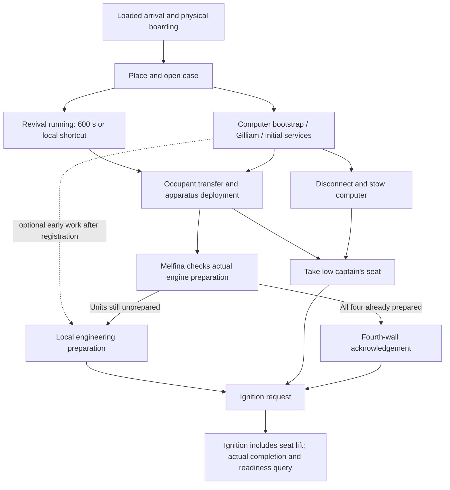

# Phase 1.3 — Player Actions And Readiness Discussion Draft

Status: Phase 1.3 planning accepted and complete, 2026-10-08. No implementation, installation,
model or runtime/fit pass is claimed. The user confirmed publication of this final closeout.

The [accepted closeout](phase-1-3-closeout-audit.md) owns the consolidated current behavior contract.
This file retains detailed selected interactions and discussion history. Where an earlier paragraph
still calls a settled C13 choice or supporting default recommended/open, the closeout supersedes it.
Exact metrics/art/source uncertainty and later implementation contracts remain deferred as recorded.

Closeout review update: C13-01/02/03/05 are now user-selected (post-disconnect presentation,
deferred visible-Melfina registration beat, cap-closure bridge and bounded automatic seal check).
C13-04's revised reverse travel/relocking is also user-selected: only after completed OFF/shutdown,
with no new ribbons, and all-unit readiness revalidated on restart. The user also accepted all seven
supporting defaults, completing the Phase 1.3 planning package. Phase 1.4 remains unstarted.

Inputs: accepted [Phase 1.2 closeout](phase-1-2-closeout-proposal.md), its
[discussion record](phase-1-2-spatial-motion-decision-packet.md),
[slice contract](../reconstruction/baseline-v1/vertical-slice-1.md),
[operational vocabulary](../reconstruction/baseline-v1/operational-state-baseline.md),
[interaction](../architecture/interaction-system.md),
[player/camera](../architecture/player-camera-control.md) and
[shared-command requirements](../architecture/external-control-automation.md).
Evidence remains owned by those source-linked records. No new episode/audio or Japanese review.
All new action rules, interlocks and service assumptions are E/F proposals, not canon.

## Established Constraints

- One physical player and shared ship state across both camera perspectives. Camera changes do
  not change local permissions, progress, carried equipment or occupant state.
- Start inside the facility airlock, doors closed, trunk secured on the back and closed computer
  carried in one hand. Dark hangar, ordered lighting reveal, rectangular lower entry and H03 ascent
  lead to the cockpit; no direct cockpit boarding.
- Manual switchable magnetic boots with mode/contact distinction, a stabilized hatch approach
  and notification when ship gravity becomes available after completed main ignition. Numeric gravity
  and transition tuning remain open.
- Entering-right trunk staging; placed case is player-nonblocking for this demo. Its visible geometry,
  moving machinery, occupant and ordinary route still need fit checks.
- Case code lead `VSDO2C`, reference-inspired revival with a 600 s default and a local second
  interaction to skip remaining revival time. Code interpretation remains track/source-qualified.
- Computer bootstrap at the pilot workspace, basic registration/status, deterministic Gilliam guidance.
  Disconnect/close/stow before seat lift; Gilliam remains available afterward under the agreed adaptation.
- Preparation can overlap revival. All four engineering endpoints, occupied navigation apparatus,
  operating seat position and completed ignition are still required for SHIP READY.
- Guidance cannot complete required local engineering work. No flight, crew AI, damage model,
  numerical power model, general inventory UI or generated dialogue is needed.

## Minimal State And Ownership Proposal

### Laptop Notes, Focused Screen And Local Connection — User-Selected Direction

On 2026-10-08 the user selected the larger focused screen view and the following E/F interaction:

- With Hilda's laptop drawn in hand, an on-demand open/use action opens a larger readable screen
  view. Notes work while disconnected; Connected Device is disabled with a clear disconnected status.
- Hilda's code message is a digital note found/read on the laptop, replacing the separate inventory
  note proposal. Exact wording remains a placeholder; no inventory document viewer is required.
- With the laptop drawn and a supported case/ship connector locally reachable, show a Connect
  prompt. Activating it establishes the physical cable/workspace and opens the focused screen.
  Merely approaching the device does not connect, unlock the case or boot Gilliam.
- Enable Connected Device only after connection completes. Its controls reflect the actual target:
  case authentication versus ship bootstrap/registration. The code is entered through the connected
  laptop, not an invented alphanumeric keypad on the case's three unlabelled controls.
- Provide both an on-screen Disconnect button and a disconnect hotkey, submitting the same action.
  Exact binding remains open. Physical disconnect completion disables Connected Device;
  Notes remain available. Drawing, opening, connecting and bootstrap are distinct states/actions.
- Case opening is followed by a separate Begin Resuscitation prompt, selected by the user.
  The existing 600 s duration and local shortcut remain in force. Laptop connection is not assumed
  to supply the case's revival power or to remain necessary throughout the timer.

Laptop-to-case authentication is an explicit adaptation: the
[EP-01/02 review](../../reference/indexes/episode-01-02-melfina-case-review.md) and re-inspected
EP-01 case frame 04 (21:48.015) show three unlabelled controls and a cabled connector, but do not
establish an external controller's identity or input method. Reusing Hilda's laptop is E/F, not A.
No full desktop, filesystem, browser, hacking minigame or general application framework is selected.

The user agreed closing the focused screen view leaves the physical connection intact. A manual
stow request performs safe disconnect → close → holster as one sequence, preserving the assigned
hand item and reporting actual transition completion rather than making the cable disappear.
The user selected a small connected workspace allowing turning/looking and limited local movement.
An attempt to move beyond cable reach automatically requests the same safe disconnect; movement
continues beyond the workspace after physical disconnect completes. No hard station anchoring or
separate manual-disconnect requirement. Cable reach is an E fit parameter, not measured canon.
This walk-away action does not by itself select automatic holstering or bootstrap completion;
the explicit stow sequence remains distinct. Hands-required actions respect the connected workspace.
Whether explicit Disconnect alone leaves the focused screen open remains open.
One connection target at a time is the proposed default; never switch from case to ship while
silently retaining a stale cable/session.

The user selected disconnect cancellation for an unfinished connected operation: report the attempt
as canceled with readable feedback, preserve no false completion and permit reconnect/retry.
Completed results persist: the case stays unlocked after successful authentication and Gilliam
stays online after completed bootstrap. The rule applies to the shared safe-disconnect action used
by button, hotkey, walking beyond reach and stowing. A canceled operation's stale callbacks cannot
complete it later. Revival already started on the case is independent of the laptop connection
and is not canceled merely by disconnecting it. Fresh-run/reset still restores the initial state.

### Exterior Hatch — User-Selected Independent Actions

During Phase 1.3 discussion the user selected independent exterior opening, boarding and interior
closure rather than an assisted entrance triggered by opening the hatch:

- Jump to a handhold beside the exterior keypad/panel and steady there to operate it.
- Panel interaction opens the hatch without pulling the player inside. The player can remain,
  release toward the opening, or return to the hangar floor while leaving the hatch open.
- An open hatch remains available for a later jump/entry; opening is not a one-shot boarding trigger.
- Once inside, turn back to an interior control to close the hatch. This proposed interior panel
  and its placement are E/F, not newly verified source hardware.
- The user wants closure to contribute to a startup airtightness/pressurization requirement.
  This extends the prior no-required-pressure-check direction; exact service dependencies,
  pressure representation and readiness gating remain for discussion before adopting the contract.

Recommended boundary: track hatch motion/closed endpoint separately from seal-check completion
and any selected pressurization result. A close request is not closure; closure alone does not
prove all ship openings sealed. Do not assume H02/H03/future branches are exterior leaks or silently
implement a whole-ship pressure network. Reopening must invalidate the affected seal/ready result.
No assisted pull-in is selected; low-gravity control, landing support and optional entry-edge
assistance still need fit/feel discussion. Holding the ship during panel use does not require boarding.

The user agreed the separate closed → seal verified → pressure-ready results and reopening
invalidation. They selected an already pressurized, breathable hangar for the opening. The user
cites EP-04's later remote opening of the large facility exterior door to eject attacking pirates
as supporting evidence. This is a user-supplied episode lead, not a newly inspected frame/audio
observation; exact interval and pressure implications still need targeted verification. No new
decompression scene or remote facility-door gameplay is added to the slice.

Under the selected demo premise, the ship's boarded spaces are initially breathable through the
open connection to the hangar. Closing the hatch establishes an independent boundary; do not
portray it as filling an initially evacuated cabin. Recommend the later startup step verify the
seal and acceptable cabin pressure, with conditioning/top-up presentation only if selected.
Numerical pressure, gas transfer and leak simulation remain deferred. Startup gating and the
response to reopening remain D13-09 decisions; reopening into this pressurized hangar does not
automatically mean decompression or immediate engine shutdown.

The user agreed bootstrap and available preparation can proceed with the ship hatch open.
They subsequently revised the earlier seal-before-ignition rule: hatch sealing/pressure readiness
constrains departure readiness, not engine ignition or the startup milestone. Hatch opening supplies
guide lighting only; Gilliam boots exclusively through the bridge laptop connection/bootstrap action.
Once available, Gilliam may report the open hatch and direct the player to its interior panel.
The player may close it immediately, return later, or complete startup with it open. Reopening
invalidates affected seal/departure results without shutting down engines or ship gravity in this
pressurized-hangar demo. Check execution/services and other represented boundaries remain open.

### Startup Milestone And Continued Exploration — User-Selected Direction

SHIP READY means the slice's startup milestone, not a launch clearance or an end-of-demo trigger.
After completed startup the player can leave the captain's seat, walk the included rooms, reopen
the boarding hatch, exit to the hangar and re-enter. No forced ending screen, reset or input lock.
Leaving the seat does not undo the completed seat/lift action or turn off running services.

Keep startup completion distinct from departure readiness. An open hatch or outstanding seal/pressure
check may produce “startup complete; departure readiness incomplete” in cockpit/Gilliam status.
No launch command or full departure checklist is implemented merely to display that bounded warning;
clearing it does not certify all future flight requirements. Other unfinished startup prerequisites
still prevent ignition under the selected contract.

After ignition, gravity applies in the selected ship interior region. Crossing the hatch into the
hangar returns the same player to hangar low gravity; crossing back restores the ship's active field.
An open hatch does not turn off the field throughout the ship. Preserve movement/equipment across
the boundary, including falling/jumping/climbing and magnetic-boot contact. Exact field boundary,
blend and acceleration remain E/F graybox tuning; do not assume a doorway opening changes pressure
or gravity identically. No sudden velocity reset, respawn or mandatory boot-mode change is selected.

### Device Screens And Text Focus — Discussion Update, 2026-10-08

The user agreed the proposed case code screen: visible code field, clickable on-screen keyboard,
Delete/Submit, result text and Disconnect; normal keyboard typing when the field is focused.
Typing captures letter/number/edit inputs and suppresses gameplay hotkeys. Enter submits, Backspace
edits and Escape first exits typing focus without closing/disconnecting. Show a readable focus hint;
keep code characters visible rather than password dots. The exact visual arrangement remains to design.

The user rejected using a similarly generic ship bootstrap screen and supplied the anime's ordered
laptop screenshots. The [focused screen review](../../reference/indexes/episode-04-hilda-laptop-screen-review.md)
records seven images: blue grid/status layout → activation graphic → three/two/one/zero presentation,
with a distinct zero-stage palette. img002/img003 are wider/closer activation views, not automatically
two separate machine states. Use this source-backed visual direction for ship bootstrap; the case
interface is an E/F adaptation and need not duplicate the countdown layout.

The user proposed and selected an additional scripted access-override stage before activation:
on the initial blue-grid/four-box screen, click the top-right panel containing the polygon emblem.
Animate the leftward chevrons toward the smaller left-hand status box and show short fictional
operation messages, for example “Deleting crew manifest” and “Removing security policy files.”
Exact wording/timing remains to review. On actual completion of this stage, show the activation
screen; the player then clicks activation and can pause/resume its countdown with HOLD as agreed.
Connection alone does not start the override, and clicking the override does not instantly boot Gilliam.

This supplies the activity implied by Hilda's typing without a typing challenge, simulated shell,
real malware, exploit or full permission/filesystem model. The
[opening/bootstrap review](../../reference/indexes/episode-04-opening-bootstrap-review.md)
records English-track dialogue at 06:18.29–07:15.58: missing crew records, partially deleted personnel
regulations, recovery offered/declined and crew registration. The exact files deleted by the laptop,
protocol, ownership rights and root/admin privilege model remain unverified. Crew-manifest/security
messages are F presentation, not exact canon transcriptions or proof that Hilda uploaded a virus.
Original-language speech remains unreviewed. This step is ship-specific; it does not replace the
case's normal code authentication.

Apply shared progress/cancellation rules to the override too: disconnect cancels an unfinished
attempt with feedback/retry and stale callbacks cannot finish it. A completed override is a distinct
result from completed bootstrap or registration; do not declare the ship ready from the log text.
Whether completed override is retained on reconnect follows the existing completed-result rule;
fresh run/reset restores initial conditions. Actual registration dialogue/choices remain D13-03.

The user selected mouse-operated ship controls: click the activation control to begin, then the
sequence advances automatically; no code field or on-screen keyboard is required for this ship
screen. Click HOLD to pause the bootstrap operation and its displayed countdown together.
KEY remains a visual element with no action for this slice; do not attach an invented required step.
These control meanings are F adaptations, not verified Hilda input behavior. The user selected
HOLD as a toggle: click again to resume the same operation from its paused point. While paused,
change the HOLD button's color and show a readable paused indicator; restore its normal appearance
when resumed. Exact colors remain to design; state must be legible beyond color alone.
Paused/running/completed results must agree with actual progress. Disconnect cancels an unfinished
operation even when paused, using the existing feedback/retry rule. Pausing bootstrap does not
pause the independent case revival or the whole world. Timing, translations/readability and
post-bootstrap state remain open. This laptop bootstrap is not the later engine ignition key and
does not enable ship gravity. General close/disconnect/equipment inputs remain separate from the
mouse-only device-specific controls.

### Gilliam Registration And Cockpit Pod — User-Selected Direction, 2026-10-08

Follow EP-04's introductory/registration exchange closely, using exact supported wording where
appropriate to the chosen dialogue track and otherwise an explicit one-player adaptation. Present
Gilliam through text and player dialogue choices for now, rather than laptop-only registration forms.
The user selected Gene Starwind as the fixed player identity for this demo; no name entry or
character creator is required. Future player-identity choices remain deferred. Response choices,
pacing and exact script remain to discuss; no voice production
or LLM is required. Original/dub dialogue cannot be called verified from English subtitles alone.

Include Gilliam's ceiling-mounted cockpit housing/display in the slice: initially inactive,
lights/presentation activate after successful laptop bootstrap, and the face/panel animates during
his dialogue and later relevant guidance/status. The user selected a recognizable speaking/reacting
presentation without requiring exact source-matched animation yet. This is a bounded addition to
the previous minimal deterministic guidance scope, not full robot/crew simulation.

The [opening review](../../reference/indexes/episode-04-opening-bootstrap-review.md), OPEN-05/10,
already records the dim overhead housing and illuminated red regions during introduction; its
06:18.29–07:15.58 English-track review owns registration evidence. Detailed expression shapes and
motion/timing still need targeted visual comparison. Keep this overhead cockpit unit distinct from
mobile rail-mounted maintenance robots; those locomotion/AI mechanisms remain future reservations.
Include its physical body/presentation in the cockpit canopy/seat/rail clearance checks rather than
overlaying a face without reserving the housing. Exact mounting/animation asset choice remains later work.

Pod animation reads the shared dialogue/service state; it does not independently boot Gilliam,
complete registration or set readiness. Talking/idle/listening distinctions are possible presentation
choices, not newly verified source modes. Later phase ownership: physical proxy/clearance 3.3/3.4,
bootstrap and text/choice presentation 5.3/5.4, consistent guidance 7.2 and integrated readability 8.2.

The user additionally wants the scene's individual photo/personnel-record beats and Gilliam's
characterful remarks retained, particularly his intrigued reaction to Melfina. They propose using
that recognition to register her before revival completes rather than postponing all registration
until she connects to the apparatus. This is an E/F adaptation; no awake pose or response is required
from the sleeping occupant. Exact snapshot framing/display and Gene reaction remain to discuss.

Rechecked cached EP-04 English ASS: 07:08.74–07:11.34 contains “Oh, my. And who might this be?”,
with a REGISTERED caption spanning 07:08.95–07:12.91 and personnel-recording completion afterward.
The user directly listened to the English performance while watching and confirmed the extended
“interesting” addition, which is absent from the cached subtitles. This is recorded as user-verified,
English-audio-specific A evidence in the opening review's OPEN-13 addendum; the agent has not
listened, exact audio timing/stream is unspecified and Japanese wording remains unverified.
Preserve the intrigued delivery as a demo reference. The scene does not prove hidden knowledge,
biometric identity inference or a canonical database connection to Melfina's case.

Recommended staging: when the case is open/occupant visible, Gilliam's overhead presentation can
notice her, show a personnel-image beat and the intrigued line, then record her with a simple Gene
identification if needed. Exact case-open dependency/fallback remains to select; do not identify an
occluded occupant through an unopened trunk without an explicit adaptation. Registration and
revival/awake status remain separate from actual occupied navigation deployment/availability.

The user selected the exact English-dub wording for Gene's proceed response after Gilliam offers
file recovery: “No, that's not necessary. We are the crew. Obey the orders of the crew”.
Use this wording rather than the earlier assistant paraphrase. The user directly listened to Hilda's
line while watching and verified it; OPEN-14 in the opening review owns the English-dub-specific
A observation and subtitle difference. Reassigning Hilda's line to Gene is an explicit F demo adaptation.
This selects that response, not every other dialogue option or the entire registration script.

The user approved a second response branch at the recovery offer:

- Proceed: the exact dub-derived response above declines recovery and leads to registration.
- Decline immediate registration / attempt recovery: Gene's draft line is “Yeah, try to pull
  yourself together...” Gilliam visibly attempts recovery for a brief interval using text and
  cockpit-pod presentation, then fails. Draft result: “I was unable to recover the missing files,
  would you like to proceed with registration?”
- The recovery-failure prompt offers the simple draft response “Yeah, fine, whatever...” and
  rejoins the same photo/personnel registration sequence. Do not loop recovery indefinitely or
  require another unplanned system to continue.

The added attempt, failure and response wording are F, not anime observations. Deleted files
remain missing; both paths produce the same registration result. This is a deterministic story
beat, not a real file-recovery subsystem or random success/failure roll. Exact added wording and
brief attempt duration remain tunable. Clearly label choices by consequence so declining immediate
registration is not confused with refusing the entire demo.

The user wants this beat to provide useful activity during the independent 600 s revival timer
and a place to expand future crew registration. Do not prolong it to consume the whole timer or
require the timer still to be running: the shortcut/natural completion can occur independently.
Future full-crew registration remains deferred; no extra characters or generalized dialogue
framework are required by this branch.

The user selected resumable registration at Gilliam's cockpit pod. Walking away from the exchange
preserves its current conversation step/branch and completed results. Return to the pod and use
a local resume interaction; do not repeat laptop bootstrap or a completed failed-recovery beat.
At the post-recovery prompt, add “No, hold off for now” alongside “Yeah, fine, whatever...”.
The hold-off choice explicitly suspends registration at that pending decision without marking it
complete. On return, present the saved pending registration choice; do not restart the whole exchange.

Completed bootstrap and available limited services/lighting remain active while registration is
suspended, allowing exploration of the included route. Suspension does not shut Gilliam down,
undo the override, stop independent revival or grant a completed crew record. Dialogue continuation
belongs to the pod, not a mandatory live laptop connection. No save/load persistence is implied;
fresh-run/reset clears pending conversation along with other initial state.
The user selected the pre-registration permission boundary: exploration, laptop/case use and
hatch controls stay available; Gilliam-guided ship preparation waits for completed registration.
Apply that requirement to preparation requests for navigation apparatus, engineering and the
later station/ignition sequence, without switching off completed bootstrap lighting. Case revival
and its shortcut are not ship-preparation permission grants. This is an F demo access contract,
not a canonical security model. Exact resume
prompt and mid-line text/pod-animation handling remain presentation details to resolve.

### Melfina Awakening And Local Transfer — User-Selected Direction

The user selected a player-witnessed apparatus transfer. Natural revival completion or the local
shortcut makes Melfina awake and produces readable notification; she waits at/by the open case
rather than automatically entering or deploying the apparatus while Gene is elsewhere.
If registration is suspended/incomplete, revival may still finish but transfer waits.

After registration completes, Gene returns locally and acknowledges her through a brief dialogue
interaction to initiate the short scripted move into the apparatus. This is F demo staging, not
full companion AI. Preserve low-gravity movement before ignition, the existing case/approach
orientation and clear transfer/machinery paths. Registration, awake status, transfer and deployed
navigation availability remain distinct; acknowledgement alone cannot mark navigation ready.
The user selected local acknowledgement as the start of a coordinated sequence: Gilliam opens
the apparatus cap, Melfina enters through the cleared approach, then descent, cylinder rise and
cover movement proceed automatically. No additional player apparatus-start control is required.
Keep the player free to look around without a forced camera cut. Supported visible stages remain
source-linked; the complete joined choreography, cap closure across cuts, timings and coordination
are explicit E/F choices rather than one verified uninterrupted anime motion. Obstruction/interruption
handling remains to resolve; actual stage endpoints must complete before navigation is available.
Exact waiting pose and dialogue wording remain to discuss. Local
acknowledgement provides a chance to witness the sequence without selecting a forced camera lock
or a rule that prevents the player looking away afterward.

### Engineering Input Style — User-Selected Direction

The user selected contextual clicks/holds for the demo's local per-unit engineering work rather
than direct handle dragging/gestural manipulation. Visit each of the four units and represent
seal removal, release operation and extension/prepared completion with distinct unit progress.
The user refined the inputs: a simple click removes the ribbon seals in a quick ripping motion;
hold interaction grips/turns the handle, then continued mouse hold plus backward keyboard movement
pulls the unit outward, with Gene moving backward along
with it rather than releasing it and waiting for a powered extension from a stand-clear position.
User-supplied motion detail: handle turns 90 degrees clockwise from horizontal to vertical before
the pull. Exact rotation/orientation is a user observation to reconcile with the existing one-unit
review, not a newly measured agent finding. Use a coordinated turn-then-pull presentation.
The user's further refinement requires both sustained grip and backward movement input to extend:
mouse hold alone turns/holds the handle but does not automatically pull. Backward movement begins
the pull only after the release rotation is complete. Exact bindings, movement tuning,
release handling and animation remain to refine. Reject the earlier
assistant hold-to-remove-seals and click-release/stand-clear recommendation.

The guided operator retreat must fit the forward work area with the handle/body/feet, all other
extended units, housing, platform and both camera views. Preserve the same physical Gene and
the held interaction context; do not merely move the camera or allow machinery to pass through
him. A fixed relative pull stance/offset is E/F animation coordination, not demonstrated fit.
No blanket stand-clear prerequisite for the pulling operator; unrelated obstructions still need
the bounded collision/interruption contract. Completion occurs at the actual prepared endpoint.
User-agreed interruption behavior: releasing backward movement pauses the pull while grip is held;
releasing the mouse ends grip and leaves the unit at its current extension for local re-engagement.
No snap or automatic completion. Re-engage locally to finish from the retained extension; the unit
is not prepared until the full endpoint is reached. Detailed turn-interruption and collision handling
remain to discuss/test.

Preserve the reviewed one-unit seal/handle/extension sequence as the source anchor; repeating
the manual treatment on the other three is F, not four independently observed procedures.
Input acceptance is not completed extension. Guidance cannot bypass local actions, and the player
must accommodate the moving sweep while retaining a usable exit route. Upper-row reach still
requires the planned physical fit check; clicks do not authorize remote or through-wall interaction.

The user selected reversible engineering operation after completed main-engine OFF/shutdown:
grip plus forward movement pushes a unit back along the same path; at fully inserted position,
reverse the handle to locked. Do not replace ribbons. Retain partial handle rotation on release
and resume on re-grip; pulling requires the fully released rotation. Forward/backward travel
requires actual occupied path clearance and preserves partial extension when stopped.

Leaving the full prepared endpoint clears that unit's prepared state. Partly extended, inserted
or relocked units cannot pass the same all-four prerequisite used on the first startup. Every ON
request revalidates current states; if any units are unprepared, reject startup with Gilliam and
matching cockpit/status feedback identifying the remaining work. No ignition/lift or running
report on a rejected request. Redeploy locally to restore preparation, without new ribbons or
replaying registration/revival. Historical completed-startup milestone remains true until reset;
it never overrides live validation. Repeat ON/OFF/stow/redeploy is a reusable F simulation contract,
not proof of a canonical reverse commissioning procedure. No stow/relock while main engines run.

Direct manipulation remains a future experiment because its usability depends on control method
and tuning. No drag-input system, physics-grab framework or alternate-control integration is
required now. Later iteration can change interaction presentation while preserving local validation,
unit identities and supported endpoints; it must recheck affected access/motion behavior.

### Ignition-Triggered Seat Lift — User Correction

While directly watching EP-04, the user reports that the seat/control assembly raises only after
the ignition key is turned. This is a user-verified visual ordering observation; exact timestamp
and independent agent motion review are still pending. It supersedes the earlier proposed
take-seat → lift → key order, not every source's seating state.

Gene takes the captain's seat in its low position. With required registration/navigation/all-four
engineering/limited-service preparation complete and computer/cable clear, the ignition-key action
starts full ignition including the occupied seat/control lift. Raised seating is not an input
prerequisite for ignition: it is one actual completed result needed for the startup milestone.
Lift/service/gravity timing within that sequence remains to refine as further scene details are
reviewed; do not mark startup complete merely because the key turns. No separate raise control
or automatic lift on sitting is selected. Preserve post-startup seat exit/continued exploration.

### Guided Engine Discovery And Early-Preparation Branch — User-Selected Revision

The user approved restoring EP-04's discovery order for the normal guided route: registration and
Melfina's preparation/link precede her engine-activation attempt; she reports sealed engines, then
Gilliam directs Gene to engineering for the local work performed by Jim in the scene. Return to
the low captain's seat and use the key for final ignition/lift afterward. Existing source-linked
startup reviews own that ordering evidence; no new independent audio/motion review here.

Revival-period activity normally consists of bootstrap/registration, exploration and optional hatch
checks, not a required engineering detour. The 600 s natural revival and optional shortcut remain;
do not invent chores or pad dialogue to guarantee ten minutes of activity. Guided direction is not
a chronological interaction lock: the user explicitly selected allowing savvy players to prepare
engineering early under the already selected registration/local-access rules, without waiting for
Melfina's report. Neither her link nor the sealed-engine dialogue is a prerequisite for unsealing.

After her actual apparatus link completes, query the real four-unit preparation states:

- If all four are already prepared, replace the sealed-engine report with a playful fourth-wall
  acknowledgement to Gene/the player, then continue toward final ignition without repeating work.
  User-selected starting wording: “uh oh...the engines are sealed! we need to access them now or...oh....wait....you already did that....SOMEONE knows their lore....”
  This is F Easter egg dialogue; retain as the initial version and allow later polish.
- If any units remain unprepared, report the remaining engineering obstacle and direct the player
  to finish those units. Do not claim all are sealed if some have already been prepared, reset
  early progress, or grant the all-four Easter egg for a partial pull/one completed unit.

Melfina's attempted activation/check is distinct from completed engine ignition and cannot bypass
the later key, seat lift or readiness conditions. Gilliam's guidance may direct Gene without adding
mobile rail-robot escort/AI. Trigger the acknowledgement as a bounded dialogue beat, not repeatedly
on status polling. Exact reset/replay and registration/Melfina fallback remain in their existing owners.

For the ordinary fully sealed case, the user directly listened to and supplied Melfina's English-dub
line: “uh oh...the engines are sealed! we need to access them now or they won't work!”
The opening review's OPEN-15 addendum records the user-verified English-audio observation and
subtitle difference; original Japanese, exact stream/word timing and agent listening remain unverified.
Use the selected joke's interrupted report and self-correction to echo this delivery in the all-four-prepared branch.
For mixed unit states, adapt the report to remaining work rather than play either an inaccurate
fully-sealed statement or the all-four-prepared joke. Mixed-state wording remains to polish.

### Occupied Seat Lock And Apparatus Obstruction — User-Selected Direction

The user selected a temporary seat-exit lock while the ignition-triggered seat/control assembly
is moving. Gene must already occupy the low captain's seat to use the key; retain that same body
in the seat through lift motion rather than allowing him to stand/jump into its sweep. Restore
seat exit after the lift reaches its actual endpoint; this is not a permanent post-startup lock.
Camera perspective changes preserve occupancy and cannot bypass the protected transition.
Unexpected interruption/reset must not strand input in a stale seat lock; the bounded recovery
contract still applies. Seat/hull/canopy/rail/equipment fit remains required even though Gene
cannot become a separate walking obstruction during his occupied lift.

Melfina's apparatus can be obstructed by Gene standing over its opening or in the required motion
path. Check before starting the affected stage, and pause an active stage if a new unrelated
obstruction occurs. Gilliam provides a pointed/in-character instruction to move clear, with visible
blocked feedback; no crushing/damage or forceful player teleport. Continue from the preserved stage
once clear rather than skipping completion or restarting revival. Exact line wording remains to write.
Melfina's intended supported entry/descent is not an unrelated obstruction; the player may look
around normally and is not camera-locked to the apparatus. Spatial proxies must determine the
actual opening/sweep exclusions rather than flagging everyone merely near the apparatus.

### Reversible Ignition Key And Retained Completion — User-Selected Direction

The user selected physical key presence and switch position as distinct states:

- A local hotkey inserts the ignition key; the same hotkey removes it. Exact binding remains open.
- With the key inserted, click to turn OFF → ON and initiate the selected full startup.
- Click again for ON → OFF, allowing a bounded shutdown and lowering the seat/control assembly.
- Retain the same seated Gene and temporary seat-exit lock through both raising and lowering;
  restore exit at the actual motion endpoint. Conflicting key/seat transition requests need readable
  in-progress feedback rather than overlapping lift motions.

This is an explicitly user-authorized expansion from one-way ignition to reversible demo operation,
not a complete canonical shutdown/storage procedure. Key turn acceptance is not finished startup,
shutdown or seat travel. First startup still requires completed local preparation.
The user selected key removal only when OFF and shutdown/occupied lowering have actually finished.
While startup or shutdown is in progress, another toggle click leaves the current sequence unchanged
and reports “transition in progress”; no queued reversal or overlapping lift motion. Once complete,
normal OFF/ON switching is available again. Removal attempts while ON or transitioning give readable
unavailable feedback rather than emergency cutoff. Immediate key-removal shutdown and emergency
recovery are explicitly deferred; these F demo rules are not canonical ignition interlocks.

Preserve a per-run “full startup completed” milestone once the whole successful sequence is actually
complete, even when the player later switches OFF and explores/restarts. Live engine/services,
gravity, seat position and departure warnings still report current state: the historical milestone
does not force them to remain ready/running after shutdown. Fresh run/reset clears the milestone;
no save-file achievement persistence is selected. Repeated ON/OFF uses current prepared mechanisms
under the eventual shutdown contract rather than automatically reapplying seals or revival timers.

The user agreed bounded OFF behavior: main services/ship gravity go offline and seat lowers,
while Gilliam and limited lighting persist from the early-service assumption. Preserve engineering
preparation and completed case/registration state. Restart does not repeat the introduction,
revival or seal removal. Detailed shutdown timing and gravity change during occupied lowering
still need review; apparatus retention is selected below and no full storage reversal is selected.

The user selected Gilliam narration for graceful ON → OFF transitions, reflecting the reversal of
startup's post-key service reports and the return to the non-full-power state. Derive a bounded
shutdown script from the source-linked startup vocabulary; reversed narration, exact order and
words are F unless separately verified in a shutdown scene. Each report must reflect the actual
transition/progress/completion, not cause a second state change or announce a service offline
before it is. OFF initiates a shutdown sequence rather than instantaneously cutting every supply.
The user selected shutdown ordering: retain sufficient services and ship gravity while lowering
the occupied seat/control assembly; after its actual low endpoint, withdraw ship gravity and
settle into limited lighting/Gilliam operation. Do not lose gravity midway through seat travel.
Final shutdown completion/key-removal availability follows the completed transition, not merely
the low-seat endpoint. Detailed durations and individual service reports remain to refine/test.
Use current state to
avoid reporting nonexistent transitions on duplicate requests. No damage, emergency cutoff,
reactor cooldown model, storage seals or universal reverse-startup assumption is introduced.

The user selected keeping Melfina's apparatus deployed and physically linked through bounded OFF,
with a degraded low-power presentation: reduced/darkened internal illumination and a subdued/drooping
occupant pose, recovering her normal presentation as main services return on restart. No automatic
descent/retraction, exit, renewed resuscitation or registration replay. Physical linkage/retained
preparation is distinct from full navigation operating availability; report the reduced-power state
truthfully rather than a disconnected occupant or full-ready navigation while main services are off.

Reference: the user cites EP-11's gravity-missile disruption, key cutoff and restart as showing pod
light loss and Melfina becoming droopy then perking up. The
[EP-11 review](../../reference/indexes/episode-11-subether-review.md) establishes cutoff/auxiliary/
restart context. The user then supplied exact comparison screenshots, inspected directly and
recorded in that review: OFF is dimmer but still blue/green-lit, eyes closed and hands relaxed/lowered;
ON is brighter with open eyes and more lifted/spread fingers. Use that subdued contrast rather
than a fully black pod or collapsed occupant. Continuous transition motion/timing remains unverified.
Applying it to graceful limited-power OFF is E/F, not proof
that every canonical shutdown has the same effects. No health damage, incapacitation timer or
sub-ether/emergency incident simulation is added. Exact pose/brightness and transition timing remain
to review; retain enough readable presentation for continued exploration.

### Internal Ladder — User-Selected Controls

The user selected a local interact action to grab the internal lower-entry/main-passage ladder.
Temporarily auto-stow a drawn laptop using the existing safe disconnect/close/stow contract if
needed, retaining its hand-slot assignment. Hold forward/backward movement to climb up/down;
releasing movement stops Gene on the ladder. At either endpoint, a short assisted step-off ends
the climb and restores the previous draw state when hands/current context permit. No midway
jump-off in this demo. Preserve the same physical body and back-mounted trunk, both camera views
and actual loaded clearance rather than teleporting equipment through the hatch. Exact bindings,
climb speed, endpoint animation and obstruction/reset recovery remain to tune/test.

### Optional Empty-Trunk Cleanup — User-Selected Direction

After Melfina has physically left the trunk, allow a local close interaction, then reattach the
closed empty trunk to Gene's back using the existing carrying behavior. Carry it out through the
normal ladder/hatch route and set it down at a marked hangar staging spot using the placement
interaction already required in the cockpit. No deletion/disposal, hidden cargo room, prop shrinking
or cleanup minigame. The trunk remains an accounted-for object at its new location.

Cleanup is optional and never a startup/readiness prerequisite. Leaving the open case in the
cockpit retains the agreed demo nonblocking-player exception. Do not enable pickup/closure while
revival runs or while Melfina remains inside; availability follows actual occupant departure, not
timer completion alone. Test closed-case handling on descent, exterior exit/re-entry and the
ship/hangar gravity boundary, with both camera views and hand-item auto-stow. Empty does not
reduce its geometric envelope. Extra material/weight simulation is not required.

The user approved this bounded handling addition; exact hangar marker placement and prompt/carry
timing remain E/F fit/presentation choices. No additional inventory/storage system is implied.

### Hand Slot And Draw/Stow — User-Selected Direction

The user selected this F equipment behavior during Phase 1.3 discussion on 2026-10-07:

- Keep the item assigned to a hand slot distinct from whether it is drawn in the hand. The portable
  computer can remain the equipped hand item while physically stowed in its agreed holster.
- Provide an on-demand draw/stow hotkey during ordinary play, without opening an inventory menu,
  unassigning the slot or requiring a contextual interaction point. Exact binding remains undecided.
- Keep the assigned item's HUD icon visible while stowed; separately indicate drawn/stowed status.
  Temporary hands-required restrictions must not look like the item was unequipped or lost.
- Actions needing both hands may temporarily auto-stow the drawn item. Retain its slot assignment
  and account for its physical storage throughout climbing or other protected transitions.
- This distinction should support future hand items, including weapons; it does not add weapons,
  multiple equipment slots, item swapping or a full inventory UI to this slice.

Workspace/connected computer use remains a distinct physical context: the draw/stow hotkey must
not teleport a connected computer or cable into the holster. Disconnect/close/stow handling and
feedback for unavailable draw requests during protected actions still need discussion.
The user also selected restoration of the pre-action draw state: after a hands-required action,
automatically redraw an item that was drawn before temporary auto-stow; leave a manually stowed
item stowed. Restore only when the current physical context permits drawing, without bypassing
another hands-required action or a connected/workspace state. HUD styling and transition timing
remain proposals.

These are descriptive fields, not C++ names, APIs or a universal simulation framework. Exact
implementation ownership and presentation technology belong to Phase 1.4.

| Domain | Minimum information to distinguish | Initial draft condition / boundary |
| --- | --- | --- |
| Player context | Physical location, exploration/climb/station/seated context; assigned hand item, drawn/stowed status and temporary hands-required restriction | Exploration; trunk back-carried, computer assigned and drawn. Initial boot mode ON selected; contact requires suitable surface. |
| Player condition | Supported initial healthy condition | No damage, numerical health, oxygen, stamina or equipment battery drain introduced. |
| Environment | Facility lighting sequence, local gravity availability, suitable contact surfaces, bounded atmosphere status | Facility lights off; pressurized/breathable hangar selected; low-gravity premise. Stable walk is F boot-assisted tuning, not boots generating gravity. |
| Access | Each chosen door/hatch state and traversability; selected hatch closure and prospective seal-check result kept separate | Facility doors closed; selected ship entry closed. Independent opening/boarding/interior closure agreed; startup pressure contract pending. Keep unrelated hatch identities distinct. |
| Trunk/occupant | Carried/placed, locked/open, revival not started/running/complete, occupant transfer/apparatus location | Locked, inactive occupant. These states do not equal navigation availability. |
| Computer/Gilliam | Held/stowed/workspace, cable connected, bootstrap progress, Gilliam available, registration progress | No live ship session. Computer's independent operating supply is qualitative E; no capacity model. |
| Ship services | Guide lighting, limited bridge services, machinery-service availability, gravity availability, main-service startup/available | Main services unavailable. Initial guide-light and pre-main machinery source are proposed below, not verified wiring. |
| Apparatus/seat | Supported physical stages and actual completion | Apparatus stowed; seat group low. Occupant, cap, cylinder and covers tracked separately rather than one instant boolean. |
| Engineering | Each of four units' wrapping/release/extension/prepared progress | Banded/closed. Project IDs do not establish exterior-engine mapping or canonical numbering. |
| Readiness | Required conditions met/missing, ignition pending/running/complete, aggregate ready | Preparing/incomplete; never a separately editable UI flag. |

The HUD reads player condition, boot mode/contact, assigned hand item and distinct drawn/stowed status, plus relevant action/result
feedback. Gilliam reads the same services/mechanisms/readiness. Neither maintains a competing state.

## Initial Services And Gravity — Recommendation For Discussion

Use a bounded commissioning-service assumption, separate from main engine ignition. Facility controls,
personal boots, the portable computer and the revival case can operate without the ship's main engines.
Opening the ship entry makes low-level guide lighting available. Computer bootstrap then enables
limited bridge interaction and the service capability needed to prepare machinery. This explains
pre-main access without inventing battery chemistry, wattage or canonical bus names.

**User-selected gravity milestone:** ship gravity stays offline throughout preparation and becomes
available after completed main ignition, announced by Gilliam. Laptop bootstrap enables limited
services, not gravity. Use boots for controlled grounded preparation; boots-off movement can drift
in low gravity. Facility/hangar remain low gravity. Boots stay manually controllable; do not silently
change their switch setting when gravity comes online. Enabled boots attach only on suitable contact.

The user corrected their scene citation to EP-04, 10:05–10:07 and 11:54–12:00, describing Jim's
low-gravity movement through the ship. These are user-supplied visual leads pending a targeted
motion review; the subtitle cache aligns the latter with engineering work but cannot prove drifting.
Keep the original EP-03 citation superseded. Reactor/main-power support for artificial gravity is
an E/F reconstruction rationale, not a verified canonical power requirement. The earlier proposal
to enable gravity at bootstrap is rejected. Melfina's short pre-ignition transfer must also account
for low gravity; do not silently supply normal gravity only for her animation.

Boundary transitions must preserve the same player and equipment. Recommend a brief controlled
gravity blend, with stable footing before station interactions; exact blend and numeric jump/gravity
tuning are later graybox parameters. No new required gravity-generator button or pressure simulation.

## Draft Normal-Path Action Table

“Local” requires the relevant physical actor/context; an on-screen prompt alone cannot grant access.
Rows marked with D13 refer to the unresolved discussion queue. Completion is an actual state/motion
endpoint, not merely an accepted request. Order permits the stated parallel preparation branch.

| ID / action | Local context and proposed prerequisites | Completion / feedback | Open choice |
| --- | --- | --- | --- |
| A13-01 Inner facility door | At door control, exploration, no obstructed door sweep | Door reaches traversable endpoint; outer door remains closed | D13-02 interaction style; no pressure check added |
| A13-02 Hangar lights | At nearby switch; facility supply assumed available | Near-to-far overhead sequence then ambient lights; progress remains readable while walking | Reveal pacing later tuning, not a camera lock |
| A13-03 Boot toggle | Player equipment action; cannot detach during a protected climb/handhold transition | Mode change reported separately from attached/no contact | D13-02 timing/binding; numeric locomotion deferred |
| A13-04 Jump/steady at ship entry | Boots disengaged for jump; reachable handhold; loaded body fits | Stable hatch-control context; release/return to hangar or enter separately | D13-02 movement/entry feel; opening never auto-boards |
| A13-05 Exterior hatch | Local exterior panel while supported by handhold/stance; clear sweep | Opening complete; remains open for independent later entry; guide lighting available under service proposal | D13-01 supply assumption; exact hatch path remains E |
| A13-05b Interior hatch closure | At proposed interior panel; hatch sweep clear; player has independently entered | Actual closed endpoint; separate seal/pressure check may clear the represented departure warning | D13-09 check/service behavior; closure does not gate ignition |
| A13-06 H03 ascent | Local interact grabs ladder; loaded route fits; laptop temporarily auto-stows as needed | Hold forward/backward climbs; release stops; assisted endpoint step-off; previous draw state restored when permitted; no midway jump-off | Climb tuning, actual fit and recovery remain open |
| A13-07 Place trunk | At designated cockpit marker, carrying closed case | Case staged; no pickup during revival/occupancy. After Melfina leaves, optional close/back-carry and placement at marked hangar spot | Return-route fit and marker/prompt details remain to tune |
| A13-08 Unlock/open case | Placed case, drawn laptop connected locally, code read from laptop note and entered through Connected Device | Lock released after valid entry; case opening reaches endpoint; wrong entry gets feedback | Exact code-entry widget, opening action and post-authentication disconnect handling remain open |
| A13-09 Start revival | Separate local Begin Resuscitation interaction after case open; occupant inactive | 600 s simulation-time progress; case cannot be carried/closed while running; awake is not navigation ready | Menu alone does not pause; explicit sim pause and optional focus-loss pause freeze progress |
| A13-10 Revival shortcut | Local case control only while running | Remaining time skipped; same completion/transfer path, other prerequisites unchanged | Clear demo label; no instant all-systems completion |
| A13-11 Computer setup/connect | Laptop drawn; supported case/ship connector locally reachable; no conflicting connection | Connect prompt establishes cable/workspace, opens focused screen and enables target-specific Connected Device controls | Notes/open-on-demand work disconnected; exact input and setup motion remain open |
| A13-12 Bootstrap/register | Bootstrap from connected bridge laptop; subsequent text/choices through cockpit pod; hatch need not be closed | Bootstrap enables Gilliam/limited lighting without gravity; registration suspends/resumes at saved pod step without undoing bootstrap | Exploration/laptop/case/hatches available before registration; ship preparation gated; hold-off is not completion |
| A13-13 Disconnect/close/stow | Disconnect inputs share action; walking beyond workspace safely disconnects; stow requests disconnect/close/holster | Cancel unfinished attempts, retain completed results; explicit disconnect keeps focused Notes view; walk-away closes view/keeps laptop drawn; stow holsters without unassigning | Cable distance/transition presentation deferred |
| A13-14 Engineering wrapping/release | Local unit; registration complete, applicable services available; click removes ribbon seals, hold initiates handle turn/pull | Quick seal-removal endpoint and separate release/rotation progress; no prepared flag yet | User's 90-degree clockwise detail needs reference reconciliation; other-unit repetition F |
| A13-15 Engineering extension | Mouse grip held after handle rotation plus backward keyboard input; coordinated retreat fits; unrelated obstruction absent | Releasing backward pauses with grip; releasing mouse lets go at retained extension; re-grab to finish; only full endpoint prepares unit | Turn interruption and D13-08 obstruction behavior remain open; no operator stand-clear step |
| A13-15b Engineering stow/relock | Main engines OFF and shutdown complete; local grip plus forward input and clear occupied path | Push back, relock handle at full insertion; any departure from full prepared endpoint clears unit readiness; partial turn/travel retained | Reverse operator-path/handle fit and timing still require proof |
| A13-16 Occupant transfer | Revival/registration complete; Gene locally acknowledges Melfina; required services and opening/approach clear | Gilliam opens cap before Melfina's short low-gravity entry; she waits by case beforehand | Waiting pose/dialogue and obstruction handling remain open |
| A13-17 Apparatus deployment | Coordinated local start; cap opened, occupant enters; clear stages/services | Descend clear, cap closes, cylinder rises/covers move automatically to actual available endpoint; blocked stage waits/resumes; camera retained | Joined choreography F; exact timing/fit later |
| A13-18 Take station | Low captain's seat accessible; computer/cable clear for ignition/lift | Gene seated in low position; sitting does not raise assembly | Seat entry/exit presentation remains to refine |
| A13-19 Ignition | Gene occupies low-seat pilot key; registration/navigation/all-four/services prepared; occupied lift fit valid; hatch check does not gate ignition | Key starts ignition/lift; seat exit temporarily locked during motion and restored at endpoint; actual completion required for startup milestone | Internal timing/recovery remain to refine; no circular raised-seat prerequisite |
| A13-20 Ready report | Derived query after actual ignition completion and all eight conditions | SHIP READY startup milestone; keep playing, leave seat and explore/exit/re-enter; separate departure warning if hatch open/check outstanding | Actual startup and departure results remain distinct; no launch action required |

Normal guidance waits for Melfina's deployed/link check to reveal engineering intervention;
optional early engineering remains available after registration while revival progresses. A13-16/17
wait for revival; A13-19 waits for completed navigation and all-four preparation. Navigation completion
is not timer completion. This is a partial-order experience, not one global ship state ladder.

Diagram shows recommended dependencies for discussion, not accepted interlocks. Starting revival
before bootstrap is supported by the proposed independent case supply, not a discovered canonical
power circuit. Whether engineering extension specifically needs initial services is still a choice.

## Request, Progress And Recovery Rules — Draft Defaults

- Validate target, local context, equipment, prerequisites and occupied sweep before beginning an
  action. Report rejected/unavailable with the actual reason; do not advance state on rejection.
- Repeating an already completed request reports its existing result without repeating motion,
  removing wrapping twice or duplicating registration/occupants. Repeating a running request reports
  progress rather than starting another operation. Exact result/API names remain for 1.4.
- Serialize conflicting actions on the same mechanism. Parallel independent revival and preparation
  is allowed; key ignition cannot race missing preparation into a ready result.
- Recommend single-press initiation for most controls, with progress until a real endpoint.
  Walking away closes optional UI but does not automatically reverse a started mechanism or pause
  revival. Hold-to-work and deliberate mechanical gestures remain D13-02/06 discussion choices.
- Before motion, block a start if the relevant sweep is occupied. During motion, recommend a
  non-damaging pause with “clear the mechanism” feedback, preserving intermediate state and
  resuming only when clear. No crushing, health damage, repair or arbitrary teleportation. Exact
  behavior for carried player/occupant inside a supported motion is separate from an obstruction.
- Climb, station lift and occupant transfer need a defined protected transition/cancel boundary;
  no mid-shaft drop or automatic camera-mode workaround. Camera changes cannot bypass it.
- Revival keeps progressing after the player leaves, and cannot be canceled/restarted through a
  duplicate activation. The user selected preventing case carry and lid closure while revival runs;
  this is F demo usability, not a general canonical medical model.
- The user replaced the earlier menu-triggered pause setting: opening the pause menu always leaves
  an already-running simulation running. Include an explicit **Pause Sim / Resume Sim** button
  that toggles simulation time/progress. Opening/closing the menu alone neither pauses nor resumes
  a sim already explicitly paused. Apply sim pause consistently to timers/motion, not just revival;
  laptop HOLD remains an independent local operation pause. The UI remains usable while sim paused.
- The user also selected an in-game **Pause/Resume Sim hotkey**, without opening the menu.
  Hotkey and menu button share the same manual sim-pause action/state. Exact binding remains open;
  respect laptop text-entry/UI focus so typing cannot inadvertently toggle simulation pause.
  Provide readable paused/running status even when the menu is closed. Focus-return behavior must
  preserve a manual pause initiated through either control.
- The configurable option is **Automatically pause on focus loss**, covering Alt+Tab and similar
  app focus changes. The user selected default enabled and automatic resume on focus return only
  when focus loss caused the pause. If disabled, focus loss alone leaves the sim running. A sim
  manually paused through hotkey/menu stays paused across focus changes; focus return cannot
  clear that manual pause. Setting persistence remains a later configuration choice.
  No offline progress while the app is closed
  or saved-state persistence is selected.
- Menu input owns keyboard/mouse regardless of simulation pause policy. Recommend releasing
  gameplay hold/grip input on menu entry rather than latching engine-pull/movement commands;
  returning requires fresh input. This input-release rule is accepted in the closeout. Automatic operations may finish and leave results/notifications
  pending while simulation continues. Validate with seat locks, low-gravity movement and apparatus
  obstruction; no secret world freeze just because the menu is open or false completion. Exact player
  motion/menu treatment remains to refine.
- On a fresh run/reset, restore doors, lights, equipment, case lock/timer/occupant, computer session,
  services/gravity, four units, apparatus, seats, ignition and ready result. Prior callbacks cannot
  complete new operations. Save/load, checkpoints and universal shutdown remain deferred.

## Eight Readiness Conditions — Observable Draft Mapping

| Baseline condition | Required observable result | Must not count as completion |
| --- | --- | --- |
| 1 Entry and route | Selected physical entry completed; required bridge/engineering route usable | A remote command or marker claiming the player boarded |
| 2 Initial services | Selected bootstrap/service result completed and usable | Connected cable alone or a highlighted switch |
| 3 Navigation apparatus | Actual occupied deployed/available apparatus endpoint | Case open, timer finished or Melfina awake alone |
| 4 Engineering | All four independent prepared endpoints complete | One demonstrated unit, all-four request acceptance or guidance text |
| 5 Seat/control cluster | Operating endpoint complete with valid context during startup; afterward the player may leave the seat without undoing completion | Entering seat UI while lift still moving; requiring permanent seat occupancy after success |
| 6 Ignition | Key/startup action completes and main-service/engine/gravity presentation agrees | Key press or start of animation; hatch-open departure warning treated as failed ignition |
| 7 Consistent report | HUD, Gilliam and status query read the same completed aggregate | UI-owned ready flag or scripted congratulation bypass |
| 8 Supported endpoint | Ship remains supported in hangar; startup success leaves exploration and exit/re-entry available | A launch command, forced demo ending or countdown needed to finish |

Readiness is F and does not certify future weapons, flight or sub-ether capability. Health/boot mode
is not another arbitrary ignition prerequisite. Required stow and local access protect the chosen
operation, not an invented universal ship safety regulation.
Route usability and the supported hangar pose are spatial acceptance invariants as well as operating
constraints; do not invent a runtime “geometry passed” switch to replace actual traversal evidence.

## Discussion Queue For The User's Return

Discuss these in experience order; recommendations are starting points, not choices already made.
Exact key bindings, art style, timings and metric locomotion can follow the behavioral decisions.

| ID / topic | Recommendation to discuss | Material alternative / effect |
| --- | --- | --- |
| D13-01 Initial services and gravity | User selected low gravity throughout preparation, ship gravity available after completed main ignition and Gilliam notification; boots stay manually toggled. Laptop bootstrap supplies limited services without gravity. | Qualitative supply assumptions, exact gravity blend/tuning and low-gravity occupant-transfer staging remain to resolve. EP-04 motion leads are recorded, not yet visually verified. |
| D13-02 Boarding and everyday actions | Manual hand-item draw/stow, temporary auto-stow/restoration and laptop handling selected. Internal ladder: interact to grab, forward/backward climbs, release stops, assisted endpoint step-off, no midway jump-off. | Binding/speed/animation, loaded fit and protected-action recovery remain to tune/test; laptop-specific choices in D13-04. |
| D13-03 Gilliam registration | Gene fixed identity; scene-faithful text/choices, animated pod/photo beats and Melfina recognition. Exact proceed line; optional failed recovery branch. Walk-away/hold-off resumes at saved pod step with bootstrap lighting active. Before completion, exploration/laptop/case/hatches allowed; guided ship preparation gated. | Remaining script/pacing, Melfina visibility fallback, mid-line presentation and pod reference/clearance remain open. Future identity/full crew deferred. |
| D13-04 Case and code | Laptop/code/connection and separate revival rules selected. Menu leaves sim running; shared manual Pause/Resume Sim button/hotkey. Focus-loss auto-pause defaults ON; return resumes only focus-caused pause, never manual pause. | Note/layout/timing, post-disconnect screen/draw state and settings persistence remain open. |
| D13-05 Melfina and apparatus | Notification, waiting by case and local acknowledgement after registration selected. Gilliam opens cap, Melfina enters, automatic descent/rise/cover sequence follows with camera control retained; no separate player start control. | Waiting pose/dialogue, cap closure bridge, stage timing and obstruction/interruption handling remain open. |
| D13-06 All-four engineering workflow | Click seals; grip/turn then backward pull. Partial turn/travel retained. After completed OFF, grip/forward pushes and inserted handle relocks; no new ribbons. Every startup checks all-four current prepared endpoints; failed restart reports missing work. Other three repeated procedures F. | Collision/tuning, rotation reconciliation and occupied/upper-row/reverse reach fit remain open. Free-form dragging deferred. |
| D13-07 Seat and ignition | Insert/remove hotkey; click OFF/ON; occupied lift/lowering lock. Remove only after completed OFF; no mid-transition reversal. Lower seat with gravity/services retained, then withdraw gravity and settle to limited lighting/Gilliam. Preparation/registration/milestone persist; Melfina remains deployed with reduced-power presentation. | Detailed service reports, pose/brightness and durations remain open; source timing review pending. Emergency cutoff deferred. |
| D13-08 Interruptions and presentation | User selected temporary seat-exit lock during occupied lift, restored afterward; Gene can block apparatus opening/sweep, with pointed Gilliam feedback and pause until clear. No damage/teleport; preserve motion stage. | Exact lines, blocked/resume presentation, unexpected interruption/reset behavior and fit remain to verify; no damage system introduced. |
| D13-09 Hatch sealing and pressurization | Independent opening/entry/interior closure and seal/pressure results agreed. Hangar breathable. Hatch/check results gate represented departure readiness, not ignition; reopening updates that warning without shutting down engines/gravity. Startup success allows continued exploration and ship/hangar gravity transitions. | Decide check execution/services, represented boundaries and status wording. No whole-ship pressure network, launch system or exact gravity-field shape selected. |

First discussion recommendation: boarding/control feel and gravity, then case/registration/Melfina,
then engineering and final station/key. The dependent rows remain drafts until those choices are made.
Resolve D13-09 with initial-service dependencies before freezing the ignition/readiness contract.

## Validation To Specify After Discussion

Planned scenarios, not executed tests: boot ON/no contact versus attached; loaded boarding in both
views; laptop Notes readable offline, Connected Device disabled offline, proximity alone causes no
connection, Connect opens focused target screen, disconnect disables device controls, case versus
ship target remains correct and no stale session survives disconnect/reset;
closing the screen preserves connection; both disconnect inputs share behavior; stow completes
disconnect/close/holster in order while preserving slot assignment;
turning/looking and local movement within cable reach keep connection; walking beyond reach safely
disconnects before departure without completing an unfinished device operation;
open hatch without boarding, return to hangar and later re-entry, interior closure and blocked
closure, separate seal/pressure completion and invalidation on reopening;
computer physically accounted for through climb/stow; manual draw/stow keeps slot assignment
and HUD icon, temporary auto-stow preserves assignment and respects connection/context restrictions;
post-action restoration redraws a previously drawn item but leaves a manually stowed item stowed;
wrong code; duplicate start/skip;
600 s natural completion and separate shortcut; prep overlapping revival; all-four local completion;
blocked transfer/sweep and clear/resume; no ignition while prerequisites incomplete; consistent
in-progress/completed readiness; fresh reset during timer/motion/ignition with no stale completion.
Also verify successful ignition with hatch open, separate departure warning, seat exit after startup,
continued traversal, hatch reopen/close and exit/re-entry through the active-ship/low-gravity-hangar
boundary in both views. Startup completion must not end play or make the seat permanently occupied.

Laptop-specific checks: text focus suppresses gameplay hotkeys, Escape releases text focus first,
typed and clickable case input share validation; override needs an explicit click and completes
before activation; HOLD freezes/resumes bootstrap progress with consistent visual state without
pausing independent revival; cancel during running/paused override or bootstrap cannot complete
later; completed results persist on reconnect. Registration checks include Gene's fixed identity,
pod power-up/dialogue presentation and separate personnel-record versus navigation availability.
Also run normal Melfina-first discovery, all-four early preparation and partial early preparation:
guidance/acknowledgement must match actual units, preserve early work and still require the key
for ignition. Completing a partial pull or one unit must not trigger the all-four Easter egg.
Both direct and recovery-attempt paths must reach the same registration result, preserve missing
files and keep revival independent; no endless recovery loop or false registration completion.
Walking away and explicit hold-off must preserve the branch/current step and completed bootstrap
lighting, allow exploration, and resume at the pod without repeating completed operations. Pending
registration is not a completed crew record; fresh reset clears the conversation checkpoint.
Seat-exit attempts during lift must not release Gene into the sweep; exit returns at the actual
endpoint and reset cannot retain stale locks. Standing over the apparatus blocks the affected
stage with Gilliam feedback; moving clear permits continuation without false completion/damage.
Before-registration access checks must permit exploration/laptop/case/hatch actions and reject
ship-preparation requests with readable registration-needed feedback; guidance cannot bypass it.
Revival finishing while Gene is away or registration is suspended must notify and leave Melfina
waiting, without automatic apparatus deployment. Local acknowledgement after registration initiates
transfer; navigation availability still requires completed apparatus stages.
Reversible-operation checks must cover key presence versus OFF/ON position, occupied lowering/raising,
partial engineering pause/re-grab, main-service/gravity changes with limited lighting/Gilliam retained,
Melfina's deployed reduced-power/recovery presentation, and current status separate from retained
per-run startup completion. Restart must not repeat registration/revival/seal removal; fresh reset
clears the completion milestone and restored states. Reject key removal while ON or transitioning;
mid-transition toggle clicks must not queue reversal or overlap motion, and key removal becomes
available after actual OFF/lowering completion. Pending timing rules still need review.
Check menu-open simulation progress, shared menu-button/in-game-hotkey Pause/Resume Sim, text-focus
suppression of the gameplay hotkey, and focus-loss auto-pause enabled/
disabled: revival/motion obey actual pause state, UI remains usable, menu input cannot issue gameplay
commands and engineering pull does not continue from latched input. Focus return must not undo a
manual pause. Case carry/closure rejects during revival without resetting it.

Use existing VS/VS1 validation owners in the implementation plan; Phase 1.4 will set concrete
procedures and manual/automated evidence arrangements. No runtime acceptance test is complete from this planning.
VS-D04–06 have accepted bounded planning contracts in the closeout; these statements do not claim
runtime or fit validation. Phase 1.4 remains unstarted and requires explicit authorization.
