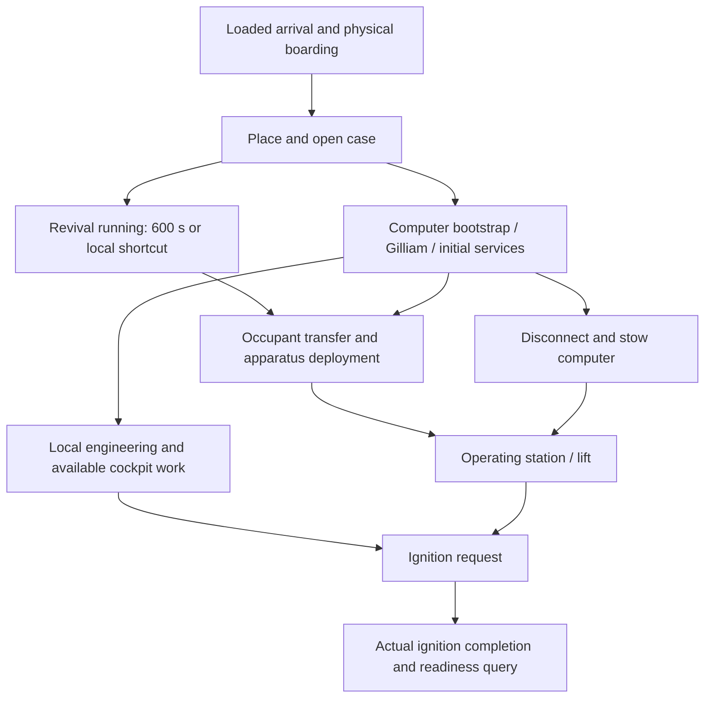

# Phase 1.3 — Player Actions And Readiness Discussion Draft

Status: authorized preparation in progress, 2026-10-07. The user asked for independent draft work
and a prepared discussion queue while away. New recommendations below are **not accepted**.
No implementation, installation or model is authorized by this preparation. The user confirmed
publication of the current discussion checkpoint; that does not accept the remaining recommendations
or complete Phase 1.3.

Inputs: accepted [Phase 1.2 closeout](phase-1-2-closeout-proposal.md), its
[discussion record](phase-1-2-spatial-motion-decision-packet.md),
[slice contract](../reconstruction/baseline-v1/vertical-slice-1.md),
[operational vocabulary](../reconstruction/baseline-v1/operational-state-baseline.md),
[interaction](../architecture/interaction-system.md),
[player/camera](../architecture/player-camera-control.md) and
[shared-command requirements](../architecture/external-control-automation.md).
Evidence remains owned by those source-linked records. No new episode/audio or Japanese review.
All new action rules, interlocks and service assumptions are E/F proposals, not canon.

## Established Constraints

- One physical player and shared ship state across both camera perspectives. Camera changes do
  not change local permissions, progress, carried equipment or occupant state.
- Start inside the facility airlock, doors closed, trunk secured on the back and closed computer
  carried in one hand. Dark hangar, ordered lighting reveal, rectangular lower entry and H03 ascent
  lead to the cockpit; no direct cockpit boarding.
- Manual switchable magnetic boots with mode/contact distinction, a stabilized hatch approach
  and notification when ship gravity becomes available after completed main ignition. Numeric gravity
  and transition tuning remain open.
- Entering-right trunk staging; placed case is player-nonblocking for this demo. Its visible geometry,
  moving machinery, occupant and ordinary route still need fit checks.
- Case code lead `VSDO2C`, reference-inspired revival with a 600 s default and a local second
  interaction to skip remaining revival time. Code interpretation remains track/source-qualified.
- Computer bootstrap at the pilot workspace, basic registration/status, deterministic Gilliam guidance.
  Disconnect/close/stow before seat lift; Gilliam remains available afterward under the agreed adaptation.
- Preparation can overlap revival. All four engineering endpoints, occupied navigation apparatus,
  operating seat position and completed ignition are still required for SHIP READY.
- Guidance cannot complete required local engineering work. No flight, crew AI, damage model,
  numerical power model, general inventory UI or generated dialogue is needed.

## Minimal State And Ownership Proposal

### Laptop Notes, Focused Screen And Local Connection — User-Selected Direction

On 2026-10-08 the user selected the larger focused screen view and the following E/F interaction:

- With Hilda's laptop drawn in hand, an on-demand open/use action opens a larger readable screen
  view. Notes work while disconnected; Connected Device is disabled with a clear disconnected status.
- Hilda's code message is a digital note found/read on the laptop, replacing the separate inventory
  note proposal. Exact wording remains a placeholder; no inventory document viewer is required.
- With the laptop drawn and a supported case/ship connector locally reachable, show a Connect
  prompt. Activating it establishes the physical cable/workspace and opens the focused screen.
  Merely approaching the device does not connect, unlock the case or boot Gilliam.
- Enable Connected Device only after connection completes. Its controls reflect the actual target:
  case authentication versus ship bootstrap/registration. The code is entered through the connected
  laptop, not an invented alphanumeric keypad on the case's three unlabelled controls.
- Provide both an on-screen Disconnect button and a disconnect hotkey, submitting the same action.
  Exact binding remains open. Physical disconnect completion disables Connected Device;
  Notes remain available. Drawing, opening, connecting and bootstrap are distinct states/actions.
- Case opening is followed by a separate Begin Resuscitation prompt, selected by the user.
  The existing 600 s duration and local shortcut remain in force. Laptop connection is not assumed
  to supply the case's revival power or to remain necessary throughout the timer.

Laptop-to-case authentication is an explicit adaptation: the
[EP-01/02 review](../../reference/indexes/episode-01-02-melfina-case-review.md) and re-inspected
EP-01 case frame 04 (21:48.015) show three unlabelled controls and a cabled connector, but do not
establish an external controller's identity or input method. Reusing Hilda's laptop is E/F, not A.
No full desktop, filesystem, browser, hacking minigame or general application framework is selected.

The user agreed closing the focused screen view leaves the physical connection intact. A manual
stow request performs safe disconnect → close → holster as one sequence, preserving the assigned
hand item and reporting actual transition completion rather than making the cable disappear.
The user selected a small connected workspace allowing turning/looking and limited local movement.
An attempt to move beyond cable reach automatically requests the same safe disconnect; movement
continues beyond the workspace after physical disconnect completes. No hard station anchoring or
separate manual-disconnect requirement. Cable reach is an E fit parameter, not measured canon.
This walk-away action does not by itself select automatic holstering or bootstrap completion;
the explicit stow sequence remains distinct. Hands-required actions respect the connected workspace.
Whether explicit Disconnect alone leaves the focused screen open remains open.
One connection target at a time is the proposed default; never switch from case to ship while
silently retaining a stale cable/session.

The user selected disconnect cancellation for an unfinished connected operation: report the attempt
as canceled with readable feedback, preserve no false completion and permit reconnect/retry.
Completed results persist: the case stays unlocked after successful authentication and Gilliam
stays online after completed bootstrap. The rule applies to the shared safe-disconnect action used
by button, hotkey, walking beyond reach and stowing. A canceled operation's stale callbacks cannot
complete it later. Revival already started on the case is independent of the laptop connection
and is not canceled merely by disconnecting it. Fresh-run/reset still restores the initial state.

### Exterior Hatch — User-Selected Independent Actions

During Phase 1.3 discussion the user selected independent exterior opening, boarding and interior
closure rather than an assisted entrance triggered by opening the hatch:

- Jump to a handhold beside the exterior keypad/panel and steady there to operate it.
- Panel interaction opens the hatch without pulling the player inside. The player can remain,
  release toward the opening, or return to the hangar floor while leaving the hatch open.
- An open hatch remains available for a later jump/entry; opening is not a one-shot boarding trigger.
- Once inside, turn back to an interior control to close the hatch. This proposed interior panel
  and its placement are E/F, not newly verified source hardware.
- The user wants closure to contribute to a startup airtightness/pressurization requirement.
  This extends the prior no-required-pressure-check direction; exact service dependencies,
  pressure representation and readiness gating remain for discussion before adopting the contract.

Recommended boundary: track hatch motion/closed endpoint separately from seal-check completion
and any selected pressurization result. A close request is not closure; closure alone does not
prove all ship openings sealed. Do not assume H02/H03/future branches are exterior leaks or silently
implement a whole-ship pressure network. Reopening must invalidate the affected seal/ready result.
No assisted pull-in is selected; low-gravity control, landing support and optional entry-edge
assistance still need fit/feel discussion. Holding the ship during panel use does not require boarding.

The user agreed the separate closed → seal verified → pressure-ready results and reopening
invalidation. They selected an already pressurized, breathable hangar for the opening. The user
cites EP-04's later remote opening of the large facility exterior door to eject attacking pirates
as supporting evidence. This is a user-supplied episode lead, not a newly inspected frame/audio
observation; exact interval and pressure implications still need targeted verification. No new
decompression scene or remote facility-door gameplay is added to the slice.

Under the selected demo premise, the ship's boarded spaces are initially breathable through the
open connection to the hangar. Closing the hatch establishes an independent boundary; do not
portray it as filling an initially evacuated cabin. Recommend the later startup step verify the
seal and acceptable cabin pressure, with conditioning/top-up presentation only if selected.
Numerical pressure, gas transfer and leak simulation remain deferred. Startup gating and the
response to reopening remain D13-09 decisions; reopening into this pressurized hangar does not
automatically mean decompression or immediate engine shutdown.

The user agreed bootstrap and available preparation can proceed with the ship hatch open.
They subsequently revised the earlier seal-before-ignition rule: hatch sealing/pressure readiness
constrains departure readiness, not engine ignition or the startup milestone. Hatch opening supplies
guide lighting only; Gilliam boots exclusively through the bridge laptop connection/bootstrap action.
Once available, Gilliam may report the open hatch and direct the player to its interior panel.
The player may close it immediately, return later, or complete startup with it open. Reopening
invalidates affected seal/departure results without shutting down engines or ship gravity in this
pressurized-hangar demo. Check execution/services and other represented boundaries remain open.

### Startup Milestone And Continued Exploration — User-Selected Direction

SHIP READY means the slice's startup milestone, not a launch clearance or an end-of-demo trigger.
After completed startup the player can leave the captain's seat, walk the included rooms, reopen
the boarding hatch, exit to the hangar and re-enter. No forced ending screen, reset or input lock.
Leaving the seat does not undo the completed seat/lift action or turn off running services.

Keep startup completion distinct from departure readiness. An open hatch or outstanding seal/pressure
check may produce “startup complete; departure readiness incomplete” in cockpit/Gilliam status.
No launch command or full departure checklist is implemented merely to display that bounded warning;
clearing it does not certify all future flight requirements. Other unfinished startup prerequisites
still prevent ignition under the selected contract.

After ignition, gravity applies in the selected ship interior region. Crossing the hatch into the
hangar returns the same player to hangar low gravity; crossing back restores the ship's active field.
An open hatch does not turn off the field throughout the ship. Preserve movement/equipment across
the boundary, including falling/jumping/climbing and magnetic-boot contact. Exact field boundary,
blend and acceleration remain E/F graybox tuning; do not assume a doorway opening changes pressure
or gravity identically. No sudden velocity reset, respawn or mandatory boot-mode change is selected.

### Device Screens And Text Focus — Discussion Update, 2026-10-08

The user agreed the proposed case code screen: visible code field, clickable on-screen keyboard,
Delete/Submit, result text and Disconnect; normal keyboard typing when the field is focused.
Typing captures letter/number/edit inputs and suppresses gameplay hotkeys. Enter submits, Backspace
edits and Escape first exits typing focus without closing/disconnecting. Show a readable focus hint;
keep code characters visible rather than password dots. The exact visual arrangement remains to design.

The user rejected using a similarly generic ship bootstrap screen and supplied the anime's ordered
laptop screenshots. The [focused screen review](../../reference/indexes/episode-04-hilda-laptop-screen-review.md)
records seven images: blue grid/status layout → activation graphic → three/two/one/zero presentation,
with a distinct zero-stage palette. img002/img003 are wider/closer activation views, not automatically
two separate machine states. Use this source-backed visual direction for ship bootstrap; the case
interface is an E/F adaptation and need not duplicate the countdown layout.

The user proposed and selected an additional scripted access-override stage before activation:
on the initial blue-grid/four-box screen, click the top-right panel containing the polygon emblem.
Animate the leftward chevrons toward the smaller left-hand status box and show short fictional
operation messages, for example “Deleting crew manifest” and “Removing security policy files.”
Exact wording/timing remains to review. On actual completion of this stage, show the activation
screen; the player then clicks activation and can pause/resume its countdown with HOLD as agreed.
Connection alone does not start the override, and clicking the override does not instantly boot Gilliam.

This supplies the activity implied by Hilda's typing without a typing challenge, simulated shell,
real malware, exploit or full permission/filesystem model. The
[opening/bootstrap review](../../reference/indexes/episode-04-opening-bootstrap-review.md)
records English-track dialogue at 06:18.29–07:15.58: missing crew records, partially deleted personnel
regulations, recovery offered/declined and crew registration. The exact files deleted by the laptop,
protocol, ownership rights and root/admin privilege model remain unverified. Crew-manifest/security
messages are F presentation, not exact canon transcriptions or proof that Hilda uploaded a virus.
Original-language speech remains unreviewed. This step is ship-specific; it does not replace the
case's normal code authentication.

Apply shared progress/cancellation rules to the override too: disconnect cancels an unfinished
attempt with feedback/retry and stale callbacks cannot finish it. A completed override is a distinct
result from completed bootstrap or registration; do not declare the ship ready from the log text.
Whether completed override is retained on reconnect follows the existing completed-result rule;
fresh run/reset restores initial conditions. Actual registration dialogue/choices remain D13-03.

The user selected mouse-operated ship controls: click the activation control to begin, then the
sequence advances automatically; no code field or on-screen keyboard is required for this ship
screen. Click HOLD to pause the bootstrap operation and its displayed countdown together.
KEY remains a visual element with no action for this slice; do not attach an invented required step.
These control meanings are F adaptations, not verified Hilda input behavior. The user selected
HOLD as a toggle: click again to resume the same operation from its paused point. While paused,
change the HOLD button's color and show a readable paused indicator; restore its normal appearance
when resumed. Exact colors remain to design; state must be legible beyond color alone.
Paused/running/completed results must agree with actual progress. Disconnect cancels an unfinished
operation even when paused, using the existing feedback/retry rule. Pausing bootstrap does not
pause the independent case revival or the whole world. Timing, translations/readability and
post-bootstrap state remain open. This laptop bootstrap is not the later engine ignition key and
does not enable ship gravity. General close/disconnect/equipment inputs remain separate from the
mouse-only device-specific controls.

### Gilliam Registration And Cockpit Pod — User-Selected Direction, 2026-10-08

Follow EP-04's introductory/registration exchange closely, using exact supported wording where
appropriate to the chosen dialogue track and otherwise an explicit one-player adaptation. Present
Gilliam through text and player dialogue choices for now, rather than laptop-only registration forms.
The user selected Gene Starwind as the fixed player identity for this demo; no name entry or
character creator is required. Future player-identity choices remain deferred. Response choices,
pacing and exact script remain to discuss; no voice production
or LLM is required. Original/dub dialogue cannot be called verified from English subtitles alone.

Include Gilliam's ceiling-mounted cockpit housing/display in the slice: initially inactive,
lights/presentation activate after successful laptop bootstrap, and the face/panel animates during
his dialogue and later relevant guidance/status. The user selected a recognizable speaking/reacting
presentation without requiring exact source-matched animation yet. This is a bounded addition to
the previous minimal deterministic guidance scope, not full robot/crew simulation.

The [opening review](../../reference/indexes/episode-04-opening-bootstrap-review.md), OPEN-05/10,
already records the dim overhead housing and illuminated red regions during introduction; its
06:18.29–07:15.58 English-track review owns registration evidence. Detailed expression shapes and
motion/timing still need targeted visual comparison. Keep this overhead cockpit unit distinct from
mobile rail-mounted maintenance robots; those locomotion/AI mechanisms remain future reservations.
Include its physical body/presentation in the cockpit canopy/seat/rail clearance checks rather than
overlaying a face without reserving the housing. Exact mounting/animation asset choice remains later work.

Pod animation reads the shared dialogue/service state; it does not independently boot Gilliam,
complete registration or set readiness. Talking/idle/listening distinctions are possible presentation
choices, not newly verified source modes. Later phase ownership: physical proxy/clearance 3.3/3.4,
bootstrap and text/choice presentation 5.3/5.4, consistent guidance 7.2 and integrated readability 8.2.

The user additionally wants the scene's individual photo/personnel-record beats and Gilliam's
characterful remarks retained, particularly his intrigued reaction to Melfina. They propose using
that recognition to register her before revival completes rather than postponing all registration
until she connects to the apparatus. This is an E/F adaptation; no awake pose or response is required
from the sleeping occupant. Exact snapshot framing/display and Gene reaction remain to discuss.

Rechecked cached EP-04 English ASS: 07:08.74–07:11.34 contains “Oh, my. And who might this be?”,
with a REGISTERED caption spanning 07:08.95–07:12.91 and personnel-recording completion afterward.
The user directly listened to the English performance while watching and confirmed the extended
“interesting” addition, which is absent from the cached subtitles. This is recorded as user-verified,
English-audio-specific A evidence in the opening review's OPEN-13 addendum; the agent has not
listened, exact audio timing/stream is unspecified and Japanese wording remains unverified.
Preserve the intrigued delivery as a demo reference. The scene does not prove hidden knowledge,
biometric identity inference or a canonical database connection to Melfina's case.

Recommended staging: when the case is open/occupant visible, Gilliam's overhead presentation can
notice her, show a personnel-image beat and the intrigued line, then record her with a simple Gene
identification if needed. Exact case-open dependency/fallback remains to select; do not identify an
occluded occupant through an unopened trunk without an explicit adaptation. Registration and
revival/awake status remain separate from actual occupied navigation deployment/availability.

### Hand Slot And Draw/Stow — User-Selected Direction

The user selected this F equipment behavior during Phase 1.3 discussion on 2026-10-07:

- Keep the item assigned to a hand slot distinct from whether it is drawn in the hand. The portable
  computer can remain the equipped hand item while physically stowed in its agreed holster.
- Provide an on-demand draw/stow hotkey during ordinary play, without opening an inventory menu,
  unassigning the slot or requiring a contextual interaction point. Exact binding remains undecided.
- Keep the assigned item's HUD icon visible while stowed; separately indicate drawn/stowed status.
  Temporary hands-required restrictions must not look like the item was unequipped or lost.
- Actions needing both hands may temporarily auto-stow the drawn item. Retain its slot assignment
  and account for its physical storage throughout climbing or other protected transitions.
- This distinction should support future hand items, including weapons; it does not add weapons,
  multiple equipment slots, item swapping or a full inventory UI to this slice.

Workspace/connected computer use remains a distinct physical context: the draw/stow hotkey must
not teleport a connected computer or cable into the holster. Disconnect/close/stow handling and
feedback for unavailable draw requests during protected actions still need discussion.
The user also selected restoration of the pre-action draw state: after a hands-required action,
automatically redraw an item that was drawn before temporary auto-stow; leave a manually stowed
item stowed. Restore only when the current physical context permits drawing, without bypassing
another hands-required action or a connected/workspace state. HUD styling and transition timing
remain proposals.

These are descriptive fields, not C++ names, APIs or a universal simulation framework. Exact
implementation ownership and presentation technology belong to Phase 1.4.

| Domain | Minimum information to distinguish | Initial draft condition / boundary |
| --- | --- | --- |
| Player context | Physical location, exploration/climb/station/seated context; assigned hand item, drawn/stowed status and temporary hands-required restriction | Exploration; trunk back-carried, computer assigned and drawn. Initial boot mode ON is recommended, contact requires a suitable surface. |
| Player condition | Supported initial healthy condition | No damage, numerical health, oxygen, stamina or equipment battery drain introduced. |
| Environment | Facility lighting sequence, local gravity availability, suitable contact surfaces, bounded atmosphere status | Facility lights off; pressurized/breathable hangar selected; low-gravity premise. Stable walk is F boot-assisted tuning, not boots generating gravity. |
| Access | Each chosen door/hatch state and traversability; selected hatch closure and prospective seal-check result kept separate | Facility doors closed; selected ship entry closed. Independent opening/boarding/interior closure agreed; startup pressure contract pending. Keep unrelated hatch identities distinct. |
| Trunk/occupant | Carried/placed, locked/open, revival not started/running/complete, occupant transfer/apparatus location | Locked, inactive occupant. These states do not equal navigation availability. |
| Computer/Gilliam | Held/stowed/workspace, cable connected, bootstrap progress, Gilliam available, registration progress | No live ship session. Computer's independent operating supply is qualitative E; no capacity model. |
| Ship services | Guide lighting, limited bridge services, machinery-service availability, gravity availability, main-service startup/available | Main services unavailable. Initial guide-light and pre-main machinery source are proposed below, not verified wiring. |
| Apparatus/seat | Supported physical stages and actual completion | Apparatus stowed; seat group low. Occupant, cap, cylinder and covers tracked separately rather than one instant boolean. |
| Engineering | Each of four units' wrapping/release/extension/prepared progress | Banded/closed. Project IDs do not establish exterior-engine mapping or canonical numbering. |
| Readiness | Required conditions met/missing, ignition pending/running/complete, aggregate ready | Preparing/incomplete; never a separately editable UI flag. |

The HUD reads player condition, boot mode/contact, assigned hand item and distinct drawn/stowed status, plus relevant action/result
feedback. Gilliam reads the same services/mechanisms/readiness. Neither maintains a competing state.

## Initial Services And Gravity — Recommendation For Discussion

Use a bounded commissioning-service assumption, separate from main engine ignition. Facility controls,
personal boots, the portable computer and the revival case can operate without the ship's main engines.
Opening the ship entry makes low-level guide lighting available. Computer bootstrap then enables
limited bridge interaction and the service capability needed to prepare machinery. This explains
pre-main access without inventing battery chemistry, wattage or canonical bus names.

**User-selected gravity milestone:** ship gravity stays offline throughout preparation and becomes
available after completed main ignition, announced by Gilliam. Laptop bootstrap enables limited
services, not gravity. Use boots for controlled grounded preparation; boots-off movement can drift
in low gravity. Facility/hangar remain low gravity. Boots stay manually controllable; do not silently
change their switch setting when gravity comes online. Enabled boots attach only on suitable contact.

The user corrected their scene citation to EP-04, 10:05–10:07 and 11:54–12:00, describing Jim's
low-gravity movement through the ship. These are user-supplied visual leads pending a targeted
motion review; the subtitle cache aligns the latter with engineering work but cannot prove drifting.
Keep the original EP-03 citation superseded. Reactor/main-power support for artificial gravity is
an E/F reconstruction rationale, not a verified canonical power requirement. The earlier proposal
to enable gravity at bootstrap is rejected. Melfina's short pre-ignition transfer must also account
for low gravity; do not silently supply normal gravity only for her animation.

Boundary transitions must preserve the same player and equipment. Recommend a brief controlled
gravity blend, with stable footing before station interactions; exact blend and numeric jump/gravity
tuning are later graybox parameters. No new required gravity-generator button or pressure simulation.

## Draft Normal-Path Action Table

“Local” requires the relevant physical actor/context; an on-screen prompt alone cannot grant access.
Rows marked with D13 refer to the unresolved discussion queue. Completion is an actual state/motion
endpoint, not merely an accepted request. Order permits the stated parallel preparation branch.

| ID / action | Local context and proposed prerequisites | Completion / feedback | Open choice |
| --- | --- | --- | --- |
| A13-01 Inner facility door | At door control, exploration, no obstructed door sweep | Door reaches traversable endpoint; outer door remains closed | D13-02 interaction style; no pressure check added |
| A13-02 Hangar lights | At nearby switch; facility supply assumed available | Near-to-far overhead sequence then ambient lights; progress remains readable while walking | Reveal pacing later tuning, not a camera lock |
| A13-03 Boot toggle | Player equipment action; cannot detach during a protected climb/handhold transition | Mode change reported separately from attached/no contact | D13-02 timing/binding; numeric locomotion deferred |
| A13-04 Jump/steady at ship entry | Boots disengaged for jump; reachable handhold; loaded body fits | Stable hatch-control context; release/return to hangar or enter separately | D13-02 movement/entry feel; opening never auto-boards |
| A13-05 Exterior hatch | Local exterior panel while supported by handhold/stance; clear sweep | Opening complete; remains open for independent later entry; guide lighting available under service proposal | D13-01 supply assumption; exact hatch path remains E |
| A13-05b Interior hatch closure | At proposed interior panel; hatch sweep clear; player has independently entered | Actual closed endpoint; separate seal/pressure check may clear the represented departure warning | D13-09 check/service behavior; closure does not gate ignition |
| A13-06 H03 ascent | Local ladder/access; loaded route fit; drawn computer may auto-stow before hands-required climb | Same player/trunk reaches upper landing; computer remains assigned/accounted for; restore its prior draw state when permitted | D13-02 climb feel and protected-transition handling |
| A13-07 Place trunk | At designated cockpit marker, carrying closed case | Case placed in agreed orientation; back mount clear | Re-pickup during revival recommended unavailable; D13-04 |
| A13-08 Unlock/open case | Placed case, drawn laptop connected locally, code read from laptop note and entered through Connected Device | Lock released after valid entry; case opening reaches endpoint; wrong entry gets feedback | Exact code-entry widget, opening action and post-authentication disconnect handling remain open |
| A13-09 Start revival | Separate local Begin Resuscitation interaction after case open; occupant inactive | Running 600 s progress; completion makes occupant awake, not navigation ready | Explicit start selected; pause/carry/closure rules still to discuss |
| A13-10 Revival shortcut | Local case control only while running | Remaining time skipped; same completion/transfer path, other prerequisites unchanged | Clear demo label; no instant all-systems completion |
| A13-11 Computer setup/connect | Laptop drawn; supported case/ship connector locally reachable; no conflicting connection | Connect prompt establishes cable/workspace, opens focused screen and enables target-specific Connected Device controls | Notes/open-on-demand work disconnected; exact input and setup motion remain open |
| A13-12 Bootstrap/register | Local bridge computer session; connected; ship hatch need not be closed | Laptop bootstrap makes Gilliam and limited services available, without ship gravity; registration result reported distinctly | D13-03 registration scope; hatch opening alone never boots Gilliam |
| A13-13 Disconnect/close/stow | Disconnect button/hotkey share one action; walking beyond connected workspace requests the same safe disconnect; stow hotkey requests disconnect then close/holster | Cancel unfinished attempt with feedback/retry; preserve completed results; cable cleared before leaving reach; screen close alone keeps connection; holstering keeps assignment | Explicit-disconnect screen behavior and walk-away draw state remain open |
| A13-14 Engineering wrapping/release | At each required unit's controls; service prerequisites according to selected contract | Individual wrapping/release progress; no prepared flag yet | D13-06 repeated steps and interaction feel |
| A13-15 Engineering extension | Local unit, released, powered if required, operator/sweep clear | Actual extended/prepared endpoint; all-four aggregate derived | D13-06 mechanical adaptation; D13-08 obstruction behavior |
| A13-16 Occupant transfer | Revival complete, open apparatus approach clear; Gilliam/services as selected | Short scripted movement to apparatus, readable pending if blocked | D13-05 automatic versus player acknowledgement |
| A13-17 Apparatus deployment | Occupant staged, required services, clear cap/descent/cylinder/cover volumes | Supported stages reach available endpoint; closure bridge explicitly F | D13-05 trigger/closure and D13-08 interruption |
| A13-18 Take station/seat lift | Computer/cable stowed, occupant/machinery coordination valid, lift volume clear | Same player occupies operating station; actual raised endpoint | D13-07 one station action or separate raise control |
| A13-19 Ignition | At pilot key, required navigation/all-four/seat/service preparation complete; hatch closure/seal/pressure result is not an ignition prerequisite | Startup in progress then actual main-services/gravity availability | D13-07 key action and timing; no canonical full bus topology |
| A13-20 Ready report | Derived query after actual ignition completion and all eight conditions | SHIP READY startup milestone; keep playing, leave seat and explore/exit/re-enter; separate departure warning if hatch open/check outstanding | Actual startup and departure results remain distinct; no launch action required |

Engineering preparation and available cockpit work may run while revival progresses. A13-16/17
wait for revival; A13-19 waits for the selected preparation predicates. Navigation completion must
not be implied by timer completion. This is a partial-order experience, not one global ship state ladder.

Diagram shows recommended dependencies for discussion, not accepted interlocks. Starting revival
before bootstrap is supported by the proposed independent case supply, not a discovered canonical
power circuit. Whether engineering extension specifically needs initial services is still a choice.

## Request, Progress And Recovery Rules — Draft Defaults

- Validate target, local context, equipment, prerequisites and occupied sweep before beginning an
  action. Report rejected/unavailable with the actual reason; do not advance state on rejection.
- Repeating an already completed request reports its existing result without repeating motion,
  removing wrapping twice or duplicating registration/occupants. Repeating a running request reports
  progress rather than starting another operation. Exact result/API names remain for 1.4.
- Serialize conflicting actions on the same mechanism. Parallel independent revival and preparation
  is allowed; key ignition cannot race missing preparation into a ready result.
- Recommend single-press initiation for most controls, with progress until a real endpoint.
  Walking away closes optional UI but does not automatically reverse a started mechanism or pause
  revival. Hold-to-work and deliberate mechanical gestures remain D13-02/06 discussion choices.
- Before motion, block a start if the relevant sweep is occupied. During motion, recommend a
  non-damaging pause with “clear the mechanism” feedback, preserving intermediate state and
  resuming only when clear. No crushing, health damage, repair or arbitrary teleportation. Exact
  behavior for carried player/occupant inside a supported motion is separate from an obstruction.
- Climb, station lift and occupant transfer need a defined protected transition/cancel boundary;
  no mid-shaft drop or automatic camera-mode workaround. Camera changes cannot bypass it.
- Revival keeps progressing after the player leaves, and cannot be canceled/restarted through a
  duplicate activation. Recommend preventing case carry/closure while running; this is a usability
  rule to discuss, not a general canonical medical model.
- Recommend measuring revival in active play time: it continues while walking away, but a deliberate
  full-game pause freezes it with other simulation progress. No background wall-clock completion
  while the demo is closed. Pause/time semantics remain D13-04 discussion input, not a selected engine timer.
- On a fresh run/reset, restore doors, lights, equipment, case lock/timer/occupant, computer session,
  services/gravity, four units, apparatus, seats, ignition and ready result. Prior callbacks cannot
  complete new operations. Save/load, checkpoints and universal shutdown remain deferred.

## Eight Readiness Conditions — Observable Draft Mapping

| Baseline condition | Required observable result | Must not count as completion |
| --- | --- | --- |
| 1 Entry and route | Selected physical entry completed; required bridge/engineering route usable | A remote command or marker claiming the player boarded |
| 2 Initial services | Selected bootstrap/service result completed and usable | Connected cable alone or a highlighted switch |
| 3 Navigation apparatus | Actual occupied deployed/available apparatus endpoint | Case open, timer finished or Melfina awake alone |
| 4 Engineering | All four independent prepared endpoints complete | One demonstrated unit, all-four request acceptance or guidance text |
| 5 Seat/control cluster | Operating endpoint complete with valid context during startup; afterward the player may leave the seat without undoing completion | Entering seat UI while lift still moving; requiring permanent seat occupancy after success |
| 6 Ignition | Key/startup action completes and main-service/engine/gravity presentation agrees | Key press or start of animation; hatch-open departure warning treated as failed ignition |
| 7 Consistent report | HUD, Gilliam and status query read the same completed aggregate | UI-owned ready flag or scripted congratulation bypass |
| 8 Supported endpoint | Ship remains supported in hangar; startup success leaves exploration and exit/re-entry available | A launch command, forced demo ending or countdown needed to finish |

Readiness is F and does not certify future weapons, flight or sub-ether capability. Health/boot mode
is not another arbitrary ignition prerequisite. Required stow and local access protect the chosen
operation, not an invented universal ship safety regulation.
Route usability and the supported hangar pose are spatial acceptance invariants as well as operating
constraints; do not invent a runtime “geometry passed” switch to replace actual traversal evidence.

## Discussion Queue For The User's Return

Discuss these in experience order; recommendations are starting points, not choices already made.
Exact key bindings, art style, timings and metric locomotion can follow the behavioral decisions.

| ID / topic | Recommendation to discuss | Material alternative / effect |
| --- | --- | --- |
| D13-01 Initial services and gravity | User selected low gravity throughout preparation, ship gravity available after completed main ignition and Gilliam notification; boots stay manually toggled. Laptop bootstrap supplies limited services without gravity. | Qualitative supply assumptions, exact gravity blend/tuning and low-gravity occupant-transfer staging remain to resolve. EP-04 motion leads are recorded, not yet visually verified. |
| D13-02 Boarding and everyday actions | User selected assigned hand slot, on-demand draw/stow hotkey, separate HUD drawn status, temporary auto-stow/restoration and laptop connect/disconnect/stow handling. Guided internal ascent/local interact remain recommendations. | Protected-action feedback and internal climb feel still need discussion; laptop-specific remaining choices are in D13-04. |
| D13-03 Gilliam registration | User selected Gene Starwind as fixed demo player, a close EP-04 exchange via text/dialogue choices, and ceiling-mounted cockpit pod power-up/animated speaking presentation. No name entry, exact-animation or voice requirement. | Exact dialogue/choices, pacing and detailed pod reference/clearance remain open. Future player identity remains deferred. |
| D13-04 Case and code | User selected a digital Hilda note, larger on-demand focused screen, local Connect/device controls, visible code field with typed/clickable keyboard input and focus capture, then separate Begin Resuscitation. Ship override/activation/countdown and HOLD toggle follow the selected anime-inspired flow. Both Disconnect inputs; safe stow/walk-away disconnect; unfinished attempts cancel, completed results persist. | Note wording, visual layout, stage timing and post-disconnect screen/draw state remain open. Timer pause and no-case-movement rules remain recommendations. |
| D13-05 Melfina and apparatus | On revival completion, notify player; local acknowledgement initiates short transfer and a staged deployment. Keep cap closure an explicit provisional transition. | Automatic transfer/deployment lets prep continue but may make the player miss the central machinery sequence. Separate apparatus controls offer more hands-on staging. |
| D13-06 All-four engineering workflow | Repeat a short local unseal/release/extend workflow per unit, preserving distinct completion and source order; describe three repetitions as F. | One local bank-wide command after physical releases is shorter; fully gestural handles/wrapping is more tactile and requires additional motion/input fit. |
| D13-07 Seat and ignition | Explicit take-station action triggers protected seat lift after stow/navigation; separate key interaction starts ignition after all-four prep, with visible progress. | Separate seat-raise control is more manual. Ignition should remain a distinct deliberate action under either option. |
| D13-08 Interruptions and presentation | No-damage obstruction pause/retry; case timer continues while away; concise text instruction/status, persistent equipment HUD and contextual prompts. | Hold-to-work, reversible mechanisms, dialogue acknowledgement and presentation style may change pacing. Do not add failure/damage systems to get recovery behavior. |
| D13-09 Hatch sealing and pressurization | Independent opening/entry/interior closure and seal/pressure results agreed. Hangar breathable. Hatch/check results gate represented departure readiness, not ignition; reopening updates that warning without shutting down engines/gravity. Startup success allows continued exploration and ship/hangar gravity transitions. | Decide check execution/services, represented boundaries and status wording. No whole-ship pressure network, launch system or exact gravity-field shape selected. |

First discussion recommendation: boarding/control feel and gravity, then case/registration/Melfina,
then engineering and final station/key. The dependent rows remain drafts until those choices are made.
Resolve D13-09 with initial-service dependencies before freezing the ignition/readiness contract.

## Validation To Specify After Discussion

Planned scenarios, not executed tests: boot ON/no contact versus attached; loaded boarding in both
views; laptop Notes readable offline, Connected Device disabled offline, proximity alone causes no
connection, Connect opens focused target screen, disconnect disables device controls, case versus
ship target remains correct and no stale session survives disconnect/reset;
closing the screen preserves connection; both disconnect inputs share behavior; stow completes
disconnect/close/holster in order while preserving slot assignment;
turning/looking and local movement within cable reach keep connection; walking beyond reach safely
disconnects before departure without completing an unfinished device operation;
open hatch without boarding, return to hangar and later re-entry, interior closure and blocked
closure, separate seal/pressure completion and invalidation on reopening;
computer physically accounted for through climb/stow; manual draw/stow keeps slot assignment
and HUD icon, temporary auto-stow preserves assignment and respects connection/context restrictions;
post-action restoration redraws a previously drawn item but leaves a manually stowed item stowed;
wrong code; duplicate start/skip;
600 s natural completion and separate shortcut; prep overlapping revival; all-four local completion;
blocked transfer/sweep and clear/resume; no ignition while prerequisites incomplete; consistent
in-progress/completed readiness; fresh reset during timer/motion/ignition with no stale completion.
Also verify successful ignition with hatch open, separate departure warning, seat exit after startup,
continued traversal, hatch reopen/close and exit/re-entry through the active-ship/low-gravity-hangar
boundary in both views. Startup completion must not end play or make the seat permanently occupied.

Laptop-specific checks: text focus suppresses gameplay hotkeys, Escape releases text focus first,
typed and clickable case input share validation; override needs an explicit click and completes
before activation; HOLD freezes/resumes bootstrap progress with consistent visual state without
pausing independent revival; cancel during running/paused override or bootstrap cannot complete
later; completed results persist on reconnect. Registration checks include Gene's fixed identity,
pod power-up/dialogue presentation and separate personnel-record versus navigation availability.

Use existing VS/VS1 validation owners in the implementation plan; Phase 1.4 will set concrete
procedures and manual/automated evidence arrangements. No checklist is complete from these drafts.
VS-D04–06 remain open for discussion. Phase 1.4 is not started automatically.
