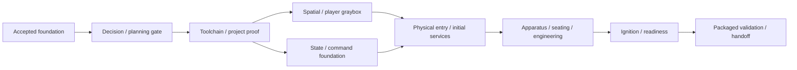

# Awakening The Outlaw Star — Vertical Slice 1 Implementation Plan

| Field | Value |
| --- | --- |
| Created / last edited | 2026-10-07 |
| Status | Confirmed for publication 2026-10-07; planning baseline accepted; execution not started or authorized |
| Prepared by | Codex, from approved Reconstruction / Implementation Baseline v1 |
| Maintainer | Repository owner |
| Planning baseline | Baseline v1 published in `d05d1822a41b3e0a3b03bd015676d97124a08fab` |
| First implementation checkpoint | Phase 1 decisions and exit review; not started |

## Purpose And Placement

Deliver the first playable **Awakening the Outlaw Star** slice: approach the supported dormant ship,
enter it, traverse the required interior, initialize services, deploy the navigation apparatus,
prepare engineering, return to the bridge and complete ignition to **SHIP READY**. Remain inside
the hangar; do not launch.

This is the execution checklist and phase-status owner. Baseline v1 owns spatial/motion constraints,
operational vocabulary and slice scope/acceptance. Architecture documents own shared-state and
interaction requirements; source reviews own evidence. This plan cannot silently change those contracts.
Its format follows the user-supplied implementation plans: accepted foundations, decimal subphases,
explicit prerequisites, reviewable checklists, validation, recovery and phase exit gates. No unrelated
project facts, deployment policies or framework lifecycles are imported from the format references.

## Current State And Next Action

Reference/research is substantially complete for defining this bounded slice. Baseline v1 is approved
and published. No Unreal project, graybox, gameplay code, machinery rig or playable build exists.
No planned runtime tests have run. Installation observations are not compilation proof.

The user has now requested this expanded formal planning document, superseding the earlier hold on
**introducing the planning gate**. That authorizes this document and navigation/status updates only.
The user confirmed this plan and its MCP additions for publication on 2026-10-07.
Every new execution checkbox remains open. Next, authorize a specific Phase 1
scope. Phase 1 produces concrete design decisions; its exit review precedes project creation.

Do not begin Unreal initialization, modeling, installations or implementation because this file exists
or because its documentation commit is confirmed. Once a concrete subphase is authorized, complete
routine implementation, fixes and relevant validation within that scope without adding permission
pauses for every file or test. Publication still follows the user's explicit confirmation workflow.

## Authoritative Inputs

- [Spatial constraint map](../reconstruction/baseline-v1/spatial-constraint-map.md): S01–S16, H01–H06,
  accepted 72 × 21 × 16 m overall envelope, unknown connections and E/D boundaries.
- [Motion/clearance envelopes](../reconstruction/baseline-v1/motion-clearance-envelopes.md): M01–M13
  reservations and MC-01–MC-08 interference checks.
- [Operational state baseline](../reconstruction/baseline-v1/operational-state-baseline.md): commissioning
  versus departure/transit/recovery; shared component state rather than one invented power ladder.
- [Slice contract](../reconstruction/baseline-v1/vertical-slice-1.md): inclusions, exclusions, eight
  readiness conditions, VS-01–VS-10 acceptance and VS-D01–VS-D07 unresolved decisions.
- [Canon policy](../canon-policy.md), [vision](../vision.md) and [design pillars](../design-pillars.md).
- [Unreal/toolchain strategy](../architecture/unreal-strategy.md), [player/camera/control](../architecture/player-camera-control.md),
  [interaction](../architecture/interaction-system.md), [simulation](../architecture/ship-simulation.md)
  and [external-control compatibility](../architecture/external-control-automation.md).
- [Ongoing research](../reconstruction/open-questions.md) and [reference index](../reconstruction/xgp-reference-index.md).
  Research resolves specific constraints; it does not add feature scope without agreement.
- [Editor automation evaluation](../architecture/editor-automation.md): Blender/Unreal MCP candidates,
  adoption requirements, bounded pilots and fallbacks; optional development tooling, not runtime scope.

## Scope And Operating Rules

- Deliver one physical player with first/third-person perspective over the same body/state; camera
  perspective does not grant equipment access or change command permissions.
- Include minimal hangar/hull context, one selected entry, bridge/passage/engineering route, initial
  services, placeholder-occupied apparatus, seat-cluster lift, all four engineering endpoints,
  cockpit key ignition and deterministic status/guidance.
- Keep detailed art, full rooms/crew, flight, sub-ether, combat, weapons, damage/repair models,
  calibrated power physics, Gilliam LLM and external adapters outside this slice.
- Reserve future mechanisms spatially. Reservation is not implementation of grapplers, robots,
  Shooter, lounge furniture or landing/sub-ether behavior.
- Keep C++ authoritative state/validation independent of presentation. Blueprints configure and
  compose assets, motion and feedback; they do not own a competing readiness system.
- A control submits a request; acceptance, progress and completion are distinct. All required local
  actions remain local. Guidance cannot bypass the player route by silently completing them.
- Record geometry E, gameplay F and strong inference D explicitly; none becomes canon. Selected
  B-candidate drawings do not gain authenticated provenance through implementation.
- Use small reviewable increments. Subphase numbers do not prescribe commit counts. Preserve user
  edits and unrelated files; do not add extra enhancements after an increment is accepted.
- Source folders are immutable/local-only. No source textures, episode frames or full subtitles are
  silently imported into game content or packages. Project-owned binary tracking policy must be
  agreed before the first authored map/Blueprint asset is published.
- Prefer file/log/API checks and identified user-run observations. Computer Use requires separately
  requested and received permission for its specific scope; plan/phase approval is not that permission.
- Work on one agreed increment at a time. Dependency branches permit independently reviewable work,
  not unrequested agent delegation or uncontrolled parallel edits.

## Accepted Decisions And Open Contracts

- [x] Preserve Baseline v1 as the reconstruction/slice authority, with readiness inside the hangar.
- [x] Use UE 5.8 as intended baseline; current installed candidate is 5.8.3, not yet build-validated.
- [x] Target Visual Studio Community 2026, MSVC 14.50 and Windows SDK 10.0.26100.0; follow the
  compiler-family constraints in Unreal strategy. Last inspection found only MSVC 14.51 installed.
- [x] Keep unresolved archaeology in a parallel track and preserve original-language uncertainty.
- [x] Preserve shared command/state requirements without implementing a transport or external client.
- [ ] Accept this draft's phase boundaries and specific initial execution scope.
- [ ] Decide concrete VS-D01–07 choices and validation budgets in Phase 1; no new architecture is
  accepted merely because its checklist is present.

## Completion Definitions

**Planning-ready:** chosen slice connections, mechanisms, interaction adaptations, state ownership,
  tooling changes, asset policy and validation procedures are concrete and reviewed. No implementation
  or compatibility success is implied.

**Project foundation:** the agreed C++ project reproducibly builds and launches using recorded actual
  engine/compiler/SDK versions; an early minimal package runs outside the editor.

**Spatially viable:** one body traverses the required route in both views; relevant machinery proxy
  endpoints/sweeps fit inside the chosen hull arrangement and preserve service/access paths.

**Functionally integrated:** the normal route reaches the eight Baseline v1 readiness conditions through
  physical actions and authoritative completed state. Test/debug fixtures are not player shortcuts.

**Playable slice complete:** all VS-01–VS-10 criteria have observed evidence on the agreed host/build,
  a repeatable packaged run reaches SHIP READY, artifacts/docs are reproducible, known limitations
  are accepted, and the maintainer accepts closure. No full game or deployment claim follows.

A checked Phase 0 item describes an existing accepted foundation. New design items require an accepted
decision. Implementation items require the scoped change, relevant measured validation and updated docs;
live/visual items require actual observed evidence with the performer identified. Confirmation/publication
and phase acceptance are recorded separately; no exit gate closes from a compile or document review alone.

## Dependencies And Delivery Sequence

| Phase | Prerequisite | Main checkpoint / acceptance evidence |
| --- | --- | --- |
| 0 — existing foundation | Published Baseline v1 | Existing evidence, scope and tooling direction; not a runnable game. |
| 1 — planning/design contracts | Phase 0; authorization for bounded decision work | VS-D01–07 decisions, proposed layouts/state contracts, test procedures and next-phase scope. |
| 2 — tools/project foundation | Phase 1 exit accepted; installations/project creation explicitly in authorized scope | Actual tool selection, clean C++ build, editor launch and minimal package. |
| 3 — spatial/player graybox | Phase 2 exit; Phase 1 spatial/player decisions | Traversable hull/route, one player/two views, motion reservations and MC evidence. |
| 4 — authoritative state/commands | Phase 2 exit; Phase 1 operational/ownership decisions | Deterministic commands, state/results, locality and lifecycle checks independent of final room art. |
| 5 — entry/services/interaction | Phases 3 and 4 accepted | Physical boarding, usable route/control targeting and limited-service feedback. |
| 6 — apparatus/seating/engineering | Phase 5 exit; approved mechanism E/F decisions | Occupied apparatus, moving seat group and four locally prepared engineering endpoints. |
| 7 — ignition/readiness integration | Phase 6 exit | Actual completed ignition, derived readiness, consistent guidance and fresh-run behavior. |
| 8 — complete slice validation/handoff | Phase 7 exit | VS acceptance, agreed budgets, standalone package and maintainer closure. |

Phases 3 and 4 can be reviewed independently after Phase 2; Phase 4 uses a narrow test fixture,
not finished machinery. Phase 5 integrates their outputs. Within Phase 6, apparatus, seating and
engineering have separate checkpoints, but coexistence is required before integration closes.
Do not start a dependent checkpoint while its prerequisite gate has an unresolved blocking finding.

## Decision Timing And Deferred Work

| Decision | Owning checkpoint | Deferral boundary |
| --- | --- | --- |
| VS-D01 entry representation and inside route | 1.2; fit proof 3.2/5.2 | Must be concrete before affected geometry; hatch correspondence may remain a labeled E choice. |
| VS-D02 room placement / route proxy | 1.2; 3.2/3.4 | Must fit slice; full deck plan, cabins and dining/lounge identity can remain unresolved. |
| VS-D03 cavity/sweeps/dimensions | 1.2; 3.4/6.4 | E dimensions reviewed before rigs; future reservations may remain conservative/provisional. |
| VS-D04 initial services / minimal prerequisites | 1.3; 4.1/5.3 | Minimal F contract needed; battery chemistry/capacity and full reactor wiring stay deferred. |
| VS-D05 occupant and all-four preparation adaptation | 1.3; 6.1/6.3 | Choose F behavior before coding; do not present repeated manual steps as four observed procedures. |
| VS-D06 ready/results/locality/minimal controls | 1.3/1.4; 4–7 | Needs explicit outcomes now; external schemas/transports and universal state framework deferred. |
| VS-D07 tool/asset/work authorization | 1.1/1.4/1.5; actual tool proof 2 | Installation/publication scope needed before mutation; no model source-license migration assumed. |
| Initial host/input/render settings and performance budget | 1.1/1.4; validate 8.2 | Propose concrete local Windows/Win64 proof target; other platforms/hardware support not promised. |
| Project name/path/module/test/evidence layout | 1.4 | Must precede creation; avoid speculative multi-module/plugin hierarchy. |
| Animation rate, reach and camera margins | 1.2/1.3; refine 3/6 | Provisional E/F, not canonical millimetres/seconds; adjust only with fit/interaction evidence. |
| Flight, sub-ether, combat, damage, crew/LLM, networking/adapters | Outside Slice 1 | Keep compatibility seams/reservations only; no owning implementation phase in this plan. |
| Detailed art, advanced fluid/physics, final rigging, every room | Outside Slice 1 | Replaceable proxies now; no polishing phase that expands these into required scope. |
| Save/load, installer, store release, hosted CI farm | Deferred | Fresh-run reset/local package proof required; these systems are not. |

## Checkpoint, Evidence And Recovery Discipline

At each subphase record the authorization/scope, starting commit and worktree, changed files,
actual engine/compiler/SDK versions, commands/procedures, expected/observed outcomes, artifact paths,
performer for manual checks, limitations, affected baseline IDs and next checkpoint. Distinguish pass,
intentional rejection, unexecuted check, environment limitation and accepted deferral. Do not prewrite
successful evidence. Adopt a durable evidence/decision location in 1.4; until then these are planned outputs,
not extra files created by this drafting task.

Validation below is planned. Use focused C++/engine automation for state/locality/lifecycle invariants;
use in-world/manual evidence for traversal, readability, motion/camera clipping and visual reference fit.
Do not substitute a mocked transform for a real occupied machinery-clearance demonstration. Test relevant
shared behavior when it changes; avoid a broad testing platform or implementation-mirroring checkbox tests.

Preserve the last accepted source/configuration and runnable milestone. Rollback means restore the
affected asset/config or prepare a focused revert with user work preserved, then rerun affected checks.
Do not use destructive resets, remove whole source trees or change global installations as automatic recovery.
Editor assets need recoverable owned copies/versioning before edits; generated build outputs need safe,
workspace-bounded ownership. An E/F revision updates its decision and invalidates dependent fit/behavior
evidence as appropriate; it does not rewrite historical canon observations.

## Phase 0: Accepted Reconstruction And Research Foundation

- [x] Publish Baseline v1's four source-backed planning documents in `d05d182`.
- [x] Establish SHIP READY inside the hangar as the slice endpoint and preserve exclusions.
- [x] Capture selected local mechanisms/operational evidence and all-episode performance leads.
- [x] Record intended UE/Windows toolchain and separate installed from build-validated.
- [x] Retain unresolved research and immutable/local-only source boundaries.

### Phase 0 Exit Record

Existing documentation foundation is accepted. No implementation gate, project build or playable
test was completed by that publication. The next unchecked checkpoint belongs to this plan.

## Phase 1: Formal Planning Gate And Concrete Slice Contracts

### Phase 1.1: Scope, Host And Tooling Readiness Inventory

**Prerequisite:** authorized Phase 1 decision scope; Phase 0. **Deliverable:** dated host/tooling/target record.

- [ ] Recheck repository state and current UE/VS/compiler/SDK inventory; treat the earlier inspection as dated evidence.
- [ ] Agree primary proof host, intended Win64 build/input scope and what any second host is expected to prove.
- [ ] Identify actual missing components, including preferred MSVC 14.50 if still absent; propose only needed installation changes.
- [ ] Record that existing tool installs do not establish build compatibility; select measured responsiveness/performance criteria to propose in 1.4.

**Validation:** observed versus reported facts distinguished; no install or project creation during inventory.
**Recovery / deferral:** resolve access gaps with files/logs or user evidence; keep unverified hosts/components unknown, not failed or supported.

### Phase 1.2: Spatial And Motion Decision Packet

**Prerequisite:** 1.1 scope/host inventory. **Deliverable:** VS-D01–03 E decision packet, not modeled geometry.

- [ ] Propose selected entrance and entry→bridge→engineering route with S/H IDs and unresolved correspondence explicit.
- [ ] Propose hull-relative room/cavity placement, occupant scale, extension sweeps and operator paths for M01–M09; record provisional dimensions/margins without claiming measured canon.
- [ ] Reserve M10–M13 where affected by hull/route/support placement; identify remaining source checks that could invalidate the slice.
- [ ] Define how MC-01–MC-08 will be demonstrated and which future reservations remain unverified rather than fitted.

**Validation:** each geometric choice cites its constraint and E rationale; no unknown connection silently becomes confirmed.
**Recovery / deferral:** revise the text/diagram proposal before blockout; request targeted evidence if a central fit cannot be responsibly proposed. Full deck/room layout stays deferred.

### Phase 1.3: Player Actions, Mechanism Stages And Readiness Contract

**Prerequisite:** 1.2 spatial proposal. **Deliverable:** VS-D04–06 decisions and a normal-path action/result table.

- [ ] Specify initial available services and player initialization, preserving early bridge access before main ignition.
- [ ] Decide placeholder occupant deployment, cap closure/interlocks across cuts, seat lift coordination and all-four cylinder preparation behavior as F where unshown.
- [ ] Define per-action locality/station context, in-progress/completed/rejected results, duplicate/conflicting requests and declared prerequisites.
- [ ] Translate the eight baseline readiness conditions into observable outcomes; define key/ignition completion and minimal guidance without a numerical power model.
- [ ] Identify mechanism interruption/collision behavior needed for safe slice operation; do not add simulated faults or repairs.

**Validation:** action/state table matches commissioning scope; all-four endpoints retained; player can return to the bridge; no guidance shortcut bypasses local work.
**Recovery / deferral:** revise F prerequisites/timing before implementation, retaining supported visible stages. Reactor wattage/topology, universal shutdown and crew AI remain deferred.

### Phase 1.4: Minimal Architecture, Asset And Validation Contracts

**Prerequisite:** 1.1–1.3 proposals. **Deliverable:** concrete project/ownership/persistence boundary and planned validation procedures.

- [ ] Select project name/path, minimum C++ ownership, Blueprint configuration boundary, map/test/evidence layout and input/camera approach; keep illustrative APIs out of the accepted registry until reviewed.
- [ ] Specify a shared command/query path, result lifecycle and reset ownership with no external transport or second readiness writer.
- [ ] Agree publication/versioning for owned maps/Blueprints/proxy assets and whether Git LFS is needed before their first commit; keep source media excluded.
- [ ] Choose proxy production approach, limited renderer/lighting settings, primary-host budget and test session conditions; verify any required Blender/tool work separately from assumptions.
- [ ] Record Blender/Unreal MCP selection or deferral using the editor-automation contract: actual versions/client compatibility, pinned source/license/dependencies, isolation, bounded tools, configuration ownership and fallback. Neither connector is required for slice acceptance.
- [ ] Specify Blender→Unreal units, orientation, pivots, export/import/collision and recipe/binary ownership; nominate a known-size handoff fixture before repeated geometry production.
- [ ] Write procedures/expected outcomes for the validation register below, including manual performer and minimum package proof; select narrow automation, not a new CI program.

**Validation:** decisions are concrete enough to create only the bounded foundation; source/owned/generated outputs and rollback locations are distinguishable.
**Recovery / deferral:** choose simpler reviewed proxies/configuration if tooling or performance assumptions are uncertain. Detailed art, networking, serialization and broad plugin frameworks remain deferred.

### Phase 1.5: Formal Gate Review And First Execution Scope

**Prerequisite:** 1.1–1.4 reviewable outputs. **Deliverable:** accepted decisions or explicit revisions; scoped Phase 2 proposal.

- [ ] Reconcile VS-D01–07, accepted E/F assumptions, validation IDs and any necessary Baseline v1 amendment without silently changing authority.
- [ ] Review the actual installation, project-creation, binary publication and test operations proposed for Phase 2.
- [ ] Identify blocking decisions versus parallel research and confirm the first independent execution increment.

**Validation:** planning review does not claim runtime proof; unresolved blockers have named owners/checkpoints.
**Recovery / deferral:** keep gate open, revise only affected decisions and preserve accepted baseline; do not bootstrap a project to force the proposal through.

### Phase 1 Exit Gate

- [ ] Concrete slice connections, clearances, interactions, state ownership and artifact policy accepted.
- [ ] Tool changes, proof host/build, validation procedures and measurable budgets are specified.
- [ ] No blocking VS-D01–07 decision is hidden in future code; permitted parallel research is explicit.
- [ ] Maintainer authorizes the bounded Phase 2 scope. This plan's confirmation alone is not that authorization.

## Phase 2: Toolchain And Minimal C++ Project Foundation

### Phase 2.1: Approved Toolchain Preparation

**Prerequisite:** Phase 1 exit; explicit installation scope if needed. **Deliverable:** recorded actual intended toolchain availability.

- [ ] Perform only agreed side-by-side compiler/component changes; retain existing tools unless their change is specifically approved.
- [ ] Recheck actual compiler/SDK/.NET availability against engine configuration and record effective versions/paths for the upcoming build.
- [ ] Record installation outcomes/limitations without claiming Unreal compile success yet.

**Validation:** VS1-T01 inventory and engine preferred/banned-family checks; no silent substitution of installed 14.51.
**Recovery / deferral:** retain prior installation; diagnose or revert only approved component changes. Engine/toolchain migration requires a reviewed reason.

### Phase 2.2: Project Skeleton And Repository Boundary

**Prerequisite:** 2.1 and accepted project/asset policy. **Deliverable:** smallest agreed C++ project and neutral test map.

- [ ] Create only the selected project/module layout, baseline input/config and neutral map required for first proof.
- [ ] Apply owned-binary tracking and generated-output exclusions before publishing assets; preserve source folders/working references.
- [ ] Add concise build/open instructions and repository-relative asset/evidence ownership.

**Validation:** VS1-T02 configuration/source audit; tracked versus ignored files match the accepted policy.
**Recovery / deferral:** preserve pre-creation baseline and user files; replace only this skeleton if layout is rejected. No gameplay/ship geometry in this checkpoint.

### Phase 2.3: Reproducible Build And Editor Proof

**Prerequisite:** 2.2. **Deliverable:** actual C++ editor build/launch evidence on primary host.

- [ ] Run the agreed non-Live-Coding build from a fresh session and record actual compiler/SDK selected by the engine.
- [ ] Open the neutral project/map through approved methods; inspect startup/build logs and demonstrate basic input using identified visual evidence.
- [ ] Repeat after restart so hot-reload state is not the only proof of compatibility.

**Validation:** VS1-T03 build/editor result with commands/logs and observed launch; no fake pass from binaries merely existing.
**Recovery / deferral:** iterate skeleton/tool selection rather than adding gameplay to hide build issues; keep engine migration separate.

**Optional Unreal MCP pilot checkpoint (after ordinary build/editor proof):**

- [ ] If selected and scoped, evaluate installed Epic MCP/tool-provider plugins on the neutral fixture under the [editor-automation requirements](../architecture/editor-automation.md); record actual client discovery, local binding and serialized calls.
- [ ] Inspect, make one reversible actor change, save/reopen, stop/reconnect and verify scene/files independently; preserve the build-proven checkpoint and existing client settings.
- [ ] Record adoption, deferral or failure plus ordinary editor/file fallback. Carry an adopted configuration through 2.4; no packaged runtime dependence or implicit desktop-control permission.

**Pilot validation / recovery:** observed fixture result, bounded diff and successful restoration or repeatability. Disable/revert only pilot changes if unstable; MCP success is not VS1-T03 proof and pilot deferral does not block Phase 2.

### Phase 2.4: Early Standalone Package Smoke

**Prerequisite:** 2.3. **Deliverable:** minimal local package that runs outside editor.

- [ ] Build/cook/package the neutral map under the chosen configuration to an owned generated destination.
- [ ] Run it outside the editor and prove startup/input using the planned performer; record missing runtime/plugin/content dependencies.
- [ ] If Unreal MCP was adopted, prove the package runs with no MCP client/server and record development automation exclusion/disablement; otherwise record pilot deferral/fallback.
- [ ] Preserve recipe/version identity and keep generated package output out of ordinary source commits.

**Validation:** VS1-T04 package proof; later full slice acceptance is not implied.
**Recovery / deferral:** return to 2.2/2.3 for packaging dependencies; do not wait until final slice delivery to expose foundational cook failures.

### Phase 2 Exit Gate

- [ ] VS1-T01–T04 have actual evidence, source/owned/generated boundaries hold, and primary host is reproducible.
- [ ] No hidden source-media dependency, accidental unsupported compiler choice or editor-only launch assumption remains.
- [ ] Maintainer accepts the foundation and next spatial/state increment; no spatial/player/system acceptance yet.

## Phase 3: Spatial Graybox And One-Player Traversal

### Phase 3.1: Player And Scale Fixture

**Prerequisite:** Phase 2 exit; accepted scale/player decisions. **Deliverable:** one physical avatar and scale fixture.

- [ ] Establish agreed player body/collision scale, basic traversal and first/third-person perspective over that same body.
- [ ] Verify camera switching does not move/replace the physical actor or change equipment access context.
- [ ] Create only neutral scale references needed for hull/room testing; approximately 2 m settei convention is not imposed as every deck's height.

**Validation:** VS1-G01 body/camera checks in neutral fixture.
**Recovery / deferral:** adjust reviewed camera/body choices before building tight rooms; character art/animation polish stays deferred.

**Optional Blender MCP pilot checkpoint (before repeated 3.2/3.3 production):**

- [ ] If selected and scoped, verify actual Blender/add-on/server/client versions, source/license/dependencies and the agreed isolation before connecting; use only an owned disposable fixture.
- [ ] Inspect and create one known-size proxy, preserve a reviewable recipe, save/reopen and export/import through the accepted handoff; verify units, orientation, pivots and collision in the same player fixture.
- [ ] Record reproducibility, stop/reconnect, bounded output diff and recovery; choose adoption or reviewed Python/manual fallback before producing ship proxies.

**Pilot validation / recovery:** actual handoff fit and recoverable fixture changes under the [editor-automation contract](../architecture/editor-automation.md). Restore only owned pilot assets/settings on failure; no source edits, inferred canon or dependency on MCP availability.

### Phase 3.2: Hangar, Hull And Required Route

**Prerequisite:** 3.1 and VS-D01/02 accepted. **Deliverable:** minimum supported hull/context and connected walkable route.

- [ ] Place hull envelope/supports, chosen entrance, bridge, passage and engineering proxies at the agreed E layout.
- [ ] Include dining proxy only where the chosen route requires it; preserve separate hatch records and future spatial reservations.
- [ ] Traverse outside→bridge→engineering→bridge with the same player; annotate every invented connection.

**Validation:** VS1-G02 route/scale proof; baseline S/H references and VS-01/02 traced, without claiming final entry mechanism.
**Recovery / deferral:** revise affected E connection/room proxy, not the canonical overall scale, to conceal a fit problem; reopen 1.2 if central constraints conflict.

### Phase 3.3: Mechanism Endpoints And Reservation Proxies

**Prerequisite:** 3.2; accepted M01–M09 dimensional decisions. **Deliverable:** stowed/deployed occupancy/sweep proxies.

- [ ] Represent apparatus cavity/cap/covers, seat cluster and all four cylinder extension endpoints together.
- [ ] Reserve rail, other hatch and future mechanism volumes M08–M13 where the chosen layout touches them.
- [ ] Keep operator/occupant access paths visible; these proxies do not report runtime preparation completion.

**Validation:** VS1-G03 endpoint/sweep inspection against MC-01–08; separate demonstrated active fit from provisional future reservations.
**Recovery / deferral:** preserve accepted route fixture, revise individual swept volumes/placements and rerun affected MC checks. No finished rigs or extra room mechanisms.

### Phase 3.4: Occupied Clearance And Layout Acceptance

**Prerequisite:** 3.1–3.3. **Deliverable:** accepted graybox fit and explicit unresolved future-space constraints.

- [ ] Demonstrate traversal/reach in both views with proxies at low/raised/extended endpoints and placeholder occupant included.
- [ ] Check operator escape from all-four-extended engineering, bridge doorway/cap/cylinder coexistence and below-floor hull fit.
- [ ] Record camera clipping, collisions, inaccessible controls and E revisions; identify MC checks that remain reservation-only.

**Validation:** VS1-G01–G03, applicable MC checks and VS-02/03/07; visual results require observed evidence.
**Recovery / deferral:** return to 3.2/3.3 or 1.2 for structural contradictions; do not shrink canonical mechanisms/player secretly or add another deck to pass.

### Phase 3 Exit Gate

- [ ] Required route/body/two views are usable; active machinery reservations fit with service/access space.
- [ ] E geometry is traceable, future reservations are explicit and relevant MC evidence is recorded.
- [ ] Maintainer accepts the spatial prototype; no canonical final deck plan or fully functioning machinery claimed.

## Phase 4: Authoritative State, Commands And Lifecycle

### Phase 4.1: Minimal Slice State And Ownership

**Prerequisite:** Phase 2 exit; 1.3/1.4 accepted. **Deliverable:** minimal C++ state in an independent fixture.

- [ ] Represent declared initial services, apparatus stages, four engineering-unit endpoints, seating, ignition and readiness inputs.
- [ ] Keep camera/presentation separate from ship state; stable project IDs do not claim external reactor/pod correspondence.
- [ ] Define the agreed initial/reset snapshot without building numerical electrical/propulsion networks.

**Validation:** VS1-S01 initial-domain/ownership checks; state is readable without final ship UI or finished geometry.
**Recovery / deferral:** revise narrow ownership/schema before adapters; do not invent a universal component framework or serialize speculative future systems.

### Phase 4.2: Request Validation And Result Lifecycle

**Prerequisite:** 4.1. **Deliverable:** reviewed command/query path and explicit results.

- [ ] Implement agreed locality/station/prerequisite validation and accepted/in-progress/completed/rejected outcomes.
- [ ] Define duplicate/conflicting request behavior without replaying consequential motion or setting completion prematurely.
- [ ] Expose actual status to consumers; no UI-owned readiness flag or ungated guidance mutation.

**Validation:** VS1-S02 valid/missing-prerequisite/remote-bypass/duplicate cases with meaningful state assertions.
**Recovery / deferral:** return to 1.3/4.1 if semantics conflict; external authentication, transport and LLM command interpretation stay deferred.

### Phase 4.3: Mechanism Completion And Reset Boundary

**Prerequisite:** 4.2. **Deliverable:** deterministic completion/progress and fresh-run fixture behavior.

- [ ] Establish ownership of motion-start and actual completion callbacks; presentation cannot certify success independently.
- [ ] Specify safe handling of interrupted motion/teardown according to the accepted slice behavior, without a fault model.
- [ ] Reset fixture state and pending operations to the declared baseline; callbacks from a prior run cannot mark new operations complete.

**Validation:** VS1-S03 reset/interruption/stale-completion cases; no full save/load system implied.
**Recovery / deferral:** retain/replay the last known fixture case and fix lifecycle before installing real machinery adapters.

### Phase 4.4: Foundation Contract Review

**Prerequisite:** 4.1–4.3. **Deliverable:** minimal state/API documentation and executable regression ownership.

- [ ] Demonstrate equivalent requests/results from test fixture and thin control adapter over the same state.
- [ ] Review dependencies, rejected-request feedback and extension seams without implementing future clients.
- [ ] Adopt focused tests near behavior ownership and record reproducible execution instructions/results.

**Validation:** VS1-S01–S03 and baseline VS-04/05/07 semantics; a fixture pass does not close world interaction tests.
**Recovery / deferral:** simplify before Phase 5 if architecture needs an oversized subsystem/plugin tree; retain no second test-state implementation.

### Phase 4 Exit Gate

- [ ] Single state/command/results path, locality and reset behavior are proven in the narrow fixture.
- [ ] No presentation/fixture shortcut is exposed as player completion; next integration contracts are concrete.
- [ ] Maintainer accepts the foundation before physical adapters depend on it.

## Phase 5: Physical Interaction, Entry And Initial Services

### Phase 5.1: Local Control Targeting And Presentation Adapter

**Prerequisite:** Phases 3 and 4 accepted. **Deliverable:** usable thin interaction adapter on the agreed fixture/route.

- [ ] Implement the selected targeting/reach/prompt/input behavior for local equipment in both camera views.
- [ ] Submit requests with actual player/station context to Phase 4 validation; bind progress/results from that shared state.
- [ ] Make unavailable/in-progress/completed interactions readable without displaying implementation class names or debug telemetry as ordinary gameplay.

**Validation:** VS1-I01 in-world targeting/locality/feedback and the relevant state regression cases.
**Recovery / deferral:** adjust adapter/reach/camera presentation without weakening authoritative locality; detailed UI styling/controller platforms stay deferred.

### Phase 5.2: Exterior Hatch And Boarding

**Prerequisite:** 5.1, VS-D01 accepted and entry fit proved. **Deliverable:** one functioning chosen entrance.

- [ ] Implement reviewed entry movement/collision and the route from hangar into the required interior.
- [ ] Respect M09 sweep/operator access and distinct hatch identities; no unreviewed airlock pressure simulation.
- [ ] Verify approach, request, movement, traversal and permitted closure with the same player body.

**Validation:** VS1-I02 entry/collision proof, MC-05/06 where affected, VS-01; no mocked hatch-complete pass.
**Recovery / deferral:** restore the accepted static route or revise only chosen hatch/connection E geometry; rerun affected fit tests if that identity/placement changes.

### Phase 5.3: Limited-Service Initialization And Bridge Access

**Prerequisite:** 5.2 and VS-D04/06 accepted. **Deliverable:** readable initial services distinct from main ignition.

- [ ] Implement the agreed initial availability/initialization action and minimal lighting/display state.
- [ ] Preserve the distinction between a usable early bridge and engines/main services not yet operating.
- [ ] Expose the same availability/prerequisite status through physical controls and deterministic guidance.

**Validation:** VS1-I03 initial-service success/rejection/reset cases; record the F source assumption explicitly.
**Recovery / deferral:** return to 1.3 if the early-power premise contradicts evidence or creates an unplayable deadlock; no battery chemistry/capacity or service endurance added.

### Phase 5.4: Boarding-To-Engineering Interaction Review

**Prerequisite:** 5.1–5.3. **Deliverable:** complete usable approach/boarding/initialization/round-trip route.

- [ ] Walk the route in both views and verify required controls are targetable without fixture/debug shortcuts.
- [ ] Recheck hatch/rail/doorway reservations, low-seat access and engineering standing paths under actual collision.
- [ ] Review deterministic instruction wording for the next machinery actions; do not implement guidance that operates them for the player.

**Validation:** VS1-I01–I03 and VS1-G01–G03 affected cases; record unresolved blockers before machinery integration.
**Recovery / deferral:** revise the smallest control or route asset and invalidate only dependent evidence; occupant/engineering animation remains Phase 6.

### Phase 5 Exit Gate

- [ ] Real player can approach, enter, initialize services and travel bridge→engineering→bridge in both views.
- [ ] Commands, prompts and completion reflect one state; access remains local and route fit holds.
- [ ] Maintainer accepts the interaction/service increment before apparatus and engineering depend on it.

## Phase 6: Navigation Apparatus, Seating And Engineering Preparation

### Phase 6.1: Placeholder-Occupied Navigation Apparatus

**Prerequisite:** Phase 5 exit; VS-D03/05 decisions. **Deliverable:** functional apparatus sequence with occupant proxy.

- [ ] Implement the reviewed cap opening, occupant descent, cap closure, cylinder rise and lateral cover stages.
- [ ] Label unmeasured timing/closure/support details as E/F; preserve supported stage appearance without treating combined scenes as one measured animation.
- [ ] Bind stage progress/completion to authoritative state; demonstrate actual occupant/cavity/sweep collision and declared interruption behavior.

**Validation:** VS1-M01 sequence/occupied clearance, MC-01/02 and VS-03/05; missing prerequisites do not complete deployment.
**Recovery / deferral:** retain stowed/deployed proxies and revise one rig/timeline at a time; reopen 1.2/1.3 for a fit/ordering conflict. Fluid simulation/full character AI remain deferred.

### Phase 6.2: Bridge Seat And Control-Cluster Lift

**Prerequisite:** 6.1 accepted fit and Phase 5 interaction; chosen coordination contract. **Deliverable:** occupied low/operating seat states.

- [ ] Implement required lift motion and station transitions with the same physical player/control context.
- [ ] Ensure cluster/apparatus/doorway/rail can coexist and player access remains valid at both endpoints.
- [ ] Include M06 movement only if required by the accepted station-access arrangement; no full grappler rig.

**Validation:** VS1-M02 occupied lift/camera/reach, MC-01/04 and VS-02/03/07.
**Recovery / deferral:** revise isolated lift/camera offsets before changing room scale; reconsider E/F coordination explicitly rather than teleporting or duplicating the player silently.

### Phase 6.3: Four Engineering Control Cylinders

**Prerequisite:** Phase 5 locality/service foundation; accepted all-four adaptation and M07 fit. **Deliverable:** locally prepared 2×2 bank.

- [ ] Implement represented wrapping removal, release manipulation and extension for the reviewed player workflow.
- [ ] Apply the agreed F handling for unshown units, retaining four distinct project identities and all four prepared endpoints.
- [ ] Require physical intervention where declared; control panels expose real per-unit progress/status rather than a global prepare-all shortcut.
- [ ] Verify access with all four extended and match the actual preparation state to later ignition prerequisites.

**Validation:** VS1-M03 per-unit states/locality/duplicate requests, MC-03/04 and VS-04/06.
**Recovery / deferral:** restore/revise an individual cylinder adapter/asset and repeat bank-wide clearance; do not infer exterior-engine movement or add maintenance/fault simulation.

### Phase 6.4: Machinery Coexistence And Prepared-State Review

**Prerequisite:** 6.1–6.3. **Deliverable:** apparatus, seating and all-four engineering work together in the real route.

- [ ] Complete preparation from the normal player sequence and return to the bridge without stale progress or inaccessible controls.
- [ ] Recheck active MC-01–MC-05 and affected MC-06–MC-08 reservations under actual mechanisms, not only original endpoint proxies.
- [ ] Review states against Baseline v1 and document new E/F dimensions/timings/adaptations with source links.

**Validation:** VS1-M01–M03 plus affected interaction/state tests; distinguish measured active fit from future reserved assemblies.
**Recovery / deferral:** reopen the smallest mechanism checkpoint or geometry decision; preserve working unrelated mechanisms. No ignition/ready closure until preparation is accepted.

### Phase 6 Exit Gate

- [ ] Occupied apparatus stages, seating movement and four prepared cylinders operate and coexist with required traversal.
- [ ] Actual completion/locality/clearance evidence supports VS-02–VS-07's applicable parts; E/F decisions are traceable.
- [ ] Maintainer accepts machinery preparation; no whole-ship reactor topology or complete continuous canon animation claimed.

## Phase 7: Cockpit Ignition And SHIP READY Integration

### Phase 7.1: Ignition Key And Main-Service Transition

**Prerequisite:** Phase 6 exit and accepted readiness contract. **Deliverable:** physical ignition with actual progression.

- [ ] Implement cockpit key action and declared prerequisites through the shared command path.
- [ ] Demonstrate an early/incomplete ignition attempt cannot report ready; accepted startup shows progress until its declared completion.
- [ ] Connect minimal engine/generator/main-service presentation to the completed state, preserving early-service versus main-service distinction.

**Validation:** VS1-R01 ignition complete/incomplete/duplicate outcomes and baseline VS-05/06; no numerical power simulation.
**Recovery / deferral:** isolate key/presentation adapter versus state-contract failures; return to 1.3 if extra prerequisites are needed rather than adding hidden locks.

### Phase 7.2: Readiness, Deterministic Guidance And Endpoint

**Prerequisite:** 7.1. **Deliverable:** derived readiness and a readable in-hangar completion experience.

- [ ] Derive ready/incomplete/in-progress from all eight baseline conditions; display/status queries agree on the same result.
- [ ] Add only guidance needed for physical progression and understandable unmet prerequisites.
- [ ] Keep the ship supported and stop at SHIP READY; no launch command, movement, cockpit-flight controls or placeholder combat becomes a dependency.

**Validation:** VS1-R02 eight-condition aggregate and guidance/query consistency; confirm VS-06/09 without fixture bypass.
**Recovery / deferral:** simplify presentation while preserving required state feedback; no crew dialogue generation, LLM or future mode controls.

### Phase 7.3: Fresh-Run And Integrated Lifecycle

**Prerequisite:** 7.1/7.2. **Deliverable:** repeatable dormant→ready sequence and reset behavior.

- [ ] Reinitialize player/stations, services, occupant, motion, cylinders, key and pending operations from the accepted starting snapshot.
- [ ] Repeat after an incomplete run and after a completed run; old callbacks/progress do not carry readiness into the new run.
- [ ] Recheck camera switching and denied local bypasses during the integrated sequence.

**Validation:** VS1-R03 fresh-run/aborted-run/reset evidence plus state regressions; test repeated runs, not save/load persistence.
**Recovery / deferral:** return to owning lifecycle/adapter phase for leaks/stale state; debug reset stays distinct from player completion and no save system is added.

### Phase 7 Exit Gate

- [ ] Normal physical progression reaches all eight SHIP READY conditions and remains in the hangar.
- [ ] Incomplete/duplicate actions cannot fake ready, both cameras preserve one player/state and fresh runs repeat.
- [ ] Maintainer accepts integrated functionality; full packaged/host/budget closure remains Phase 8.

## Phase 8: Playable Slice Validation, Package And Handoff

### Phase 8.1: Complete Acceptance And Focused Regression

**Prerequisite:** Phase 7 exit. **Deliverable:** observed VS-01–VS-10 acceptance matrix.

- [ ] Execute the complete normal route in both camera perspectives on the agreed proof host, without debug-assisted completion.
- [ ] Run owned state/command/lifecycle tests and targeted invalid/prerequisite/locality scenarios with expected rejections identified.
- [ ] Reconcile real machinery fit and future reservations, evidence categories and source pointers against all baseline criteria.
- [ ] Classify failures, accepted limitations and unexecuted checks; fix them at their owning checkpoint and repeat affected validation.

**Validation:** VS1-A01 full acceptance evidence; an editor run alone does not close package proof.
**Recovery / deferral:** bounded fixes to the owning phase; no art or new systems to mask a blocked route, stale state or missing acceptance.

### Phase 8.2: Readability, Responsiveness And Agreed Host Budget

**Prerequisite:** 8.1 working integrated run; 1.4 measured-budget contract. **Deliverable:** reproducible budget/UX assessment.

- [ ] Measure the agreed frame/interaction/loading conditions with recorded hardware, build/config and map; retain actual results rather than invented targets.
- [ ] Inspect dim-hangar visibility, prompts, mechanism feedback, camera clipping and required-control reach during the full sequence.
- [ ] Adjust bounded proxy/lighting/interaction settings and repeat affected functional and clearance checks.

**Validation:** VS1-A02 budget/readability results against accepted thresholds; no performance claim for untested hardware.
**Recovery / deferral:** return to last acceptable visual/configuration profile and iterate its bottleneck; detailed-art optimization and other-platform budgets remain deferred.

### Phase 8.3: Full Standalone Slice Reproduction

**Prerequisite:** 8.1/8.2; Phase 2 package recipe. **Deliverable:** complete owned-content package and reproducible run instructions.

- [ ] Build/cook/package the exact accepted slice configuration, recording input commit, versions, maps/assets and output identity.
- [ ] Run the full dormant→ready sequence outside the editor from a fresh process; verify reset/repeat and no editor/debug/source-folder dependency.
- [ ] Inspect content references/packaging inputs for unintended source media; distinguish project-owned artifacts from local reference derivatives.
- [ ] If a second host was included in Phase 1 scope, reproduce only its agreed claims; otherwise record single-host proof without broad support claims.

**Validation:** VS1-A03 complete package reproduction, VS-08/09 and relevant budgets; no requirement for a store installer or remote deployment.
**Recovery / deferral:** preserve accepted source and earlier runnable package, fix missing cook/runtime dependencies and repeat exact affected proof; no silent engine upgrade.

### Phase 8.4: Documentation, Publication And Maintainer Closure

**Prerequisite:** 8.1–8.3 proof. **Deliverable:** accepted slice, build/play guide and focused milestone record.

- [ ] Update plan status, decisions, actual build/run instructions, acceptance evidence and known limitations; keep the plan an execution checklist rather than a transcript.
- [ ] Identify exact changes/artifacts for review; stage only in-scope owned files under the accepted binary policy when the user confirms publication.
- [ ] Follow established Git confirmation workflow and verify worktree/upstream state, retaining unrelated user changes.
- [ ] Record maintainer acceptance and later direction without automatically starting another slice, flight or detailed-art work.

**Validation:** VS1-A04 artifact/document/source-boundary review and actual publication/acceptance state.
**Recovery / deferral:** hold closure for unproven acceptance or unreviewed binary policy; prepare focused reversions if requested, preserving sources and unrelated work.

### Phase 8 Exit Gate

- [ ] All required validation has observed evidence; failures are resolved or explicitly accepted without omitting baseline obligations.
- [ ] Standalone slice is reproducible, measured budgets hold on agreed host(s) and fresh runs reach SHIP READY.
- [ ] Documentation/owned assets are consistent; source media/derivatives stay within approved boundaries.
- [ ] Maintainer accepts the first playable slice and publication status is recorded accurately.

## Validation Register And Requirement Traceability

These IDs identify planned scenarios, not already implemented tests. Choose their executable/manual owners
in Phase 1.4. Prefix every test ID with **VS1-** to distinguish it from baseline spatial S IDs, motion M IDs
and acceptance VS IDs. Compact ranges retain the VS1 prefix, for example VS1-T01–T04.

| ID | Scenario / minimum proof | Owning checkpoint |
| --- | --- | --- |
| VS1-T01 | Actual tool inventory, preferred compiler availability and effective-version checks | 2.1, completed build corroboration 2.3 |
| VS1-T02 | Project source/owned/generated/media boundary matches agreed layout/policy | 2.2 |
| VS1-T03 | Fresh C++ build and observed editor startup, repeated beyond hot reload | 2.3 |
| VS1-T04 | Neutral package runs outside editor | 2.4 |
| VS1-G01 | One body; two views; camera changes preserve physical state/context | 3.1, integrated repeat 8.1 |
| VS1-G02 | Hull/route approach, boarding path and bridge/engineering round trip | 3.2, actual entry repeat 5.2 |
| VS1-G03 | Occupant/operator endpoints and sweep reservations fit; MC findings explicit | 3.3/3.4, actual mechanism repeat 6.4 |
| VS1-S01 | Initial domains and single state ownership independent of presentation | 4.1 |
| VS1-S02 | Valid/invalid/local/duplicate command outcomes preserve state and completion semantics | 4.2, real control repeat 5–7 |
| VS1-S03 | Reset/interruption/teardown reject stale completion and restore declared initial state | 4.3, real-world repeat 7.3 |
| VS1-I01 | Local targeting/reach/prompts and result feedback work in both views | 5.1/5.4 |
| VS1-I02 | Chosen hatch motion/collision/entry works with actual player | 5.2 |
| VS1-I03 | Limited-service initialization and unavailable-service feedback match shared state | 5.3 |
| VS1-M01 | Occupied apparatus visible stages, progress, completion and cavity clearance | 6.1 |
| VS1-M02 | Seat lift/station transitions preserve same body, camera access and neighboring fit | 6.2 |
| VS1-M03 | Four engineering identities/endpoints reached through agreed local workflow | 6.3 |
| VS1-R01 | Key/ignition accepts only declared prerequisites and reports actual completion | 7.1 |
| VS1-R02 | Eight-condition readiness and all guidance/status agree; ship stays supported | 7.2 |
| VS1-R03 | Incomplete/completed-run reset and repeated dormant→ready run | 7.3 |
| VS1-A01 | Complete VS acceptance and focused regression on actual world | 8.1 |
| VS1-A02 | Accepted measured budgets and in-world visibility/readability on agreed host | 8.2 |
| VS1-A03 | Exact full package reproduces outside editor without source/debug dependencies | 8.3 |
| VS1-A04 | Current docs, owned-artifact policy, publication and maintainer acceptance | 8.4 |

| Baseline criterion | Delivery / validation owner | Final proof |
| --- | --- | --- |
| VS-01 dormant approach and entry | 3.2, 5.2; VS1-G02/I02 | Full editor and standalone runs 8.1/8.3 |
| VS-02 round trip before/after machinery | 3.4, 5.4, 6.4; VS1-G03/I01/M checks | Both views, prepared mechanisms, full route |
| VS-03 no blocking machinery/occupant sweeps | 3.4, 6.1–6.4; MC-01–08 where applicable | Active actual motion plus explicit future reservations |
| VS-04 required local work cannot be bypassed | 4.2, 5.1, 6.3; VS1-S02/I01/M03 | Real local/remote denied cases in integrated world |
| VS-05 acceptance is not completion | 4.2/4.3, 6, 7; VS1-S02/S03/R01 | In-progress and incomplete ignition do not announce ready |
| VS-06 preparation/key/status agreement | 6.3, 7.1/7.2; VS1-M03/R01/R02 | All eight readiness conditions and actual state |
| VS-07 one player/state through camera changes | 3.1, 5.1, 6.2; VS1-G01/I01/M02 | Same body/context throughout both-view run |
| VS-08 repeatability | 4.3, 7.3; VS1-S03/R03 | Fresh-process package repeated in 8.3 |
| VS-09 no deferred feature needed | Scope checks every phase; VS1-R02/A01/A03 | Ready endpoint inside hangar without flight/crew/AI |
| VS-10 E/F/source traceability | 1.2/1.3, every geometry/behavior revision; VS1-A04 | Decisions and implementation agree at final review |

The register is the initial scenario reference, not a second implementation test framework. Future executable
tests own exact fixtures/assertions; evidence records link back here. A baseline visual criterion cannot be
closed solely by a pure state test. Future mechanisms MC-06–08 may remain reserved/provisional; final
evidence must say which fit was actually demonstrated and which functionality was excluded.

## Risks And Iteration Points

| Risk / known uncertainty | Prevention / iteration owner | Recovery boundary |
| --- | --- | --- |
| Preferred compiler missing or engine selects another family | 1.1, 2.1/2.3 actual selection proof | Retain existing tools; scope side-by-side changes or reviewed migration separately. |
| Unknown connections/cavity cannot fit chosen layout | 1.2, 3.2–3.4 before machinery detail | Revise E layout and dependent MC evidence; do not invent canon or shrink scale silently. |
| All-four manual workflow not directly shown | 1.3, 6.3 explicit F choice | Revise interaction adaptation without claiming four observed procedures. |
| Two camera views create two authority paths | 3.1, 4, 5.1 | Fix shared body/context/command ownership; do not duplicate ship state. |
| Motion/presentation completes before state, or reset leaks | 4.2/4.3, 6/7 | Isolate callback ownership; retain narrow stale/duplicate regression case. |
| Editor success hides missing package content/runtime dependency | Early package 2.4; complete package 8.3 | Fix cook/config at owning phase, keep previous reproducible package. |
| Owned binaries or source media accidentally enter Git/package | Asset policy 1.4; audits 2.2/8.3 | Preserve source files; unstage/exclude affected content under review, not destructive blanket cleanup. |
| Research or polish expands scope indefinitely | Baseline exclusions and targeted research rule | Record deferred backlog; amend slice only with explicit agreement. |
| Real visual checks unavailable to the agent | Identify user-run/authorized observation in 1.4 | Record unexecuted evidence and arrange the named performer; never substitute an invented pass. |

## Final Completion Gate

- [ ] Phase 1–8 required exits are accepted with actual applicable evidence and no hidden unexecuted runtime checks.
- [ ] Baseline v1 scope and VS-01–VS-10 acceptance hold for a repeatable first playable standalone slice.
- [ ] Toolchain/build/config/owned asset identities and reproduction instructions are current.
- [ ] Research unknowns, E/F compromises, tested host scope and deferred features remain explicit.
- [ ] Publication and maintainer acceptance are recorded; next work is separately scoped, not automatically begun.

## Official Technical References

- [Epic Automation Test Framework](https://dev.epicgames.com/documentation/en-us/unreal-engine/automation-test-framework-in-unreal-engine):
  choose suitable engine-level/functional validation and isolated test state; no plugin/test implementation selected by this draft.
- [Epic Packaging Projects](https://dev.epicgames.com/documentation/en-us/unreal-engine/packaging-your-project):
  distinguish build, cook and packaged runtime proof; local testing package is not a store deployment.
- Compiler/IDE applicability remains in [Unreal strategy](../architecture/unreal-strategy.md), not a copied competing version table.

References read 2026-10-07 against UE 5.8 documentation. Recheck version-specific instructions when an
execution checkpoint is authorized; do not turn current generic examples into promised working commands.
