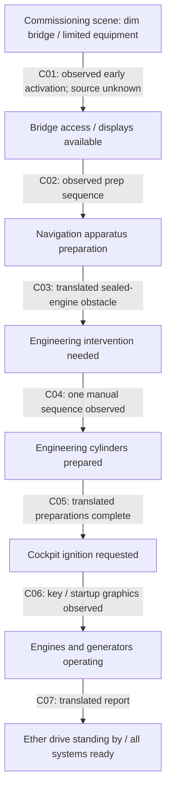
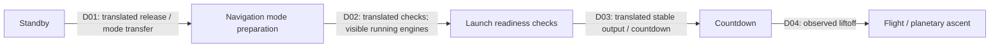
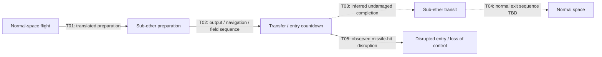

# Baseline v1 — operational state vocabulary

Companion to the [spatial map](spatial-constraint-map.md), [motion envelopes](motion-clearance-envelopes.md) and [Vertical Slice 1](vertical-slice-1.md). These are provisional state labels for future code discussion, not an implemented state machine, a verified Japanese control lexicon or an approved command registry.

## Meaning of support labels

- **Canon-supported:** specific anime observation A, translated statement with original wording unverified, or selected B-candidate design stage. State names are our English vocabulary, not automatically on-screen labels.
- **Inferred:** D connection/precondition consistent with evidence but not directly established; never canon.
- **Gameplay architecture TBD:** E/F sequencing, thresholds, interlocks, player roles or presentation to decide before implementation.

Every transition below has its own support. Drawn arrows represent observed sequence or a labeled proposal; they do not prove universal causality. Preserve different state domains instead of a single global power ladder. [Shared commands/state](../../architecture/external-control-automation.md) remains the authoritative architecture requirement: acceptance is not completion; callers do not own alternate ship state; local actions retain locality.

## A — first-use commissioning, Episode 4

| ID | Evidence / support | What the arrow does not establish |
|---|---|---|
| C01 | Canon-supported A dim/bright bridge EP-04 05:15/05:42; early activation subtitle lead 05:19–05:25, original speech unverified | No identified battery/auxiliary source or exact early switch interaction. |
| C02 | Canon-supported A hatch/rise/shield stages EP-04, occupant descent EP-26, B-candidate five-stage SET-027/086 | Complete continuous animated choreography/closure not verified; combining scenes is not one measured cycle. |
| C03 | Canon-supported translated EP-04 10:52–11:02 obstacle/engineering direction | Exact internal seal mechanism and universal long-term storage procedure unknown. |
| C04 | Canon-supported A band removal → handle/front-plate manipulation → cylinder extension on one unit; all four initially banded and later extended | Individual manual operation of all four inferred; no exact latch tolerances. |
| C05 | Canon-supported translated EP-04 13:46–13:52 request after preparations | Exact list of prerequisites and power sufficiency are gameplay architecture TBD. |
| C06 | Canon-supported A key engagement/startup/power presentation EP-04 13:53–14:03; translated generator/main transfer report | Complete reactor topology, battery count and physical switching order unknown. |
| C07 | Canon-supported translated EP-04 14:06–14:10 systems-ready/ether-standby report | Does not certify all future flight/combat/sub-ether features or authorize departure in Slice 1. |

Evidence: [EP-04 startup review](../../../reference/indexes/episode-04-startup-review.md), [follow-up comparison](../../../reference/indexes/startup-sequence-comparison.md), [EP-26 entry](../../../reference/indexes/episode-26-platform-review.md). The dormant-hangar player experience is a project premise; a fully powerless/storage → battery → auxiliary → main progression is E/F until further evidence. Do not place STANDBY as a universally necessary stage after initial ignition and before every operating mode solely because another scene starts there.

## B — standby departure, Episode 8

All four arrows are canon-supported as scene order, A visuals + original-unverified English subtitle callouts: EP-08 12:42–12:46 release/navigation; 13:18–15:00 system checks; 15:00–15:05 stable output/countdown; 15:41 onward launch. [Comparison](../../../reference/indexes/startup-sequence-comparison.md) records exact frames/intervals. Engines running while still supported/docked are distinct from flight. Exact checks enforced as interlocks, tower clearance rules and countdown duration are gameplay architecture TBD. No repeated first-use ribbon procedure is established in this departure.

## C — sub-ether preparation and disrupted transition, Episode 11

T01/T02 are canon-supported A effects + translated sequence; T05 is canon-supported A impact/distortion plus translated runaway reports. T03 is D inference for an undamaged completion; T04 remains gameplay architecture TBD rather than a verified normal-exit animation. [EP-11 review](../../../reference/indexes/episode-11-subether-review.md) separates pre-hit rings/broad aft field from disrupted entry effects. The reviewed successful return follows the emergency sequence below, not proof of a routine exit procedure.

Translated interception unavailability during transfer is a state-specific constraint, not a complete weapons lockout. Münchhausen output rise/runaway and four indexed Newton units remain distinct findings; no finalized power-routing diagram. The [performance audit](../../../reference/indexes/performance-subtitle-audit.md) supplies operating points and holds, not fixed charge times, watts, thrust or universal percentage thresholds. Sub-ether implementation is outside Slice 1.

## D — emergency cutoff, auxiliary operation and restart

```mermaid
flowchart LR
  A[Disrupted entry / loss of control] -->|E01: translated abort request| B[Abort requested / runaway report; success not established]
  B -->|E02: observed key removal / blackout| C[Engine cutoff; dim bridge]
  C -->|E03: translated auxiliary report| D[Auxiliary services; exterior info unavailable]
  D -->|E04: observed key insertion / turn| E[Restart]
  E -->|E05: lighting / view recovery; translated return| F[Normal-space services restored; damage persists]
```

All arrows describe canon-supported incident sequence, A visuals and/or original-unverified English subtitle reports, EP-11 15:38–17:54. E01 is a request, not evidence of successful automatic abort. E02 does not mean all electrical power died. E05 restores some services; Newton 1/3 are still inoperable until later repairs reported in EP-12. Full shutdown/storage reversal and damage rules remain TBD. This vocabulary is retained for later architecture; the emergency branch is not required gameplay in Slice 1.

## Component state domains

| Domain | Working labels | Support / boundary |
|---|---|---|
| Access | exterior approach, hatch available, hatch opening, traversable, closed | Some hatch views A/B candidate; exact pressure/access rules E/F TBD. |
| Power/services | limited services, main startup requested, main services available, engine cutoff, auxiliary services | Early bridge and later main ignition coexist; auxiliary report is EP-11 translation. Source capacities/circuit graph unknown. |
| Navigation apparatus | cap open, occupant lowering, cap closed, cylinder rising, front covers open, linked/available | Selected A stages + B-candidate closure/stage order. Full timing, cancellation and interlocks TBD. |
| Engineering units | banded/closed, wrapping removed, release manipulated, cylinder extending, cylinder prepared | One action sequence A; four endpoint states A. Per-unit identities are project IDs until external mapping established. |
| Bridge seating | low/stowed, moving, raised/operating | A relative motion, B-candidate designs; metric stroke and occupant/access constraints TBD. |
| Propulsion | inactive, startup requested, operating/standby, transfer preparation, insufficient power, isolated/damaged | Scene-specific A/translated evidence; do not equate reactor availability, drive functionality and thrust. |
| Readiness | preparing, incomplete, ready | Aggregate F gameplay result derived from declared slice criteria, not another physical subsystem. |

A future request must return actual in-progress/completed/rejected state through the shared interface; no control may set SHIP_READY just by playing an animation or switching UI text. Exact APIs/events, engine IDs, transport and concurrency are not selected here.

## Architecture decisions required before implementation

Choose a minimal service-power assumption, apparatus completion/interlocks across cuts, entry access behavior and how all four engineering endpoint states are reached. Assign E/F IDs and rationale. Decide which actions are local, station-based, scripted or automatic; neither VoiceAttack nor future Gilliam may bypass required local intervention. Use the [slice acceptance contract](vertical-slice-1.md) to define readiness; retain the training simulation as training evidence, not operational explosion thresholds.
