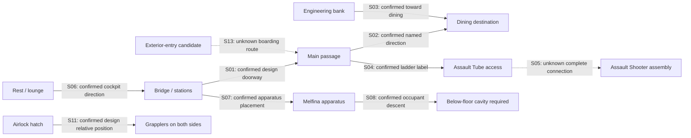

# Reconstruction / Implementation Baseline v1 — spatial constraint map

Planning baseline prepared 2026-10-07 after the user approved this documentation increment, and confirmed for publication with the README/roadmap/tooling updates on the same date. This document is the entry point for four linked deliverables: this map, [motion/clearance envelopes](motion-clearance-envelopes.md), [operational states](operational-state-baseline.md) and [Vertical Slice 1](vertical-slice-1.md). It authorizes no grayboxing, Unreal initialization, modeling or gameplay implementation. The formal implementation-planning gate remains deferred.

## Evidence and status vocabulary

Apply the [canon policy](../../canon-policy.md). **Confirmed** means the specific observation/label was verified in the cited material; a confirmed design label is still **B candidate** until collection provenance is authenticated. **Strongly inferred** is D, never canon. **Unknown** is unresolved and cannot supply a fixed placement. Any connecting geometry adopted for a future blockout is E; interaction adaptations are F. Status applies to each relationship, not automatically to an entire room or system.

The source reviews remain authoritative for observations and transcription uncertainty: [room matrix](../room-evidence-matrix.md), [component matrix](../component-evidence-matrix.md), [interior settei](../../../reference/indexes/settei-interior-review.md), [variant/follow-up review](../../../reference/indexes/startup-open-items-followup.md), [EP-04/07/08 comparison](../../../reference/indexes/startup-sequence-comparison.md), [EP-26 descent](../../../reference/indexes/episode-26-platform-review.md). This baseline consolidates constraints, not new source observations.

## Global enclosure and provisional zones

The accepted official overall envelope is **72 m long × 21 m wide × 16 m high**, C / OFFICIAL_SUPPLEMENTAL, EXT-004 ([official profile](https://www.sunrise-world.net/titles/pickup_094.php)). It is not usable interior volume or proof that every deployed appendage stays inside that box. SET-006's approximately 2 m section floor-to-ceiling convention is B candidate; it is not a uniform deck-spacing rule or a deck-count calculation.

| Planning zone | Contents to reconcile | Placement status |
|---|---|---|
| Forward working group | Bridge, Gene/Jim stations, navigation apparatus, passage approach, exterior-entry candidates, grappler-root/airlock relationship | Grouping for planning only. Exact hull coordinates, floor levels and hatch correspondence remain unknown. |
| Midship working group | Named dining destination, final rest/lounge designs, possible crew/support/cargo/utility space | Longitudinal assignment is provisional E if adopted; room count, dining/lounge identity and connecting geometry unknown. |
| Aft working group | Engineering bank, exterior propulsion and aft screw machinery | Engineering-to-exterior alignment and room coordinates unknown. Exterior aft machinery does not prove an accessible sub-ether reactor room. |

No bulkhead coordinates, room dimensions or final deck plan are selected. Crew cabins/utility volumes are unresolved brief leads, not confirmed rooms. Never import other-ship interior sheets into XGP geometry.

## Relationship map

This graph records local relationships, not distance, handedness or direct-door adjacency. Solid arrows describe confirmed relationships in the stated source sense; dashed arrows mark unknown physical completion. The connection register below controls interpretation.

| ID | Relationship | Status / category | What may be relied on; remaining limit |
|---|---|---|---|
| S01 | Bridge ↔ main passage | Confirmed selected design, B candidate; SET-044/045 | Cockpit doorway/direction appears; passage length, handedness and complete hull fit unresolved. |
| S02 | Passage → dining | Confirmed named direction, B candidate; SET-044/045 | Dining destination label; do not assert a measured directly adjoining room. |
| S03 | Engineering → dining | Confirmed named direction, B candidate; SET-046 | Route points toward dining; direct doorway versus intervening route unknown. |
| S04 | Passage → Assault Tube access ladder | Confirmed selected design, B candidate; SET-045 | Reserve vertical access; top destination level/extent unknown. |
| S05 | Tube ladder → SET-125 Shooter | Unknown complete physical correspondence; B candidates supply separate ends | Terminology supports a research lead, not a finished continuous boarding corridor. |
| S06 | Final lounge → cockpit direction | Confirmed label, B candidate; SET-088/089 | Direction only; lounge versus dining identity unknown. SET-043 preliminary layout is not used to complete it. |
| S07 | Navigation cylinder behind seating cluster | Confirmed designs and anime, B candidate + A; SET-022/028, EP-04/08 | Relative placement; clearances and metric station positions unmeasured. Gene console SET-040 and Jim console SET-128 retain distinct identities. |
| S08 | Apparatus opening → below-floor occupant volume | Confirmed A descent EP-26 21:25.784–21:27.536; B-candidate stages SET-027/086 | Cavity required; depth, support hardware and hull correspondence unknown. |
| S09 | Four cylinders → shared engineering service space | Confirmed B-candidate 2×2 bank and A extended states EP-04/08 | All-four operating clearance required; external engine/reactor mapping unknown. |
| S10 | Robot rail between passage and bridge | Confirmed local design/shot relationship, B candidate + A; SET-028/044, EP-04 11:03–11:06 | Reserve overhead/local approach; complete ship-wide rail topology unknown. |
| S11 | Grapplers on both sides of airlock hatch | Confirmed relative-position note, B candidate; SET-126 | Check root/sweep interference; no root coordinates, pressure boundary or universal front compartment established. |
| S12 | Accessible cockpit-to-engineering route exists | Strongly inferred D from Jim's engineering work and cockpit/passages | Some traversal is needed; exact path cannot be derived from edits. |
| S13 | EP-04 exterior access opening → traversable interior entry | Unknown complete route; exterior/inside views A around 13:23–13:29 | Boarding route for slice requires explicit E connection, not a canon assertion. |
| S14 | Engineering bank → exterior pods / reactor volume | Unknown | Four internal controls do not prove four full engines retract into the room or establish reactor-room layout. |
| S15 | Dining ↔ lounge ↔ cabins/cargo/utility | Unknown | Preserve unallocated space; no fixed adjacency, room count or deck assignment. |
| S16 | Aft screw → accessible sub-ether machinery room | Unknown; exterior mechanism/effects A/B candidate | Reserve exterior motion; no evidence-backed occupied machinery room. |

## Hatch identities to preserve

| Baseline ID | Source identity | Correspondence limit |
|---|---|---|
| H01 | Melfina apparatus floor cap; SET-027/086, EP-04/26 | Apparatus boarding opening, not an exterior entry. |
| H02 | Bridge emergency floor hatch; SET-006 | Relationship to exterior and H03 unknown; keep its record distinct from H01. |
| H03 | Main-passage round exterior-access floor hatch; SET-044/045 | Labeled exterior access; outside location and relationship to other openings unresolved. |
| H04 | Exterior rectangular airlock hatch; SET-047/096/197 | Provisional inward-then-slide note; correspondence to EP-04 opening unverified. |
| H05 | EP-04 exterior rectangular access opening / inside control views | Candidate for slice entrance; do not silently merge with H04 or H03. |
| H06 | Airlock interior hatch/pressure views; SET-126 | Interior/exterior arrangement and relation to H04 need reconciliation. |

IDs distinguish evidence records, not a claim that the ship has exactly six unique hatches. If evidence later establishes two records represent one opening, record the reconciliation explicitly.

## Before a future graybox

Resolve or explicitly adopt provisional E geometry for entry→passage, passage/dining→engineering and the navigation cavity within the hull. Check the [motion envelopes](motion-clearance-envelopes.md) before placing any bulkhead. Priority remaining comparisons are the hull/access, grappler-root and Assault Shooter families identified in the follow-up review; unfinished collection-wide review is not silently treated as complete.

Record any chosen connection/dimension with an assumption ID, category, source constraints, affected envelope IDs and reason. Revisions must update all four baseline documents consistently; new evidence may supersede a provisional solution without rewriting historical observations as canon.
