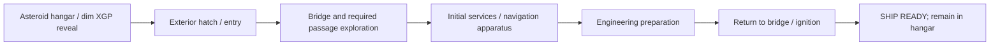

# Baseline v1 — Vertical Slice 1: Awakening the Outlaw Star

The user approved defining this slice within Baseline v1 on 2026-10-07. This is the authoritative **planning scope and completion contract**; the separate implementation/graybox phase remains unapproved. Companion constraints: [space](spatial-constraint-map.md), [motion](motion-clearance-envelopes.md), [states](operational-state-baseline.md). Existing [vision](../../vision.md) and [design pillars](../../design-pillars.md) remain in force.

## Experience and endpoint

The [Phase 1.2 closeout proposal](../../implementation/phase-1-2-closeout-proposal.md#bounded-opening-scope-amendment--proposed-contract-supplement)
records the bounded opening supplement accepted by the user on 2026-10-07, consolidating the
case/computer, reveal, boots, HUD and dining-shell directions. Read it alongside the historical
contract below; its eight readiness conditions remain intact. Source observations are unchanged.

One physical player approaches the dormant XGP inside a minimal asteroid hangar, finds and operates an exterior entry, explores the bridge and required passage route, brings limited ship services online, deploys the navigation apparatus with a placeholder occupant, performs engineering preparation, returns to the bridge and completes ignition. Reach **SHIP READY**, still supported inside the hangar; no departure. The user clarified in Phase 1.3 that this is a startup milestone, not the end of play: leave the seat and continue exploring, including hatch exit/re-entry between active ship gravity and hangar low gravity.

The path is a gameplay adaptation of EP-04's ensemble commissioning scene. The player can perform activities seen across Gene/Jim rather than requiring crew AI. A placeholder occupant/script supplies Melfina's apparatus sequence; it does not grant the player magical direct control over the ship's canonical bio-navigation. This role consolidation is F, not an anime retelling with exact actions/characters.

Ordering is the slice's F experience sequence, informed by the commissioning evidence. It is not a universal ship startup dependency chart. Initial-service and machinery power assumptions must be explicitly agreed before code/geometry implementation.

## Included scope

| Area | Required result | Limit |
|---|---|---|
| Hangar / hull context | Minimal supported ship reveal and reachable boarding approach at the accepted overall hull scale | Provisional E hangar/support geometry; no detailed asteroid facility or launch opening animation. Use grey commissioning appearance as reference, not a finalized art pass. |
| Entry | One selected exterior hatch with approach, interaction, movement and traversable interior connection | Entry identity/route is unresolved evidence; select an E/F solution explicitly before blockout. Keep other hatch records distinct. |
| Player / camera | One physical avatar can traverse required spaces and operate local controls; first/third-person views preserve the same body/state | No full character art, crew AI or separate authority per camera. Camera mode and control mode remain distinct. |
| Interior route | Lower entry/ladder, forward cockpit, main passage, minimal dining shell and engineering connected for play | Layout A is accepted provisional E geometry, not proved hull fit. Future branches reserved; full deck plan excluded. |
| Limited services | Guide lighting on entry; laptop bootstrap enables Gilliam/limited services before main ignition | Qualitative supplies accepted E/F; actual canonical topology/numerical power remain unknown. |
| Navigation apparatus | Awake occupant waits for local acknowledgement; cap opens, entry/descent, cap closure, rise/cover stages reach actual link/available state | Joined choreography/closure bridge accepted E/F. Exact metric motion/rig fit later; no fluid simulation/full AI. |
| Bridge seating | Raised/low control-cluster states and required lift motion, coordinated with access/apparatus reservations | No measured stroke or detailed actuator rig implied. |
| Engineering | Four distinct local click-seal/grip-turn/directional-pull units; early preparation allowed after registration; OFF permits push-in/relock/redeploy | Repeating one shown procedure on all four and reverse operation are F. No new ribbons; every restart validates current prepared endpoints. No exterior-pod movement assumed. |
| Ignition / feedback | Separate key presence/OFF/ON, ignition-triggered occupied lift, graceful OFF/lowering and consistent current versus milestone status | Removal only after completed OFF; no mid-transition reversal/emergency cutoff. Source-derived presentation does not establish full wiring. |
| Guidance | Animated ceiling-mounted Gilliam pod, deterministic text/choices, resumable registration/recovery branch and state-aware reports | No LLM, generated dialogue, required voice or mobile robot escort/AI. Exact source expression fidelity remains later reference/art work. |

## Explicit exclusions

- Free flight, planetary ascent, departure and sub-ether travel.
- Grappler combat, arm deployment gameplay, weapons, damage/fault simulation or repairs.
- Gilliam LLM, VoiceAttack/HOTAS/Stream Deck integrations or external transport implementation.
- Full crew simulation, every interior room, detailed art, complete mechanical rigging or calibrated power/flight physics.

Future grappler/Shooter/landing/lounge movement is reserved spatially where relevant, not activated as slice gameplay. Deeper environmental hazards, pressure cycles and life-support endurance are not added merely because their vocabulary appears in the state baseline.

## SHIP READY definition

The endpoint is an F aggregate of the following declared conditions, supported by canonical presentation where available:

1. Player has completed the selected entry and can traverse the required route.
2. Initial services have become available through the selected initialization behavior.
3. Navigation apparatus has reached its declared deployed/available state with placeholder occupant; supported visible stages are represented.
4. All four engineering control cylinders are in their prepared endpoints.
5. Bridge seat/control cluster has reached the declared operating position.
6. Cockpit ignition has completed; main-service/engine-operation presentation and selected ship gravity are available.
7. Displays/status queries consistently report readiness from the same authoritative state.
8. Ship remains supported in the hangar; startup success does not end the demo, and continued exploration/exit/re-entry remains available without departure.

These are completion criteria, not a new canonical claim that each condition is a universal launch interlock. Exact hatch closure, pressure checks, power thresholds and station-local permissions are recorded as decisions before implementation. No unfinished feature should be required to obtain this endpoint.

User-selected Phase 1.3 clarification: hatch closure/seal/pressure readiness affects the represented
departure status, not ignition or startup completion. Engines and ship gravity can run with the
hatch open in the breathable hangar. Reopening updates the departure warning without switching
off those services. Leaving the captain's seat after success does not revoke the completed seat
transition. The [Phase 1.3 record](../../implementation/phase-1-3-action-readiness-draft.md)
owns these E/F rules and remaining check/gravity-boundary details; no full flight or pressure model is added.

The user also selected reversible key operation and occupied seat lowering on OFF. Retain a
per-run completed-startup milestone after the successful sequence, independently of the current
running/ready result when later switched OFF. Raise/lower motion temporarily locks seat exit;
physical key insertion/removal and OFF/ON switching are distinct actions. Exact shutdown service
timings/visual tuning remain later work under the accepted closeout; this does not add full storage reversal or saved achievements.

## Acceptance review for the later implementation

The [accepted Phase 1.3 closeout](../../implementation/phase-1-3-closeout-audit.md) owns the current
bounded action/service/readiness contract, including pause/reset, optional cleanup and reversible
engineering/ignition. The discussion record retains source-qualified details and history. Metric/art
choices and actual implementation/fit proof remain deferred; planning completion is not gameplay acceptance.

| ID | Observable pass condition |
|---|---|
| VS-01 | A run begins at the specified dormant starting condition; physical approach and chosen entry lead to the bridge. |
| VS-02 | The bridge→engineering→bridge route is usable before and after relevant machinery movement; no required control becomes unreachable. |
| VS-03 | Apparatus stages, seat-cluster lift, engineering extension and entry pass the applicable [clearance checks](motion-clearance-envelopes.md); no wall/ceiling/occupant intersects a required sweep. |
| VS-04 | Required local engineering action cannot be completed through an unrelated remote console or guidance shortcut. |
| VS-05 | An action still moving/starting is reported in progress; readiness is not announced solely on input acceptance. Missing declared prerequisites produce understandable feedback. |
| VS-06 | Key engagement and final status reflect actual completed initialization; all four cylinder endpoints and navigation state agree with the readiness result. |
| VS-07 | Changing camera perspective changes neither ship state nor action permissions; the same physical player remains the operator. |
| VS-08 | A fresh run/reset can repeat the complete sequence without stale readiness or mechanism state. No save/load feature is required by this criterion. |
| VS-09 | SHIP READY records startup success without ending play; the player can leave the seat and explore/exit/re-enter, without flight, weapons, faults, external clients or crew AI. |
| VS-10 | All implemented invented connections, dimensions, timelines and actor substitutions have explicit E/F records; source-derived appearance is traceable to evidence. |

These are planned acceptance criteria, not tests already run. No code or modeled artifact exists for this slice yet.

## Future compatibility required now in planning

Preserve one authoritative state and a reusable command/query boundary per [external-control compatibility](../../architecture/external-control-automation.md). In-world controls and future adapters must share validation/results. Keep equipment identities, spatial locality, camera/control context and guidance separate. Do not select an external protocol, full component framework or numerical physics model merely to reserve extensibility.

## Decisions before the next phase

Current status: VS-D01–03 have accepted provisional spatial choices (actual fit pending), and
VS-D04–06 have accepted E/F behavior contracts in the Phase 1.3 closeout. Their source uncertainties
remain explicit. VS-D07 tool/asset/implementation authorization and concrete Phase 1.4/1.5 contracts
are still pending. The register below retains its original decision IDs; it is not a list of six
behavior choices still awaiting initial agreement.

| ID | Decision / required review | Evidence or assumption boundary |
|---|---|---|
| VS-D01 | Choose entry hatch representation and provisional inside route | H04/H05 correspondence unknown; any adopted connection E. |
| VS-D02 | Place bridge/passage/engineering and necessary route proxy within hull | Named directions constrain E connecting geometry; no final deck plan. |
| VS-D03 | Fit apparatus cavity, all-four engineering sweeps and seat lift | Motion lengths/margins E; preserve supported states. |
| VS-D04 | Define initialization service source and minimal interaction prerequisites | Early bridge power source unknown; an E/F contract is required. |
| VS-D05 | Define how placeholder occupant enters/deploys and how four cylinders are prepared | F role/control adaptation; no new crew behavior presented as canon. |
| VS-D06 | Specify observable ready/in-progress/incomplete behavior and minimal controls | Use baseline vocabulary, shared state and physical access; no API names frozen here. |
| VS-D07 | Approve concrete graybox and implementation increment, tools/engine version and asset publication policy | Separate future phase; no Unreal creation or modeling authorized by this baseline. |

Further source work should target decisions that would invalidate this slice's space or interaction contract. Unresolved full-ship rooms, flight numbers and sub-ether art do not automatically expand Slice 1. Before building, review these assumptions as a focused implementation proposal; after approval, routine fixes within that agreed increment do not need extra approval pauses.
